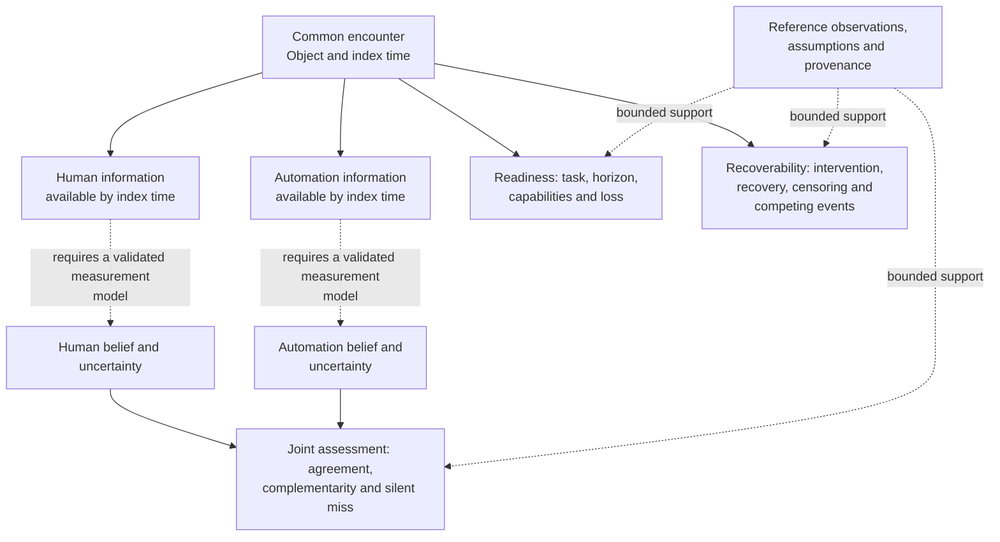
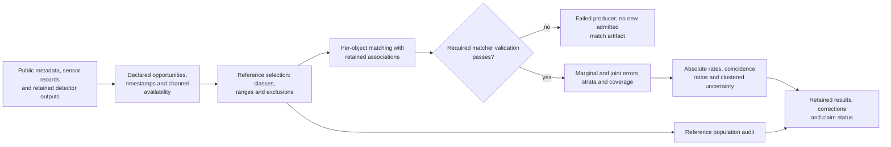
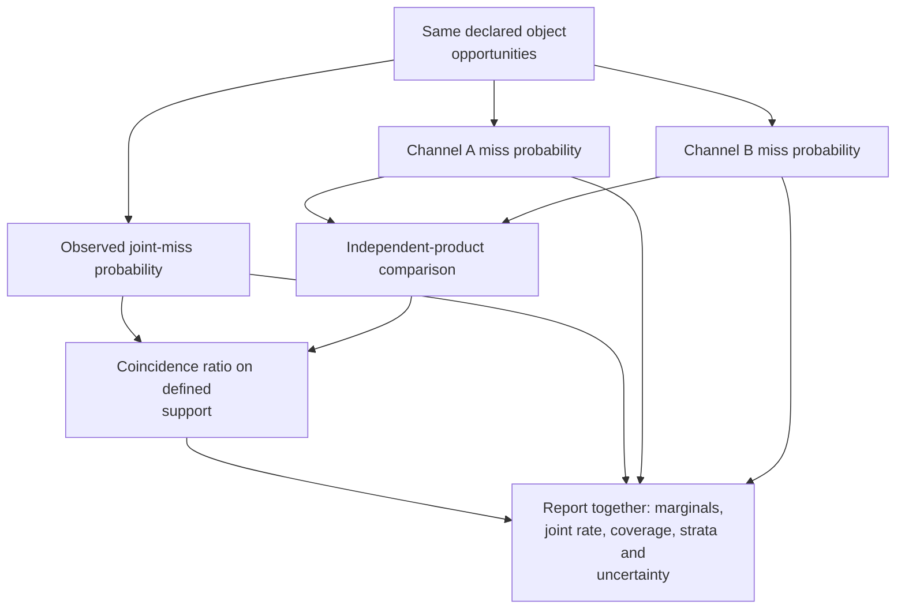
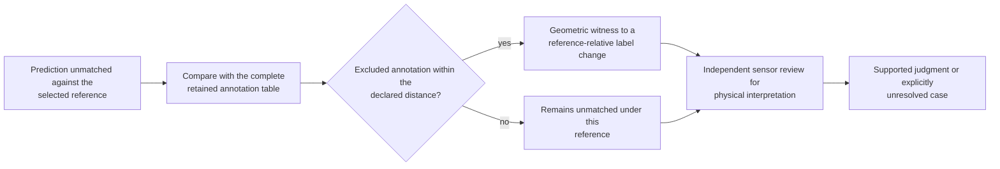
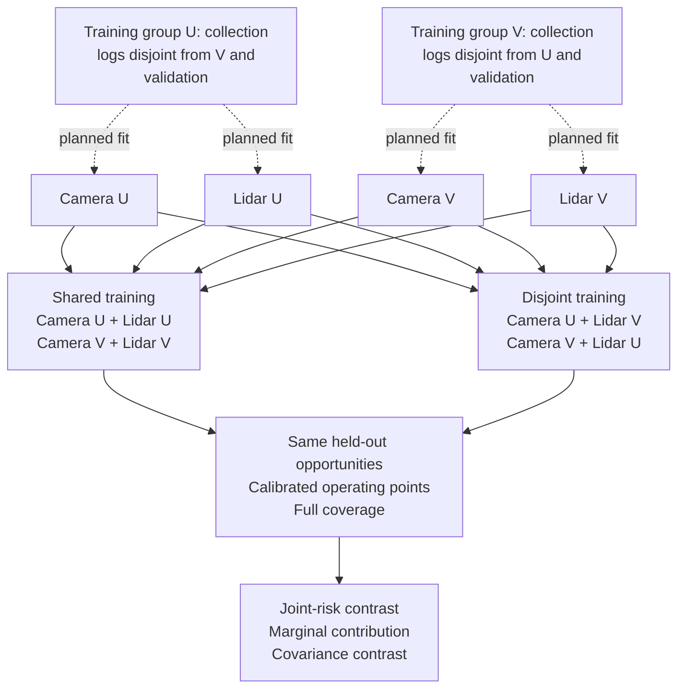
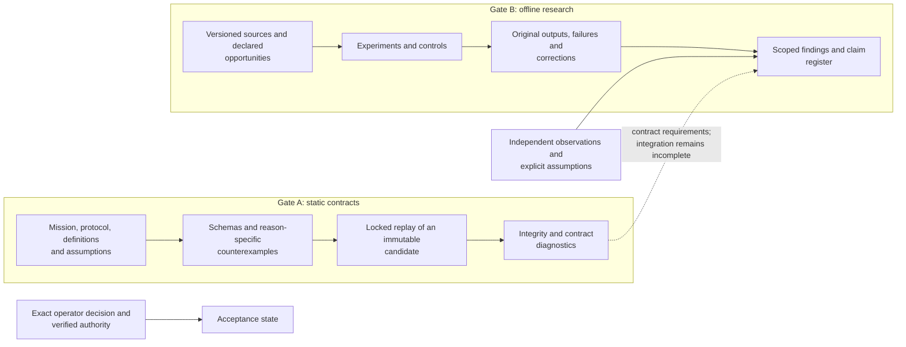

# Reiyah

**An evidence and benchmark engine for shared failures in human-automation systems.**

Two observers can each perform well and still miss the same object. Reiyah studies that gap:
what each channel could observe, where their errors coincide, what the reference actually
establishes, and how much uncertainty remains in the conclusion.

HARBOR is the proposed research program: **Human-Automation Readiness, Belief & Operational
Risk**. Its full scope connects object-level belief, readiness, recoverability, joint silent
misses, causal policy effects, explicit unknowns, transfer and worst-group evaluation. The
implemented engine currently performs offline measurement, reference audits, controlled
experiments and reproducible evidence checks. Human belief and recovery under intervention
remain research targets requiring their own observations.

[Architecture](docs/ARCHITECTURE.md) · [Mathematical specification](docs/MATHEMATICAL_SPECIFICATION.md) ·
[Research findings](docs/GENERAL_SYNTHESIS.md) · [Next experiment](docs/TRAINING_OVERLAP_NEXT_EXPERIMENT_2026-09-07.md) ·
[Run the auditor](#run-the-offline-auditor)

## One encounter, distinct information sets

The unit of inquiry is a particular object, encounter and time. A camera output, a lidar
output, a driver's gaze and a takeover action carry different information. Reiyah's architecture
keeps **observation, latent belief, decision, intervention, outcome and evidence** separate.
An observation can support an inference only under an explicit measurement model.



This diagram describes the research architecture. Gaze and takeover proxies do not by
themselves establish a person's object-level belief. The current measurement program addresses
parts of this architecture; it does not implement a driving controller or validated belief tracker.

## How the measurement engine works

The engine makes the opportunity population explicit before counting failures. Matching is
conditional on a declared reference, sensor validity and evaluation policy. Empty output,
missing output, excluded references and an unobserved physical object have different meanings.



The [matcher](tools/measure/match.py) retains per-object associations that aggregate benchmark
scores omit. The [reference audit](tools/measure/result_ao_reference_population_audit.py)
reconstructs the consequences of changing reference coverage. The
[research checker](tools/measure/gate_b_check.py) verifies retained identities and consistency;
when replay is requested, successful process exit and the expected transcript are both required.

| Research surface | What is represented | Current evidence boundary |
|---|---|---|
| Object-level belief | Actor, object, information set, state space, uncertainty and abstention | Static contracts; independent belief measurement remains outstanding |
| Readiness | Task, context, horizon, capability requirements and loss | Proposed construct; no universal readiness score |
| Recoverability | Intervention or request, recovered state, censoring and competing events | Event and causal contracts; recovery benefit has not been established |
| Joint failures | Common opportunities, marginal errors, joint errors, conditions and intervals | Implemented offline detector analyses on declared benchmark populations |
| Reference validity | Included and excluded annotations, proximity witnesses and unresolved cases | Implemented audits; physical adjudication is a separate observation |
| Causal policy effects | Versioned policies, assignment, propensities, support and estimands | Contracts and experiment designs; no measured driving intervention effect |
| Transfer and worst groups | Domain boundaries, subgroup support, held-out comparisons and uncertainty | Bounded experiments, including retained transfer failures |
| Explicit unknowns | Missing, unmeasured, sensor-invalid, out-of-distribution and abstained states | Distinct states and denominators; unavailable labels must not become observed zeros |

## What the joint-error statistic measures

For two reference-relative miss indicators, the coincidence ratio compares observed joint
miss probability with the product of the two marginal miss probabilities. Conditional analyses
make that comparison within declared strata and retain the support used for aggregation.
A ratio alone is insufficient: its meaning changes with the marginal error rates.



The [Result AO reanalysis](docs/RESULT_AO_REFERENCE_POPULATION_AUDIT.md) retains a conditional
camera/lidar ratio of **1.151053**, with whole-scene bootstrap interval
**[1.128749, 1.166206]**. The original deepest-stratum support contains 131,722 of 134,565
reference rows across 150 scenes. The interval describes resampling uncertainty on that
population; it does not cover reference errors or establish a causal sensing mechanism.

Earlier experiments investigate detector choice, thresholds, marginal-rate effects and
unmeasured difficulty. Their current interpretation is collected in the
[corrected synthesis](docs/GENERAL_SYNTHESIS.md) and
[claim register](evidence/claim-status-register-2026-09-08T042402Z.json).
The [RSS estimand analysis](docs/ESTIMAND_RSS_DEFINITION_32.md) states the additional conditions
needed to connect a benchmark statistic to that safety argument. This two-channel measurement
has not established those conditions or a vehicle safety rate.

## A reference error the engine can expose

A prediction can be unmatched because the evaluator excluded a nearby annotation. That is a
detectable measurement issue; it does not settle whether the prediction is physically correct.



At score threshold 0.30, Result AO finds **3,151 of 24,432 camera flags** and
**5,728 of 23,840 lidar flags** within two meters of annotations excluded from the original
reference cache. These are changes under a specified geometric predicate, not independently
confirmed correct detections. The [real-data replay](docs/REFERENCE_AUDIT_REAL_DATA_2026-09-07.md)
and [cache-policy reconstruction](docs/CACHE_SELECTION_AUDIT_2026-09-07.md) check the calculation
and selection policy separately.

The [reference study](docs/REFERENCE_ADJUDICATION_STUDY_2026-09-07.md) prepares a frozen sample
of **240 detections across 93 scenes**, with original sensor evidence and explicit unresolved
states. Independent human judgments remain unavailable, so physical-performance estimates
remain unestablished. The instrument is prepared; the missing observations remain visible.

## Current engine development

The next discriminating question is whether common training exposure contributes to coincident
detector errors. The [experiment design](docs/TRAINING_OVERLAP_NEXT_EXPERIMENT_2026-09-07.md)
keeps architectures and test opportunities fixed while comparing shared and disjoint training
pairings. Dataset transfer is a subsequent comparison, so two interventions are not conflated.



The four detector fits in this diagram are planned. The latest completed preparation checkpoints
are concrete and separately documented:

| Checkpoint | Retained result |
|---|---|
| [Training input inventory](docs/TRAINING_INPUT_FINDINGS_2026-09-07.md) | All 536,780 requested camera/lidar filenames are present and nonempty; a separate directory enumeration agrees |
| [Contained metadata partitions](docs/TRAINING_PARTITION_CHECKPOINT_2026-09-07.md) | Six proposed training subsets and the full validation subset load and pass declared containment checks |
| [Actual model inputs](docs/MODEL_INPUT_CHECKPOINT_2026-09-07.md) | Historical preprocessing checked on 204 metadata-selected samples across 68 logs, covering 1,224 camera images and 2,713 distinct sensor files |
| [Temporal input control](docs/MODEL_INPUT_CHECKPOINT_2026-09-07.md) | The historical lidar test recipe changes inputs on 129 smoke cases across two seeds; explicit nearest-sweep loading is stable on all 204 |
| [Camera adapter controls](docs/MODEL_INPUT_CHECKPOINT_2026-09-07.md) | Synthetic probes reproduce caller-dimension mutation and inverse-velocity loss, then check copy and coordinate safeguards |

Full model caches, separate training object databases and the fitting protocol are the next
preparation stage. Initialization history, object sampling, calibration, equal optimization
budgets and training uncertainty must be controlled before interpreting the comparison.
These engineering checks do not establish a detector accuracy gain.

The [predictive monitor experiment](docs/PREDICTIVE_MONITOR_FINDINGS_2026-09-07.md) remains
part of the record: its future-count improvement under collection-log holdouts was 2.7020%,
with a descriptive interval including zero; spatial continuity slightly worsened the primary
loss. Neither passed the declared usefulness screen. That result informs the next experiment.

## Evidence architecture and reproducibility

Gate A supplies versioned scientific contracts, schemas, counterexamples and locked offline
validation. Gate B supplies empirical research tools and retained measurements. Their integration
is incomplete, and an empirical result does not silently amend an accepted contract.



Gate A remains **operator-unaccepted**. Passing checks establish their tested scope; they do not
create scientific validation, standards compliance, safety approval or deployment authority.
The [architecture handoff](docs/SESSION_HANDOFF.md) and its referenced validation plans govern
exact Gate A release replay. This README is research navigation, not a new Gate A release packet.

Original results, failed producers, null findings, corrections and retractions remain
discoverable. Public Git contains Reiyah code, documentation and permitted aggregate evidence.
Source-derived datasets, weights and review materials retain their own access and redistribution
terms. A matching digest establishes identity; physical correctness needs appropriate observations.

### Run the offline auditor

The portable synthetic example requires no sensor dataset, model or API key. Follow the
[demo instructions](docs/REFERENCE_AUDIT_DEMO_2026-09-07.md) for the command and its expected
geometric witnesses. The [real-data adapter](docs/REFERENCE_AUDIT_REAL_DATA_2026-09-07.md)
uses separately retained inputs.

For research consistency checks, use an environment with `numpy`, `scipy` and `jsonschema`:

```sh
python -B tools/measure/gate_b_check.py --json /tmp/reiyah-gate-b-check.json
python -B -m unittest discover -s tools/measure -p test_research_board_regressions.py -v
```

The default checker verifies retained transcript digests without rerunning the historical
experiments. Replay classes and their requirements are declared in the
[replay manifest](validation/gate-b-replay-manifest.json). Gate A release validation uses its
own exact locked launcher and immutable projection; these research commands are development
checks. Dataset-dependent numerical reproduction requires the recorded input and environment
identities.

## Research map

| Read for | Start here |
|---|---|
| Mission and scientific structure | [Scientific charter](docs/SCIENTIFIC_CHARTER.md), [architecture](docs/ARCHITECTURE.md), [mathematical specification](docs/MATHEMATICAL_SPECIFICATION.md) |
| Current interpretation of sensor, human-proxy and LLM experiments | [Corrected synthesis](docs/GENERAL_SYNTHESIS.md), [current claim register](evidence/claim-status-register-2026-09-08T042402Z.json) |
| Research review and future investigations | [Research-board report](docs/RESEARCH_BOARD_2026-09-07.md), [next training experiment](docs/TRAINING_OVERLAP_NEXT_EXPERIMENT_2026-09-07.md) |
| Reference validity and physical adjudication | [Result AO](docs/RESULT_AO_REFERENCE_POPULATION_AUDIT.md), [reference study](docs/REFERENCE_ADJUDICATION_STUDY_2026-09-07.md), [portable auditor](docs/REFERENCE_AUDIT_DEMO_2026-09-07.md) |
| Temporal and observational limits | [Monitor findings](docs/PREDICTIVE_MONITOR_FINDINGS_2026-09-07.md), [threats to validity](docs/MEASUREMENT_THREATS_TO_VALIDITY.md) |
| Retained mathematical corrections | [Reference-noise interpretation](docs/REFERENCE_NOISE_INTERPRETATION_2026-09-07.md), [M4 bound audit](docs/M4_RECTANGULAR_BOUND_FINDINGS_2026-09-07.md) |
| Measurement history and continuation | [Gate B contract](docs/GATE_B_MEASUREMENT_CONTRACT.md), [Gate B handoff](docs/GATE_B_SESSION_HANDOFF.md) |
| Source custody and standards scope | [Source policy](docs/SOURCE_POLICY.md), [standards crosswalk](docs/STANDARDS_CROSSWALK.md), [public-data custody](docs/PUBLIC_DATA_CUSTODY_2026-09-06.md) |
| Repository contribution and disclosure | [Repository contract](AGENTS.md), [contribution guide](CONTRIBUTING.md), [security policy](SECURITY.md) |

Historical human-channel studies measure gaze and takeover proxies. LLM experiments investigate
error coincidence and monitor transfer on archived answer populations, including failed benchmark
transfer. These remain separately scoped lines of research; they do not establish a universal
independence law or substitute for measurements of human and vehicle belief on the same encounter.

## Author, license and citation

**Created and maintained by Daniel Wahnich.**

Reiyah-authored code and documentation are distributed under [Apache-2.0](LICENSE).
Third-party materials retain their own terms; see [NOTICE](NOTICE). Use
[CITATION.cff](CITATION.cff) and cite the exact result or artifact identity reviewed.
The configured GitHub repository distributes the work; publisher readback is an assertion,
not independent scientific or transport verification.
