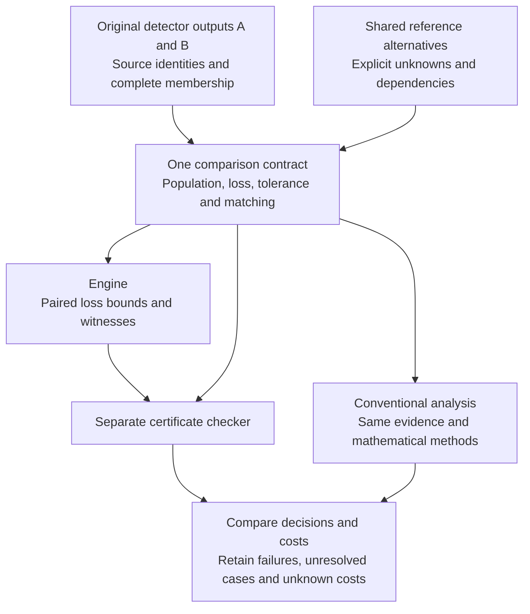
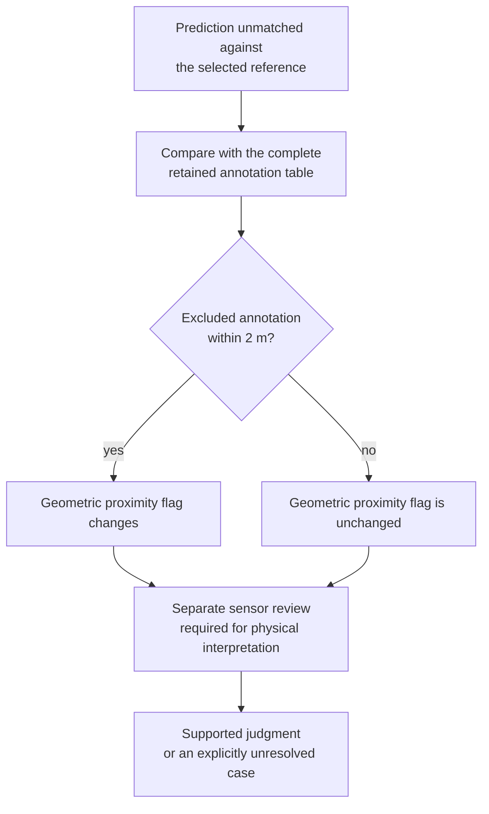
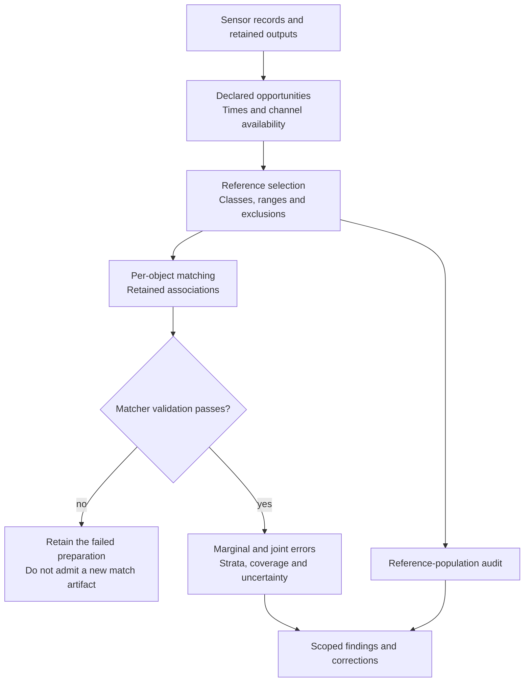
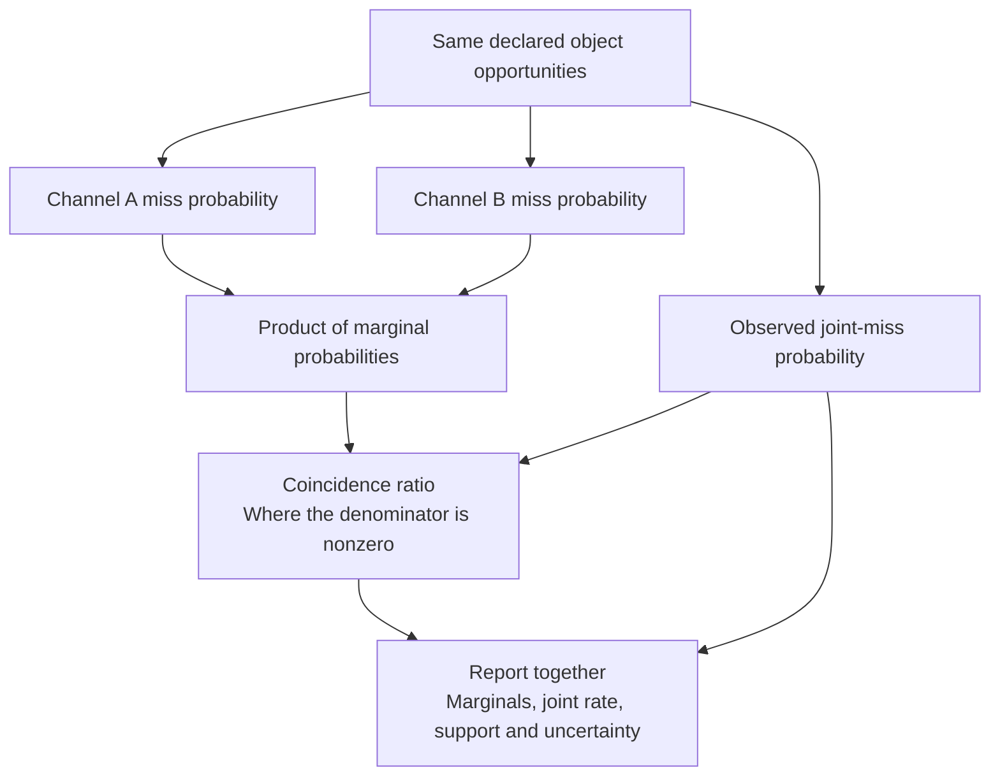
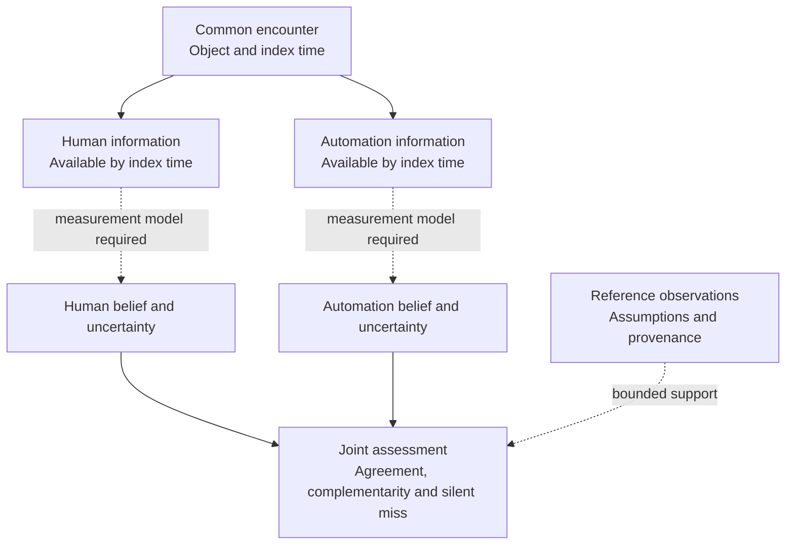
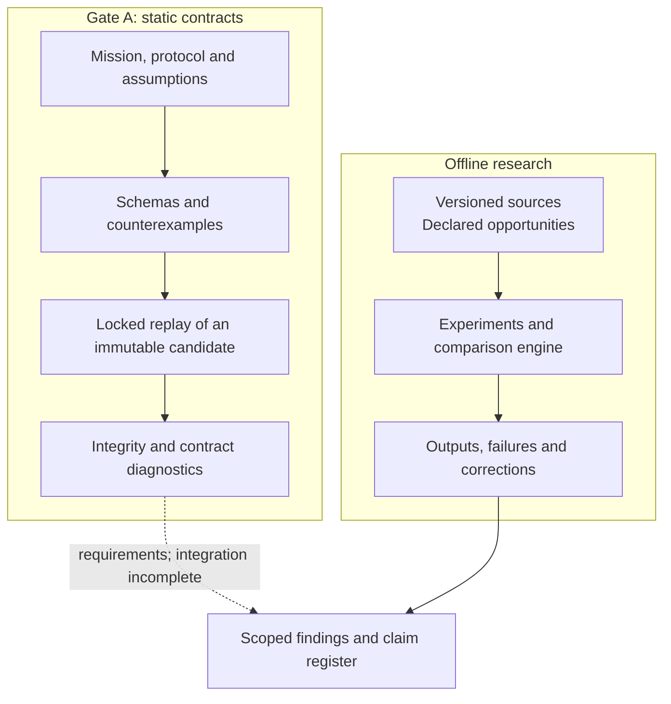

# Reiyah

**Decisions under imperfect evidence.**

Reiyah studies how to justify a change to an autonomous system when the evidence
is incomplete or disputed. Its implemented engine compares perception
configurations against shared reference alternatives and returns checked loss
bounds. It distinguishes an improvement supported by the declared evidence from
one that is excluded or remains unresolved.

The intended user is a perception-validation lead deciding whether a detector
replacement or addition merits further integration work. The research objective
is to reach the same justified decision with less total work, including the cost
of obtaining, reviewing and checking the evidence. **An advantage over competent
conventional analysis remains unproven.**

Perception is the current application within **HARBOR: Human-Automation Readiness,
Belief & Operational Risk**, the proposed wider research program. Its questions
concern what people and automated systems know about the same encounter, when
they miss the same object, and what evidence supports readiness or recovery.
The implemented perception engine and those broader research questions have
different evidence requirements.

[Decision model](#the-decision-model) · [Reference example](#when-the-reference-changes-the-answer) ·
[Results](#current-evidence) · [Run the auditor](#run-the-offline-auditor) ·
[Research program](#one-encounter-distinct-information-sets) · [Technical map](#research-map)

## The decision model

More detections do not necessarily make a better system. An addition can find
an object, introduce a false detection, or change which existing detection gets
matched. A disputed object near the original detector's output can change the
value of the addition even after every object near the added output has been
confirmed.

Reiyah compares both configurations in the same reference world. Each world
specifies one admissible interpretation of the objects and their matching
relationships. Shared uncertainties remain shared across configurations and
scenes where the declared model requires it. Independently choosing favorable
references for the two detectors would answer a different question.

Misses and false positives carry declared nonnegative penalties; both
configurations use the same population weights. For a fixed loss and improvement
threshold `tau`, write:

```text
delta(w) = loss_A(w) - loss_B(w)
lower <= delta(w) <= upper  for every admitted reference world w
```

A checked lower bound above `tau` supports strict improvement. A checked upper
bound at or below `tau` excludes it. Otherwise the comparison remains unresolved.
A loose enclosure alone does not prove that opposing decisions are possible;
that stronger conclusion requires admissible witnesses on both sides. Failed or
unavailable preparations remain recorded separately.



The implementation uses exact arithmetic, maximum one-to-one matching and
separately checked certificates for the supported bound families. It retains
original records, indices and clocks, with traces from a dependency or adverse
interpretation back to its source. These checks establish a conclusion from
specified operands; the quality of those operands remains a measurement question.

The [replacement interface](research/perception-revision/0.1.0/README.md)
accepts independently declared A/B outputs, checks conditional reference-audit
sufficiency and verifies whether a certificate remains applicable after a
revision. Reuse requires checking the earlier premises. The
[worked examples](research/perception-decision-review/0.1.0/README.md) explain
matching competition, cancellation of shared uncertainty and dependencies that
must survive aggregation.

## When the reference changes the answer

A prediction can be unmatched because the evaluator excluded a nearby
annotation. Absence from that filtered reference differs from absence in the
complete annotation table. Neither, by itself, establishes absence from the
physical scene.

The [reference-population audit](docs/RESULT_AO_REFERENCE_POPULATION_AUDIT.md)
makes this distinction concrete. At a score threshold of 0.30, **3,151 camera
flags and 5,728 lidar flags** were within two metres of annotations excluded
from the original reference: **12.90% and 24.03%** of the respective unmatched
flags under that historical, any-class distance predicate. The annotation could concern a different
class or object. This result changes the geometric flag; it does not adjudicate
the detection as physically correct.



The [real-data replay](docs/REFERENCE_AUDIT_REAL_DATA_2026-09-07.md) and
[cache-policy reconstruction](docs/CACHE_SELECTION_AUDIT_2026-09-07.md)
check the calculation and selection policy separately. The prepared
[adjudication study](docs/REFERENCE_ADJUDICATION_STUDY_2026-09-07.md)
contains 240 detections across 93 scenes; independent human judgments remain
unavailable. Preparing an inspection package does not supply those observations.

The distinction also affects the engine's decision. On the retained two-anchor
case, open physical references produce **[-8, 8]**, while supplied benchmark
labels produce **[1, 1]**. The latter is a conclusion conditional on the labels.
It is not a resolution of the former physical uncertainty.

## Measurement before comparison

A comparison needs a defined opportunity population before it can count a miss.
The sensor record, object class, index time, reference selection and matching
policy determine what was eligible to be observed. Changing that population can
change both the numerator and denominator of a reported rate.



An observed empty output, a missing output, an invalid sensor record, an
excluded reference and an unobserved physical object have different meanings.
Unavailable evidence does not become an observed zero. A review must establish
which object, time, class and geometry it actually resolves, and record the
uncertainty that remains.

This is why selecting observations efficiently is only part of the problem.
If two allowed worlds yield the same complete observation transcript but imply
opposing decisions, changing the order of those observations cannot distinguish
them. A different measurement or a justified narrower uncertainty model is
needed. The [observation-contract study](research/observation-contract/0.1.0/README.md)
tests this boundary on the retained timing cases.

## What the joint-error statistic measures

The earlier measurement research asks whether two channels miss the same
reference objects more often than their marginal miss rates would suggest.
For a nonzero marginal product, its coincidence ratio is:

```text
P(A misses and B misses) / [P(A misses) * P(B misses)]
```

The quantities must use the same declared opportunities. Conditional analyses
make the comparison within named strata and retain the support used for
aggregation. The ratio must be read with the absolute joint loss and marginal
rates; it is undefined when the marginal product is zero.



On the audited camera/lidar population, the conditional ratio is **1.151053**,
with a scene-bootstrap percentile interval of **[1.128749, 1.166206]** under
the recorded sampling procedure. This is a descriptive association on a
particular reference population. The interval does not account for every input
error or establish physical error independence, causality or a vehicle safety
rate. The [audit](docs/RESULT_AO_REFERENCE_POPULATION_AUDIT.md) gives the
population, resampling unit, donor rules and sensitivity results.

The [later comparison](docs/FABLE_RAW_CONSUMER_REVIEW_2026-09-13.md)
retains agreement on 270 selected aggregate comparisons. At exactly matched
marginals, the ordering is algebraically the same as intersection and Jaccard
ordering. Claims that wider coefficient margins established stronger evidence
were withdrawn. The [sign correction](docs/FABLE_SIGN_CONSUMER_REVIEW_2026-09-13.md)
also withdraws automatic identification from adding a third detector.
Those corrections remain part of the research record.

## Current evidence

These results summarize retained work through **20 September 2026**. The linked
records contain their complete assumptions, outcomes, failed attempts and costs.
The rows below concern different, sometimes overlapping development studies;
their counts must not be added as independent trials.

The [September 20 research expansion](research/frontier-expansion/0.1.0/README.md)
adds an offline authored clearance contract for ego and lead-vehicle motion.
All 20 cases agree with a separate conventional calculation, retaining six
unresolved, three blocked and one inconsistent-premise case. This establishes
a small checking capability; it is not a driving-performance or safety result.
The [new roadmap](docs/ENGINE_ROADMAP_2026-09-20.md) connects qualified perception,
relational motion, simulation validity and human recovery through staged tests.

The [continuous uncertainty extension](research/continuous-envelope/0.1.0/README.md)
computes tight minimum-clearance ranges with interval observations, a supplied
relative-motion bound and one shared clock offset. Its twenty authored cases
retain five supported, two contradicted, six unresolved, five blocked and two
inconsistent-premise results. Opposing witnesses make the unresolved cases
inspectable; the supplied assumptions still need physical qualification.

| Question | Retained result | Interpretation |
| --- | --- | --- |
| Can reference assumptions change a detector decision? | The two-anchor interval is **[-8, 8]** with open physical references and **[1, 1]** under benchmark labels. | Physical adjudication remains open. [Case](docs/PERCEPTION_ANNOTATION_CASE_2026-09-14.md) |
| Can an audit's sufficiency be checked? | **372 hypothetical confirmed-present labels** attain a checked minimum on one forty-frame case under its deletion model. | This is conditional sufficiency, not measured sequential query cost or reviewer time. [Proof](docs/PERCEPTION_MONOTONE_AUDIT_2026-09-17.md) |
| Which decisions remain unresolved? | All **1,790 unresolved rows** in the 7,707-row operating study have checked opposing worlds; **2,199 rows remain blocked**. | A distinguishing observation or justified change of assumptions is required. [Outcomes](research/operating-timing-witness/0.1.0/OUTCOMES.md) |
| Would complete presence answers resolve timing uncertainty? | All **623 unresolved partial-timing cases** retain opposing decisions with identical complete presence answers and counts. | The construction permits arbitrarily narrow positive-width boxes. It exposes the model's breadth, not the physical shape of cars or ambiguity of every possible transcript. [Study](research/observation-contract/0.1.0/README.md) |
| Has the engine reduced work against strong alternatives? | Conventional methods attain all **99 resolved query floors**; the small certificate-reuse assay is slower than recomputation. | No selection, stopping or complete-cost advantage is established by those studies. [Comparison](research/roadmap-audit/0.1.0/README.md) · [Reuse](docs/PERCEPTION_REVISION_AUDIT_2026-09-16.md) |
| Do adaptive statistical audits help on the retained perception conditions? | None of the tested statistical arms stops earlier than matched exact stopping on the three exposed 64-image conditions. The study retains **11,712 paths** across its authored and perception populations. | Authored errors, unresolved populations and sampled rather than exhaustive checks remain explicit. [Adaptive comparison](research/adaptive-audit/0.1.0/README.md) · [Earlier methods](research/sequential-audit/0.1.0/README.md) |

A conditional proof, a statistical guarantee and a measurement of physical
correctness answer different questions. Checks performed in this development
process are not independent scientific replication. Lower complete validation
cost remains an open hypothesis. All **1,433 outcome-reserved images remain
closed**.

## One encounter, distinct information sets

HARBOR's unit of inquiry is a particular object, encounter and time. A camera
output, a lidar output, a driver's gaze and a takeover action carry different
information. The proposed architecture separates **observation, latent belief,
decision, intervention, outcome and evidence**. Connecting an observation to
belief or readiness requires a validated measurement model.

The diagram describes the research questions and their dependencies. It does
not represent a deployed inference or vehicle-control system.



| Research question | Evidence needed | Present boundary |
| --- | --- | --- |
| Object-level belief | Actor, object, information available at the time, uncertainty and abstention | Static contracts; independent belief measurement remains outstanding. |
| Readiness and recovery | Task requirements, horizon, intervention, recovered state and censoring | Proposed constructs and protocols; no universal readiness score or measured recovery benefit. |
| Joint silent misses | Common opportunities, marginal and joint errors, coverage and strata | Offline detector analyses on declared reference populations. |
| Causal policy effects | Assignment, support, policy versions, outcomes and an identification design | No measured driving-intervention effect. |
| Transfer and worst groups | Declared domains and groups, held-out comparisons, support and missingness | Bounded studies with retained failures; no general transfer guarantee. |

Human-channel studies measure gaze and takeover proxies. Language-model studies
measure error coincidence and monitor transfer on archived answer populations.
Their populations and variables remain distinct from human and vehicle belief
in a shared encounter. The [scientific charter](docs/SCIENTIFIC_CHARTER.md),
[corrected synthesis](docs/GENERAL_SYNTHESIS.md) and
[claim register](evidence/claim-status-register-2026-09-08T054835Z.json)
set out the scope and corrections.

## Evidence architecture and reproducibility

The repository contains static scientific contracts, offline research tools and
retained experiments. Gate A defines versioned contracts, schemas,
counterexamples and locked validation. The research implementation prepares
comparisons, checks certificates and records scoped findings. Their integration
remains incomplete.



Source hashes bind conclusions to particular bytes. They do not establish that
an annotation is true, a population is complete or a conclusion has been
independently reviewed. Passing a checker is evidence about the implemented
contract. **Gate A remains operator-unaccepted**; the repository does not claim
standards compliance or deployment authority.

### Run the offline auditor

From the repository root:

```sh
python3 -B research/perception-decision-review/0.1.0/reproduce.py
```

This reference calculation uses only the Python standard library. It requires
no sensor dataset, model or API key. Its JSON should match the retained
[expected result](research/perception-decision-review/0.1.0/expected.json).
The examples exercise matching ambiguity, shared uncertainty and reference
dependencies.

The [engine guide](research/perception-decision/0.1.0/README.md) explains how
to produce and separately verify a comparison packet; it also requires
`jsonschema`. The [replacement guide](research/perception-revision/0.1.0/README.md)
adds independently declared A/B outputs and conditional audit certificates.

For repository research-consistency checks, use an environment with `numpy`,
`scipy` and `jsonschema`:

```sh
python3 -B tools/measure/gate_b_check.py --json /tmp/reiyah-gate-b-check.json
```

The default check verifies retained transcript identities and consistency. It
does not rerun the historical experiments. The
[replay manifest](validation/gate-b-replay-manifest.json) records their input
and environment requirements. Gate A release validation uses its own locked
launcher and immutable candidate procedure.

## Next research decision

The [current roadmap](docs/ENGINE_ROADMAP_2026-09-20.md) prioritizes qualified
relational motion evidence: which actor, geometry and clock support a declared
behavioral obligation. It extends the requirement for observations that
distinguish consequential reference worlds or legitimately narrow them.
Better ordering of indistinguishable answers cannot supply that information.

A subsequent value test needs a real revision decision: genuine old/new model
artifacts, an owner-defined loss and operating criterion, a qualified review
process and complete measured costs. Reiyah and the strongest applicable
conventional workflow must receive the same evidence and satisfy the same
correctness and resolution obligations. Preparation, reviewer time, retries,
checking, integration and repair all belong in the comparison.

The investment targets remain **threefold fewer expensive observations and
halved complete cost**. They have not been reached. Real team revision histories,
human review costs and an owner-approved release criterion remain missing. The
[workflow brief](research/value-disproof/0.1.0/WORKFLOW_BRIEF.md) identifies those
inputs; it is not evidence of a customer engagement. The roadmap corrects its
historical descriptions where later studies have closed a gap.

## Recent research

The project description and methods above are stable navigation. Dated records
carry the evolving results and their exact scope.

- **20 September 2026:** [Recorded coordinate-export decision](research/compact-motion/0.1.1/README.md). All 4,437 selected ViF-GTAD target records differ between CSV and MAT, by up to 6.63 m under the declared spherical comparison. Both methods reject lossless substitution after one logical reveal; no query advantage or physical clearance claim follows.
- **20 September 2026:** [Physical source qualification](research/physical-source/0.1.0/README.md). Pinned 7V-Scanario metadata supplies a concrete geometry/motion lead. No listed archive fits current limits; physical uncertainty remains unresolved. The retained contract specifies the smallest useful extract.
- **20 September 2026:** [Continuous clearance and distinguishing observations](research/continuous-envelope/0.1.0/README.md). Exact conditional ranges agree with a separate conventional calculation. Six authored ambiguities retain opposing trajectories; the failed control and corrected freeze remain available.
- **20 September 2026:** [Public vehicle-pair qualification](research/public-motion/0.1.0/README.md). Eight fixed NGSIM windows support their sampled longitudinal-proxy statements; all eight physical continuous-clearance claims remain unresolved. The separate conventional calculation agrees.
- **20 September 2026:** [Presence/count answers and timing uncertainty](research/observation-contract/0.1.0/README.md). Opposing decisions can share the same complete presence transcript under the retained optional-box model.
- **19 September 2026:** [Adaptive audit comparison](research/adaptive-audit/0.1.0/README.md). Tested betting methods do not improve query counts on the selected perception conditions.
- **19 September 2026:** [Sequential audit methods](research/sequential-audit/0.1.0/README.md). Exact checks on authored populations distinguish method validity from practical value.

The [earlier research narrative](docs/README_RESEARCH_HISTORY_2026-09-19.md)
retains the complete pre-reorganization README, including the historical
research-lane arrangement. The [handoff](docs/SESSION_HANDOFF.md) carries
current continuation instructions. Neither a new date nor a new test count
changes the scope of an earlier result.

## Research map

| Read for | Start here |
| --- | --- |
| Engine model and mathematics | [Architecture](docs/PERCEPTION_DECISION_ARCHITECTURE_2026-09-09.md) · [Replacement interface](research/perception-revision/0.1.0/README.md) |
| Current direction and evidence | [Roadmap](docs/ENGINE_ROADMAP_2026-09-20.md) · [Execution audit](research/roadmap-audit/0.1.0/README.md) · [Primary-method review](research/roadmap-audit/0.1.0/FRONTIER.md) |
| Relational motion research | [Clearance contract](research/frontier-expansion/0.1.0/README.md) · [Current primary research](research/frontier-expansion/0.1.0/SOURCES.md) · [Earlier source scope](research/frontier-expansion/0.1.0/qualification.json) · [NGSIM source adapter](research/public-motion/0.1.0/README.md) |
| Physical measurement contract | [Source qualification](research/physical-source/0.1.0/README.md) · [Geometry, motion and coverage](research/physical-source/0.1.0/CONTRACT.md) |
| Recorded input-admission decision | [ViF-GTAD export comparison](research/compact-motion/0.1.1/README.md) · [Frozen question and baseline](research/compact-motion/0.1.1/DECISION_PLAN.md) |
| Wider scientific program | [Charter](docs/SCIENTIFIC_CHARTER.md) · [Mathematical specification](docs/MATHEMATICAL_SPECIFICATION.md) · [Corrected synthesis](docs/GENERAL_SYNTHESIS.md) |
| Reference validity and review | [Population audit](docs/RESULT_AO_REFERENCE_POPULATION_AUDIT.md) · [Adjudication study](docs/REFERENCE_ADJUDICATION_STUDY_2026-09-07.md) · [Threats to validity](docs/MEASUREMENT_THREATS_TO_VALIDITY.md) |
| Corrections and prior results | [Claim register](evidence/claim-status-register-2026-09-08T054835Z.json) · [Sign correction](docs/FABLE_SIGN_CONSUMER_REVIEW_2026-09-13.md) · [Retained history](docs/README_RESEARCH_HISTORY_2026-09-19.md) |
| Contracts, sources and terms | [Gate A architecture](docs/ARCHITECTURE.md) · [Source policy](docs/SOURCE_POLICY.md) · [Public-data custody](docs/PUBLIC_DATA_CUSTODY_2026-09-06.md) · [Standards crosswalk](docs/STANDARDS_CROSSWALK.md) |
| Product hypothesis and contribution | [Intended users and proof milestones](docs/PRODUCT_AND_FUNDING_THESIS_2026-09-14.md) · [Contributing](CONTRIBUTING.md) · [Security](SECURITY.md) |

## Author, license and citation

Created and maintained by **Daniel Wahnich**.

Reiyah-authored code and documentation are distributed under [Apache-2.0](LICENSE).
Third-party materials retain their own terms; see [NOTICE](NOTICE).
Use [CITATION.cff](CITATION.cff) and cite the exact result or artifact reviewed.
