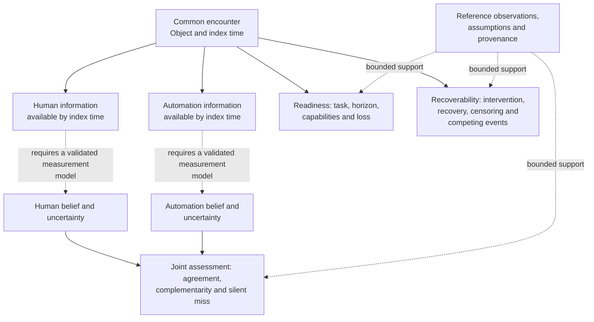
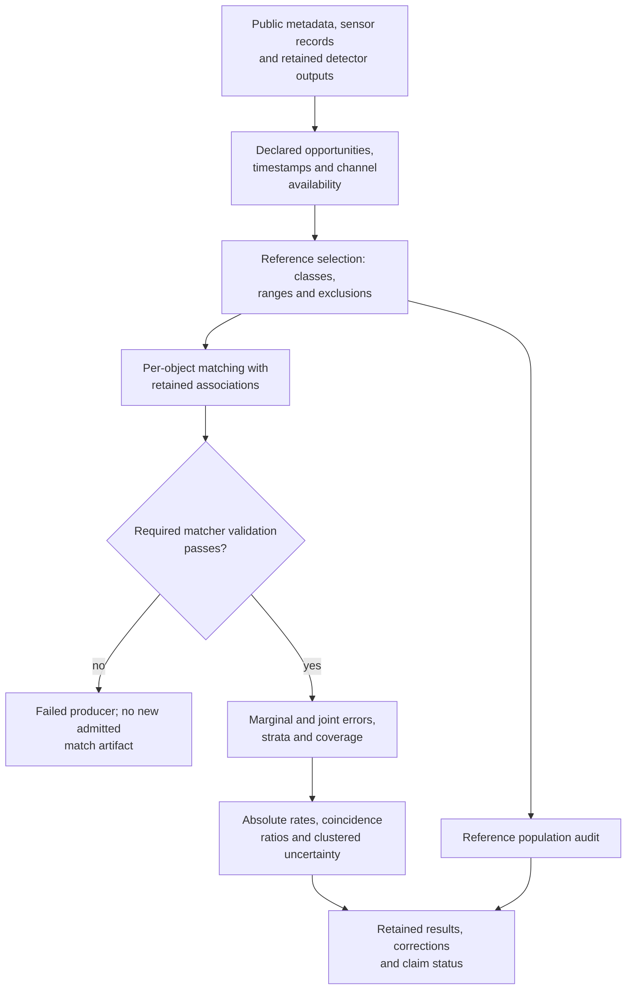
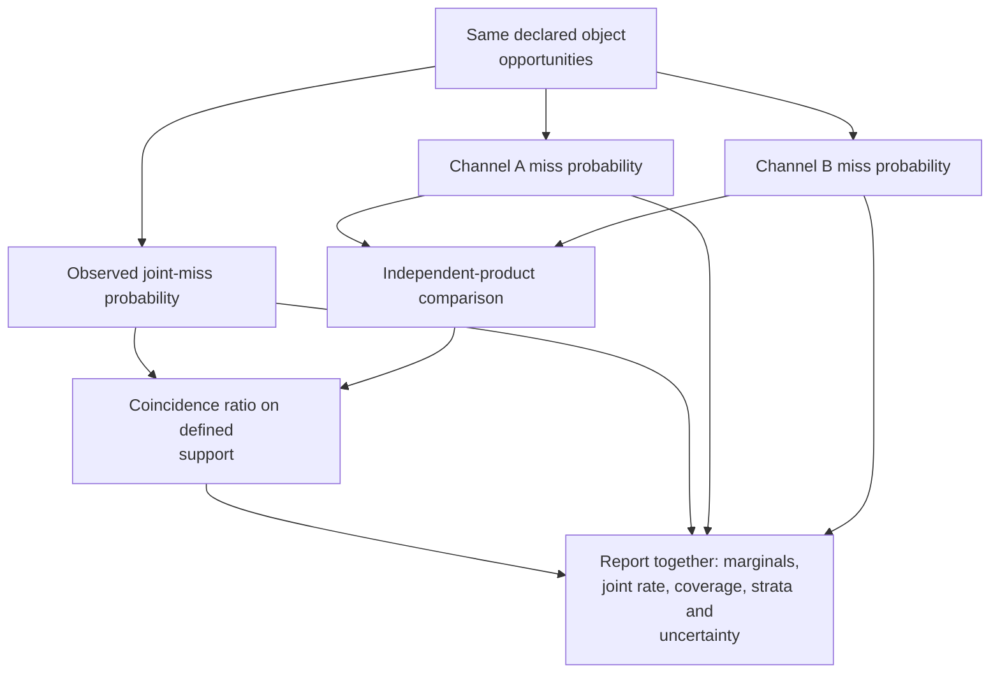
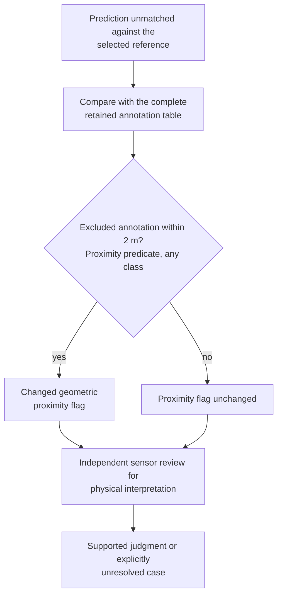
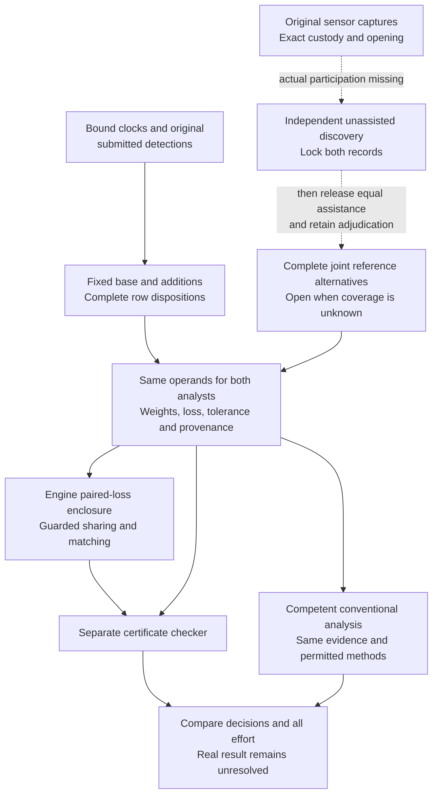
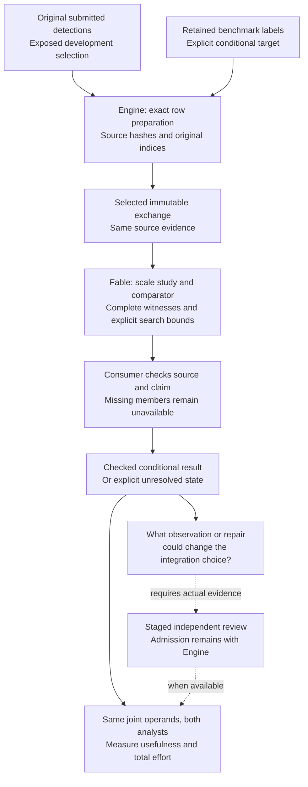
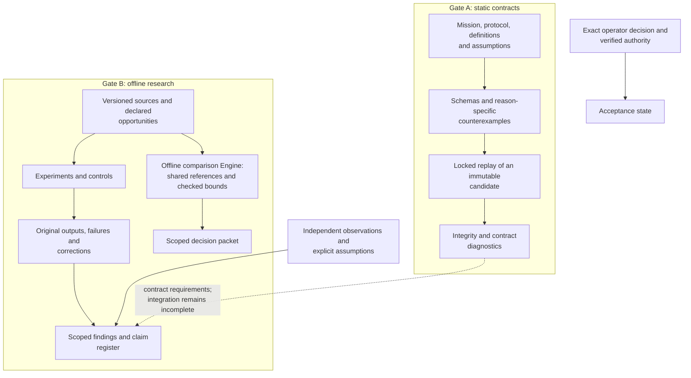

# Reiyah

**Building decision assurance for changing autonomous systems under imperfect evidence.**

Reiyah is being built to help a team justify a system change: what the evidence supports,
which assumptions remain open, what should be checked next, and what earlier work remains valid
after another revision. Perception is the first application. The intended product is dependable
decision infrastructure for AI and robotics engineering teams.

Read the [product and funding thesis](docs/PRODUCT_AND_FUNDING_THESIS_2026-09-14.md) for the
intended customer, technical research direction, current demonstration and next proof milestones.
The implementation today is an offline research Engine for perception decisions under uncertain
reference evidence.

Does an added detector improve a perception configuration once missed objects, false detections
and disputed reference interpretations are counted together? Reiyah computes bounds on that
comparison, using the same opportunities and reference interpretation for both configurations.
When the evidence cannot settle the choice, the result remains unresolved.

The current Engine binds source outputs and clocks, preserves shared reference alternatives,
computes paired-loss enclosures with exact arithmetic and checks matching certificates. Raw-window,
nominal geometry and restricted observation packages prepare physical review. The intended user
is a perception-validation lead deciding whether an added detector merits further integration work.

As checked on **14 September 2026**, a [new automated replay](docs/PERCEPTION_ANNOTATION_CASE_2026-09-14.md)
on the two existing development anchors gives **[1,1]**, conditional on the retained benchmark
labels and Reiyah's fixed rules. Weighted loss falls from 23.5 to 22.5; one anchor improves and
the other worsens. The original comparison with open physical references still gives **[-8,8]**.
No qualifying human reference judgments have been admitted. An independently demonstrated
integration benefit or advantage over competent conventional analysis remains unproven.

The [annotation adapter](research/perception-annotations/0.1.0/README.md) provides an executable
development route without new reviewer input. It preserves exact label/source identity and
uses the existing joint-reference compiler and maximum-matching checks. This is a retrospective
calculation under declared label assumptions, not an official nuScenes score or physical validation.

The [next case preparation](docs/PERCEPTION_CASE_PORTABILITY_2026-09-14.md) uses existing Engine
interfaces on 14 further exposed frames: 4,228 source rows, 588 retained base detections and 94
additions. Separate source accounting agrees, and the original case reproduces exactly. This
checks preparation reuse. The [completed second comparison](docs/PERCEPTION_SECOND_CASE_2026-09-14.md)
now uses 737 included benchmark labels and gives a weighted improvement of **2/7** at tolerance
1/10: seven frames improve, six worsen and one is unchanged. Exact source and geometry checks
pass, and existing Fable code agrees in a compatibility replay. These additional frames come
from the same two scenes and do not constitute independent scene validation.

The [dependency trace](docs/PERCEPTION_DEPENDENCY_TRACE_2026-09-14.md) now opens the original
records behind six individual first-case witnesses and two joint second-case witnesses. Both
two-label groups reduce the second result from 2/7 to zero. The command preserves the group,
original annotation and detector indices, exact capture bytes, camera timing offsets and missing
captures. It supplies an inspectable conditional argument; label truth and measured workflow
value remain open. The core comparison and common formats are unchanged.

The [15 September continuation](docs/DECISION_ASSURANCE_2026-09-15.md) checks a forty-frame
case from an additional development scene: 2,299 references, 2,007 base detections and 738
additions. Its improvement falls from **2.55 to 0.10** after a checked joint deletion of 49
annotation records, exactly at the decision threshold. The minimum follows from a lower bound
and a matching witness. Original source records and nominal preparation are checked; no label
error or physical safety result is inferred. The 49 records span eleven dataset instance IDs.

Fable's corrected final census reports all 1,127 supported units at their arithmetic floors,
with 1,873 unsupported baselines among 3,000 declared units. The Engine has source-checked the
complete delivered case, not every census witness. The corrected counterexample still proves
that above-floor minima are possible. The [earlier failure and correction request](docs/PERCEPTION_SCALE_CONSUMER_2026-09-15.md)
remain available. The next experiment compares bounded evidence reuse with full recomputation
and a competent cached procedure; its advantage and total-effort savings remain unmeasured.

The [prediction checkpoint](docs/PERCEPTION_PREDICTIONS_2026-09-13.md) prepares all **4,876 original
prediction rows across 16 exposed development keyframes** without reading annotation-bearing
inputs during extraction. Original bytes, duplicate rows and zero-based source indices survive.
A separately written source reader agrees on every selected row. This provides inputs for
association research; it supplies no physical correspondences or human references.

The [reviewed-operand stage](research/perception-reviewed-operands/0.1.0/README.md) preserves
joint interpretations and complete provenance for both analysts. [Reference sharing and its
conformance checks](docs/PERCEPTION_PARTITION_CONFORMANCE_2026-09-13.md) reduce unnecessary
compiler expansion while preserving original worlds and matching competition. These are
engineering checks on declared models.

The [assisted inspection](docs/PERCEPTION_ASSISTED_INSPECTION_2026-09-14.md) now has an actual
saved selection accompanied by user-supplied screenshots and a reported click. The Engine
recovers one original point index and verifies all 34,720 capture records unchanged. A separate
reader checks the selected record directly against the raw capture. This establishes an
assisted selection trace; it supplies no object judgment or admitted reference.

The procedure required repeated guidance, a Desktop save fallback and recovery of an exact
original from Blender's backup after its opening path was saved over. Active human effort and
operator independence were not measured. The revised coordinator procedure opens a working
copy and handles file custody; its simpler save route still needs an actual usability check.
The [earlier inspection check](docs/PERCEPTION_INSPECTION_2026-09-14.md), including its missing
required argument and programmatic controls, remains historical evidence. The native screen
control service remains unavailable; launching Blender and guiding from supplied screenshots
worked in this assisted exercise.

HARBOR is the proposed research program: **Human-Automation Readiness, Belief & Operational
Risk**. Its broader scope connects object-level belief, readiness, recoverability, joint silent
misses, causal policy effects, explicit unknowns, transfer and worst-group evaluation. Retained
measurement and reference-audit research motivates the current focus. Human belief, recovery
under intervention and cross-domain product value require their own observations.

[Engine architecture and mathematics](docs/PERCEPTION_DECISION_ARCHITECTURE_2026-09-09.md) ·
[Current state and roadmap](docs/ENGINE_ROADMAP_2026-09-13.md) ·
[Research findings](docs/GENERAL_SYNTHESIS.md) · [Proposed study](#current-engine-development) ·
[Run the auditor](#run-the-offline-auditor)

## One encounter, distinct information sets

The unit of inquiry is a particular object, encounter and time. A camera output, a lidar
output, a driver's gaze and a takeover action carry different information. Reiyah's architecture
keeps **observation, latent belief, decision, intervention, outcome and evidence** separate.
An observation can support an inference only under an explicit measurement model.



This diagram describes the research architecture. Gaze and takeover proxies do not by
themselves establish a person's object-level belief. The current measurement program addresses
parts of this architecture; it does not implement a driving controller or validated belief tracker.

## The measurement research it builds on

The engine makes the opportunity population explicit before counting failures. Matching is
conditional on a declared reference, sensor validity and evaluation policy. Empty output,
missing output, excluded references and an unobserved physical object have different meanings.



The [matcher](tools/measure/match.py) retains per-object associations that aggregate benchmark
scores omit. The [reference audit](tools/measure/result_ao_reference_population_audit.py)
reconstructs the consequences of changing reference coverage. The
[research checker](tools/measure/gate_b_check.py) verifies retained identities and consistency;
when replay is requested, successful process exit and the expected transcript are both required.

| Research surface | What is represented | Current evidence boundary |
|---|---|---|
| Object-level belief | Actor, object, information set, state space, uncertainty and abstention | Static contracts; independent belief measurement remains outstanding |
| Readiness | Task, context, horizon, capability requirements and loss | Proposed construct; no universal readiness score |
| Recoverability | Intervention or request, recovered state, censoring and competing events | Event and causal contracts; recovery benefit has not been established |
| Joint failures | Common opportunities, marginal errors, joint errors, conditions and intervals | Implemented offline detector analyses on declared benchmark populations |
| Reference validity | Included and excluded annotations, proximity witnesses and unresolved cases | Implemented audits; physical adjudication is a separate observation |
| Causal policy effects | Versioned policies, assignment, propensities, support and estimands | Contracts and experiment designs; no measured driving intervention effect |
| Transfer and worst groups | Domain boundaries, subgroup support, held-out comparisons and uncertainty | Bounded experiments, including retained transfer failures |
| Explicit unknowns | Missing, unmeasured, sensor-invalid, out-of-distribution and abstained states | Distinct states and denominators; unavailable labels must not become observed zeros |

## What the joint-error statistic measures

For two reference-relative miss indicators with a nonzero marginal product, the coincidence ratio
compares observed joint miss probability with that product. Conditional analyses
make that comparison within declared strata and retain the support used for aggregation.
A ratio alone is insufficient: its meaning changes with the marginal error rates.



The [Result AO reanalysis](docs/RESULT_AO_REFERENCE_POPULATION_AUDIT.md) retains a conditional
camera/lidar ratio of **1.151053**, with whole-scene bootstrap interval
**[1.128749, 1.166206]**. The original deepest-stratum support contains 131,722 of 134,565
reference rows across 150 scenes. The interval describes resampling uncertainty on that
population; it does not cover reference errors or establish a causal sensing mechanism.

Earlier experiments investigate detector choice, thresholds, marginal-rate effects and
unmeasured difficulty. Their current interpretation is collected in the
[corrected synthesis](docs/GENERAL_SYNTHESIS.md) and
[claim register](evidence/claim-status-register-2026-09-08T054835Z.json).
The [RSS estimand analysis](docs/ESTIMAND_RSS_DEFINITION_32.md) states the additional conditions
needed to connect a benchmark statistic to that safety argument. This two-channel measurement
has not established those conditions or a vehicle safety rate.

The separate research lane has since tested whether a dependence coefficient adds useful
ordering information over ordinary overlap. The [Engine consumer review](docs/FABLE_RAW_CONSUMER_REVIEW_2026-09-13.md)
retains **270/270 agreement** on the selected aggregate comparisons. Under exactly matched
marginals, the ordering is algebraically the same as intersection and Jaccard ordering.
Comparing wider coefficient margins across different actual marginals did not establish stronger
evidence; that interpretation is withdrawn. Earlier claims about worsening dependence across
operating points also remain corrected, with their original records preserved.

Fable's raw-submission experiment leaves the dependence sign unresolved on its selected
preparations. The [latest correction review](docs/FABLE_SIGN_CONSUMER_REVIEW_2026-09-13.md)
checks 18 aggregate thresholds, 2,401 small-table sign classifications and the default rejection
of substituted source bytes. Adding a third detector does **not** guarantee identification;
Fable has withdrawn that claim. Its raw-report helper still needs to use the corrected sign
contract. The 14.025× spread varies score, radius and rule together; radius-only spans at fixed
score and rule are 2.627×–4.133×. These conditional research results do not replace paired
detector loss or establish physical associations. No per-row coordinate or timing error bounds
are supplied by the Engine's original-row packet.

## A reference error the engine can expose

A prediction can be unmatched because the evaluator excluded a nearby annotation. That is a
detectable measurement issue; it does not settle whether the prediction is physically correct.



At score threshold 0.30, Result AO finds **3,151 of 24,432 camera flags** and
**5,728 of 23,840 lidar flags** within two meters of annotations excluded from the original
reference cache. This predicate uses distance <=2 m and can include another class. It does not
establish an eligible same-class, one-to-one match under the Engine's strict <2 m rule or a
physically correct detection. The [real-data replay](docs/REFERENCE_AUDIT_REAL_DATA_2026-09-07.md)
and [cache-policy reconstruction](docs/CACHE_SELECTION_AUDIT_2026-09-07.md) check the calculation
and selection policy separately.

The [reference study](docs/REFERENCE_ADJUDICATION_STUDY_2026-09-07.md) prepares a frozen sample
of **240 detections across 93 scenes**, with original sensor evidence and explicit unresolved
states. Independent human judgments remain unavailable, so physical-performance estimates
remain unestablished. The instrument is prepared; the missing observations remain visible.

## Current engine development

The selected comparison preserves the existing lidar detector's outputs and adds retained camera
detections under a fixed suppression rule. The Engine evaluates both configurations against
each shared reference interpretation, including disputed objects that can change competing
matches through the base detector. Misses and false detections both contribute to the loss.



For r retained additions at one anchor and nonnegative miss/false-detection penalties a and b,
the base-minus-augmented loss difference lies in **[-b r, a r]** before tighter reference evidence is available.
With observed required outputs and a consistent model, no additions gives exactly zero.
Missing required outputs or inconsistent assumptions leave the comparison unevaluated.
Restricted, explicitly shared reference models can narrow this
enclosure. This conventional count-loss identity does not establish crash-risk reduction, causal
benefit or physical-reference completeness. The
[architecture](docs/PERCEPTION_DECISION_ARCHITECTURE_2026-09-09.md) specifies the estimand,
matching counterexample, decision rules and limits.

For common nonnegative anchor weights summing to one, replace r by the weighted addition count
R. The two development anchors retain 9 and 7 additions with weights 1/2, so R=8. All extrema use
one shared interpretation across configurations and any coupled anchors. Independent optimization
of their separate losses can discard useful information.

The checker verifies matching and equal-size vertex-cover witnesses without calling the producer's
matcher. Both share input parsing, schema validation and rational conventions; physical graph
coverage remains a separate premise. Complete finite enumeration is capped at 4,096 raw Boolean
assignments and 2,000,000 estimated work units. Above that limit, the Engine can retain a count
bound if model consistency has a checked witness; otherwise the decision stays unevaluated.
These limits are explicit computational controls, not demonstrated large-scale performance.

Neutral identifiers do not guarantee anonymity or blindness. Independent discoveries must be
preserved before assistance is revealed. The [public synthetic examples](research/perception-decision-review/0.1.0/README.md)
show why confirming every candidate object need not resolve the comparison: an uncertain object
near a base detection can still change which matches are possible.

The implemented pieces form one offline comparison pipeline:

| Checkpoint | Retained result |
|---|---|
| [Decision core](docs/PERCEPTION_DECISION_CHECKPOINT_2026-09-09.md) | Exact loss bounds, maximum-matching certificates, a separate checker and an atomic packet |
| [Source inputs](docs/PERCEPTION_INPUT_CHECKPOINT_2026-09-09.md) | All 6,019 validation clock anchors retained; 2,935 meet the recorded context and prior-exposure exclusion rule |
| [Joint reference compiler](docs/PERCEPTION_REFERENCE_CHECKPOINT_2026-09-09.md) | Shared presence, identity, class, geometry and time alternatives; open-reference fallback when coverage is unknown |
| [Raw windows](docs/PERCEPTION_WINDOW_CHECKPOINT_2026-09-09.md) | Two existing development windows contain 566 decoded camera images and 159 lidar files, with timestamp gaps retained |
| [Spatial and time operands](docs/PERCEPTION_GEOMETRY_CHECKPOINT_2026-09-09.md) | Nominal transforms for the same 725 captures; 723 differ from their anchor timestamp, with no object-motion imputation |
| [Raw observation disclosure](docs/PERCEPTION_OBSERVATION_CHECKPOINT_2026-09-09.md) | All 725 captures packaged with neutral IDs and a separate custody map; raw bytes, relative times and unavailable states are checked before review |
| [Discovery record custody](docs/PERCEPTION_DISCOVERY_CHECKPOINT_2026-09-09.md) | Exact package binding, explicit inspection states and immutable submitted records; draft generation supplies no human judgment |
| [Comparison/observation binding](docs/PERCEPTION_BINDING_CHECKPOINT_2026-09-10.md) | Exact anchor/sample/scene/time correspondence and delivered images/point bodies checked against the retained inventory; physical review remains outstanding |
| [Reviewed-source admission](docs/PERCEPTION_ADMISSION_CHECKPOINT_2026-09-10.md) | Exact staged review contents and complete proposal accounting preserve shared interpretations; synthetic finite/open comparisons and forged-record rejections are checked |
| [Development review preparation](docs/PERCEPTION_REHEARSAL_CHECKPOINT_2026-09-10.md) | Separate unassigned discovery folders, neutral capture navigation and equal analyst/effort instructions; actual human workflow remains outstanding |
| [Common assistance preparation](docs/PERCEPTION_ASSISTANCE_CHECKPOINT_2026-09-10.md) | Complete source assistance for 16 development keyframes, with 960 annotations and 4,876 predictions; identical private preparations, no assisted disclosure or physical judgments |
| [Equal analysis operands](docs/PERCEPTION_OPERANDS_CHECKPOINT_2026-09-11.md) | Every comparison row and suppression disposition mapped to the same assistance for both analysts; identical private preparations and separate conventional accounting; physical references remain open |
| [Reviewed joint operands](docs/PERCEPTION_REVIEWED_OPERANDS_CHECKPOINT_2026-09-12.md) | Both analysts receive the same complete admitted model on synthetic conformance cases; no real reference admission |
| [Viewer and anchor custody](docs/PERCEPTION_ANCHOR_OPENING_2026-09-13.md) | Original point indices, exact anchor capture and saved-selection checks; actual interaction remains missing |
| [Reference sharing and identity](docs/PERCEPTION_REFERENCE_EQUIVALENCE_2026-09-13.md) | Member-aware sharing preserves world-local sources and matching; earlier fallbacks and resource bounds remain explicit |
| [Partition conformance](docs/PERCEPTION_PARTITION_CONFORMANCE_2026-09-13.md) | 5,400 tiny original-world cases, including competing matches, agree with direct partial-injection calculations |
| [Effort accounting](docs/ENGINE_EFFORT_ACCOUNTING_2026-09-13.md) | Command durations, overlapping intervals and copied receipts distinguished; human effort remains unmeasured |
| [Real comparison refresh](docs/ENGINE_WINDOW_CHECKPOINT_2026-09-13.md) | Original [-8,8] packet reproduced byte for byte, forged decisions rejected and all 648 comparison source-row dispositions rechecked |
| [Prediction-only inputs](docs/PERCEPTION_PREDICTIONS_2026-09-13.md) | Exact original arrays and record indices for 4,876 predictions; annotation reads blocked during extraction and separate conventional retrieval agrees |
| [Annotation-conditional replay](docs/PERCEPTION_ANNOTATION_CASE_2026-09-14.md) | All 119 source labels at the two anchors accounted for; 106 included; fixed paired loss [1,1] with literal row custody and checked matching |

The proposed study selects **60 scenes**, then one eligible anchor per scene, only after the
input, method, reviewer, comparator and adjudication freeze. Two independent reviewers first
inspect raw evidence without detector hints. A competent independent conventional analyst gets
the same staged evidence and may compute the same bounds. Reviewers, comparator and adjudication
remain prerequisites; **no prospective cohort or seed has been selected**. The two exposed
development anchors remain unresolved at [-8,8] under unit penalties and open reference coverage.

The [shared/disjoint training design](docs/TRAINING_OVERLAP_NEXT_EXPERIMENT_2026-09-07.md)
remains an unexecuted research route, with retained
[inventory](docs/TRAINING_INPUT_FINDINGS_2026-09-07.md),
[partition](docs/TRAINING_PARTITION_CHECKPOINT_2026-09-07.md),
[model-input](docs/MODEL_INPUT_CHECKPOINT_2026-09-07.md) and
[cache](docs/TRAINING_CACHE_CHECKPOINT_2026-09-08.md) preparation. It is not the selected next study.

The [predictive monitor experiment](docs/PREDICTIVE_MONITOR_FINDINGS_2026-09-07.md) remains
part of the record: its future-count improvement under collection-log holdouts was 2.7020%,
with a descriptive interval including zero; spatial continuity slightly worsened the primary
loss. Neither passed the declared usefulness screen.

## The next decision, and who owns it

Engine owns common inputs, admission, custody, viewing and main integration. Fable owns the
independent research, comparator, association experiments and checkers on its separate research
ref. Selected immutable exchanges connect the lanes; a mutable branch tip or a chat verdict is
insufficient evidence. The [dated roadmap](docs/ENGINE_ROADMAP_2026-09-13.md) gives the next
falsifier for each gap and the boundary between implemented work and proposed research.



This research exchange does not release detector hints to discovery reviewers. Both independent
unassisted records must still be locked before assistance is released.

The current automated comparison uses the declared benchmark target while physical review stays
separate. Fable owns its declared scale study and the reproduced search/state corrections.
The next Engine input is one exact pilot comparison with its complete deletion witness and
source identities, preserving hypothetical edits as distinct from actual observations.

The first product proof is a useful engineering choice against a competent analyst using the
same evidence, mathematics and abstention, with preparation, verification, review, computation,
integration and repair counted. More architecture or a different scalar does not establish that
advantage. Source fidelity, useful abstention or a simpler review procedure may earn it. A fresh
blind validation, crossed sensor/training study or broader HARBOR claim requires its own inputs,
protocol and evidence; none has run through this checkpoint.

## Evidence architecture and reproducibility

Gate A supplies versioned scientific contracts, schemas, counterexamples and locked offline
validation. Gate B supplies empirical research tools, the offline decision Engine and retained
measurements. Their integration is incomplete, and an empirical result does not silently amend
an accepted contract. The [Gate A architecture](docs/ARCHITECTURE.md) documents that static
packet; the [selected Engine architecture](docs/PERCEPTION_DECISION_ARCHITECTURE_2026-09-09.md)
and implementation checkpoints describe current development.



Gate A remains **operator-unaccepted**. Passing checks establish their tested scope; they do not
create scientific validation, standards compliance, safety approval or deployment authority.
The [architecture handoff](docs/SESSION_HANDOFF.md) and its referenced validation plans govern
exact Gate A release replay. This README is research navigation, not a new Gate A release packet.

Original results, failed producers, null findings, corrections and retractions remain
discoverable. Public Git contains Reiyah code, documentation and permitted aggregate evidence.
Source-derived datasets, weights and review materials retain their own access and redistribution
terms. A matching digest establishes identity; physical correctness needs appropriate observations.

### Run the offline auditor

Start with the [current paired-decision examples](research/perception-decision-review/0.1.0/README.md).
Their independent reference calculation needs only the Python standard library:

```sh
python3 -B research/perception-decision-review/0.1.0/reproduce.py
```

The [Engine guide](research/perception-decision/0.1.0/README.md) gives commands to produce and
separately verify a hash-bound packet. It requires `jsonschema`, but no sensor dataset, model
or API key. The earlier [reference-proximity demo](docs/REFERENCE_AUDIT_DEMO_2026-09-07.md) and
[real-data replay](docs/REFERENCE_AUDIT_REAL_DATA_2026-09-07.md) remain a different calculation;
they do not implement the Engine's paired matching loss.

For research consistency checks, use an environment with `numpy`, `scipy` and `jsonschema`:

```sh
python -B tools/measure/gate_b_check.py --json /tmp/reiyah-gate-b-check.json
python -B -m unittest discover -s tools/measure -p test_research_board_regressions.py -v
```

The default checker verifies retained transcript digests without rerunning the historical
experiments. Replay classes and their requirements are declared in the
[replay manifest](validation/gate-b-replay-manifest.json). Gate A release validation uses its
own exact locked launcher and immutable projection; these research commands are development
checks. Dataset-dependent numerical reproduction requires the recorded input and environment
identities.

## Research map

| Read for | Start here |
|---|---|
| Current Engine direction and implementation | [Dated roadmap](docs/ENGINE_ROADMAP_2026-09-13.md), [latest checkpoint](docs/PERCEPTION_ANNOTATION_CASE_2026-09-14.md), [current continuation](docs/SESSION_HANDOFF.md), [decision interface](research/perception-decision/0.1.0/README.md) |
| Independent research and its corrections | [Current sign/custody consumer review](docs/FABLE_SIGN_CONSUMER_REVIEW_2026-09-13.md), [earlier raw/overlap review](docs/FABLE_RAW_CONSUMER_REVIEW_2026-09-13.md); exact research commits and scope remain separate from main integration |
| Present evidence, limits and comparison with prior work | [11 September review](docs/ENGINE_CREDIBILITY_REVIEW_2026-09-11.md), [reproducible decision examples](research/perception-decision-review/0.1.0/README.md) |
| Mission and scientific structure | [Scientific charter](docs/SCIENTIFIC_CHARTER.md), [architecture](docs/ARCHITECTURE.md), [mathematical specification](docs/MATHEMATICAL_SPECIFICATION.md) |
| Current interpretation of sensor, human-proxy and LLM experiments | [Corrected synthesis](docs/GENERAL_SYNTHESIS.md), [current claim register](evidence/claim-status-register-2026-09-08T054835Z.json) |
| Selected study and earlier investigations | [60-scene study design](docs/PERCEPTION_DECISION_ARCHITECTURE_2026-09-09.md#one-prospective-study), [research-board report](docs/RESEARCH_BOARD_2026-09-07.md), [earlier training design](docs/TRAINING_OVERLAP_NEXT_EXPERIMENT_2026-09-07.md) |
| Reference validity and physical adjudication | [Result AO](docs/RESULT_AO_REFERENCE_POPULATION_AUDIT.md), [reference study](docs/REFERENCE_ADJUDICATION_STUDY_2026-09-07.md), [portable auditor](docs/REFERENCE_AUDIT_DEMO_2026-09-07.md) |
| Temporal and observational limits | [Monitor findings](docs/PREDICTIVE_MONITOR_FINDINGS_2026-09-07.md), [threats to validity](docs/MEASUREMENT_THREATS_TO_VALIDITY.md) |
| Retained mathematical corrections | [Reference-noise interpretation](docs/REFERENCE_NOISE_INTERPRETATION_2026-09-07.md), [M4 bound audit](docs/M4_RECTANGULAR_BOUND_FINDINGS_2026-09-07.md) |
| Measurement history and continuation | [Gate B contract](docs/GATE_B_MEASUREMENT_CONTRACT.md), [Gate B handoff](docs/GATE_B_SESSION_HANDOFF.md) |
| Source custody and standards scope | [Source policy](docs/SOURCE_POLICY.md), [standards crosswalk](docs/STANDARDS_CROSSWALK.md), [public-data custody](docs/PUBLIC_DATA_CUSTODY_2026-09-06.md) |
| Repository contribution and disclosure | [Repository contract](AGENTS.md), [contribution guide](CONTRIBUTING.md), [security policy](SECURITY.md) |

Historical human-channel studies measure gaze and takeover proxies. LLM experiments investigate
error coincidence and monitor transfer on archived answer populations, including failed benchmark
transfer. These remain separately scoped lines of research; they do not establish a universal
independence law or substitute for measurements of human and vehicle belief on the same encounter.

## Author, license and citation

**Created and maintained by Daniel Wahnich.**

Reiyah-authored code and documentation are distributed under [Apache-2.0](LICENSE).
Third-party materials retain their own terms; see [NOTICE](NOTICE). Use
[CITATION.cff](CITATION.cff) and cite the exact result or artifact identity reviewed.
The configured GitHub repository distributes the work; publisher readback is an assertion,
not independent scientific or transport verification.
