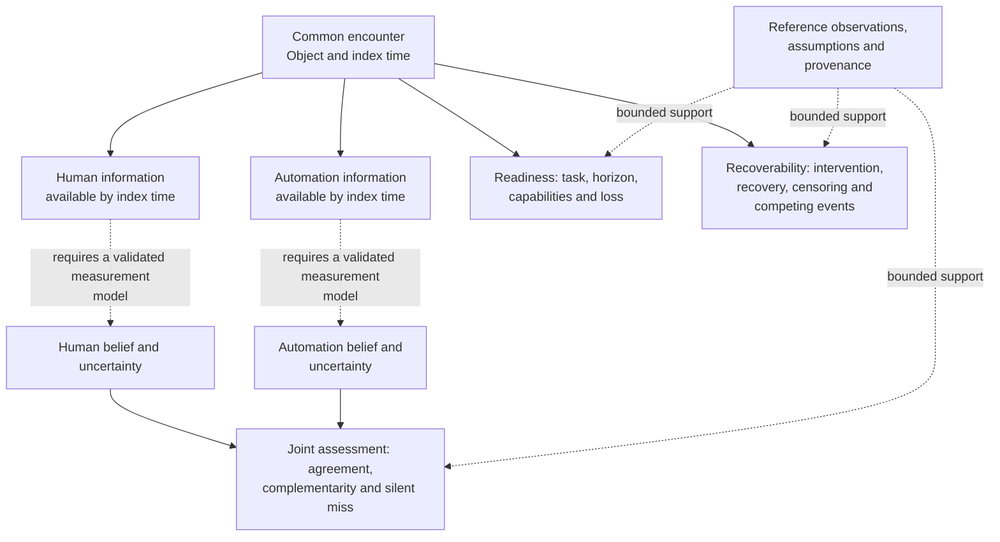
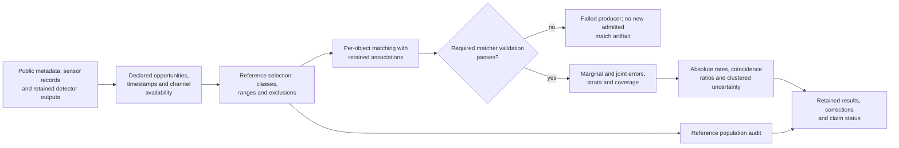
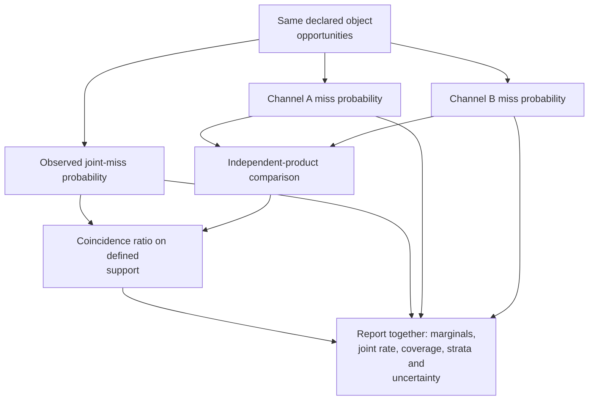
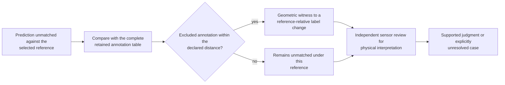
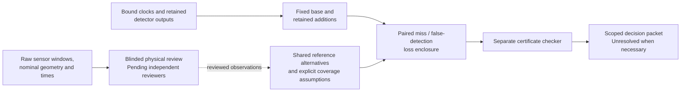
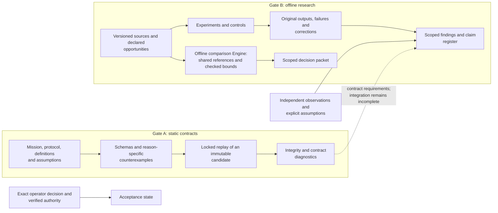

# Reiyah

**An offline evaluation engine for perception decisions under uncertain reference evidence.**

Does an added detector improve a perception configuration once missed objects, false detections
and disputed reference interpretations are counted together? Reiyah computes bounds on that
comparison, using the same opportunities and reference interpretation for both configurations.
When the evidence cannot settle the choice, the result remains unresolved.

The current Engine binds source outputs and clocks, preserves shared reference alternatives,
computes exact paired-loss enclosures and checks matching certificates. Raw-window and nominal
geometry adapters and restricted raw-evidence packages prepare physical review. The first user is a perception
validation lead deciding whether an added detector merits a further integration study.

HARBOR is the proposed research program: **Human-Automation Readiness, Belief & Operational
Risk**. Its broader scope connects object-level belief, readiness, recoverability, joint silent
misses, causal policy effects, explicit unknowns, transfer and worst-group evaluation. Retained
measurement and reference-audit research motivates the current focus. Human belief, recovery
under intervention and cross-domain product value require their own observations.

[Engine architecture and mathematics](docs/PERCEPTION_DECISION_ARCHITECTURE_2026-09-09.md) ·
[Current implementation](docs/PERCEPTION_REHEARSAL_CHECKPOINT_2026-09-10.md) ·
[Research findings](docs/GENERAL_SYNTHESIS.md) · [Selected study](#current-engine-development) ·
[Run the auditor](#run-the-offline-auditor)

## One encounter, distinct information sets

The unit of inquiry is a particular object, encounter and time. A camera output, a lidar
output, a driver's gaze and a takeover action carry different information. Reiyah's architecture
keeps **observation, latent belief, decision, intervention, outcome and evidence** separate.
An observation can support an inference only under an explicit measurement model.



This diagram describes the research architecture. Gaze and takeover proxies do not by
themselves establish a person's object-level belief. The current measurement program addresses
parts of this architecture; it does not implement a driving controller or validated belief tracker.

## The measurement research it builds on

The engine makes the opportunity population explicit before counting failures. Matching is
conditional on a declared reference, sensor validity and evaluation policy. Empty output,
missing output, excluded references and an unobserved physical object have different meanings.



The [matcher](tools/measure/match.py) retains per-object associations that aggregate benchmark
scores omit. The [reference audit](tools/measure/result_ao_reference_population_audit.py)
reconstructs the consequences of changing reference coverage. The
[research checker](tools/measure/gate_b_check.py) verifies retained identities and consistency;
when replay is requested, successful process exit and the expected transcript are both required.

| Research surface | What is represented | Current evidence boundary |
|---|---|---|
| Object-level belief | Actor, object, information set, state space, uncertainty and abstention | Static contracts; independent belief measurement remains outstanding |
| Readiness | Task, context, horizon, capability requirements and loss | Proposed construct; no universal readiness score |
| Recoverability | Intervention or request, recovered state, censoring and competing events | Event and causal contracts; recovery benefit has not been established |
| Joint failures | Common opportunities, marginal errors, joint errors, conditions and intervals | Implemented offline detector analyses on declared benchmark populations |
| Reference validity | Included and excluded annotations, proximity witnesses and unresolved cases | Implemented audits; physical adjudication is a separate observation |
| Causal policy effects | Versioned policies, assignment, propensities, support and estimands | Contracts and experiment designs; no measured driving intervention effect |
| Transfer and worst groups | Domain boundaries, subgroup support, held-out comparisons and uncertainty | Bounded experiments, including retained transfer failures |
| Explicit unknowns | Missing, unmeasured, sensor-invalid, out-of-distribution and abstained states | Distinct states and denominators; unavailable labels must not become observed zeros |

## What the joint-error statistic measures

For two reference-relative miss indicators, the coincidence ratio compares observed joint
miss probability with the product of the two marginal miss probabilities. Conditional analyses
make that comparison within declared strata and retain the support used for aggregation.
A ratio alone is insufficient: its meaning changes with the marginal error rates.



The [Result AO reanalysis](docs/RESULT_AO_REFERENCE_POPULATION_AUDIT.md) retains a conditional
camera/lidar ratio of **1.151053**, with whole-scene bootstrap interval
**[1.128749, 1.166206]**. The original deepest-stratum support contains 131,722 of 134,565
reference rows across 150 scenes. The interval describes resampling uncertainty on that
population; it does not cover reference errors or establish a causal sensing mechanism.

Earlier experiments investigate detector choice, thresholds, marginal-rate effects and
unmeasured difficulty. Their current interpretation is collected in the
[corrected synthesis](docs/GENERAL_SYNTHESIS.md) and
[claim register](evidence/claim-status-register-2026-09-08T054835Z.json).
The [RSS estimand analysis](docs/ESTIMAND_RSS_DEFINITION_32.md) states the additional conditions
needed to connect a benchmark statistic to that safety argument. This two-channel measurement
has not established those conditions or a vehicle safety rate.

## A reference error the engine can expose

A prediction can be unmatched because the evaluator excluded a nearby annotation. That is a
detectable measurement issue; it does not settle whether the prediction is physically correct.



At score threshold 0.30, Result AO finds **3,151 of 24,432 camera flags** and
**5,728 of 23,840 lidar flags** within two meters of annotations excluded from the original
reference cache. These are changes under a specified geometric predicate, not independently
confirmed correct detections. The [real-data replay](docs/REFERENCE_AUDIT_REAL_DATA_2026-09-07.md)
and [cache-policy reconstruction](docs/CACHE_SELECTION_AUDIT_2026-09-07.md) check the calculation
and selection policy separately.

The [reference study](docs/REFERENCE_ADJUDICATION_STUDY_2026-09-07.md) prepares a frozen sample
of **240 detections across 93 scenes**, with original sensor evidence and explicit unresolved
states. Independent human judgments remain unavailable, so physical-performance estimates
remain unestablished. The instrument is prepared; the missing observations remain visible.

## Current engine development

The selected comparison preserves the existing lidar detector's outputs and adds retained camera
detections under a fixed suppression rule. The Engine evaluates both configurations against
each shared reference interpretation, including disputed objects that can change competing
matches through the base detector. Misses and false detections both contribute to the loss.



For r retained additions and nonnegative miss/false-detection penalties a and b, the base-minus-
augmented loss difference lies in **[-b r, a r]** before tighter reference evidence is available.
No additions gives exactly zero. Restricted, explicitly shared reference models can narrow this
enclosure. This conventional count-loss identity does not establish crash-risk reduction, causal
benefit or physical-reference completeness. The
[architecture](docs/PERCEPTION_DECISION_ARCHITECTURE_2026-09-09.md) specifies the estimand,
matching counterexample, decision rules and limits.

The implemented pieces form one offline comparison pipeline:

| Checkpoint | Retained result |
|---|---|
| [Decision core](docs/PERCEPTION_DECISION_CHECKPOINT_2026-09-09.md) | Exact loss bounds, maximum-matching certificates, a separate checker and an atomic packet |
| [Source inputs](docs/PERCEPTION_INPUT_CHECKPOINT_2026-09-09.md) | All 6,019 validation clock anchors retained; 2,935 meet the recorded context and prior-exposure exclusion rule |
| [Joint reference compiler](docs/PERCEPTION_REFERENCE_CHECKPOINT_2026-09-09.md) | Shared presence, identity, class, geometry and time alternatives; open-reference fallback when coverage is unknown |
| [Raw windows](docs/PERCEPTION_WINDOW_CHECKPOINT_2026-09-09.md) | Two existing development windows contain 566 decoded camera images and 159 lidar files, with timestamp gaps retained |
| [Spatial and time operands](docs/PERCEPTION_GEOMETRY_CHECKPOINT_2026-09-09.md) | Nominal transforms for the same 725 captures; 723 differ from their anchor timestamp, with no object-motion imputation |
| [Raw observation disclosure](docs/PERCEPTION_OBSERVATION_CHECKPOINT_2026-09-09.md) | All 725 captures packaged with neutral IDs and a separate custody map; raw bytes, relative times and unavailable states are checked before review |
| [Discovery record custody](docs/PERCEPTION_DISCOVERY_CHECKPOINT_2026-09-09.md) | Exact package binding, explicit inspection states and immutable submitted records; draft generation supplies no human judgment |
| [Comparison/observation binding](docs/PERCEPTION_BINDING_CHECKPOINT_2026-09-10.md) | Exact anchor/sample/scene/time correspondence and delivered images/point bodies checked against the retained inventory; physical review remains outstanding |
| [Reviewed-source admission](docs/PERCEPTION_ADMISSION_CHECKPOINT_2026-09-10.md) | Exact staged review contents and complete proposal accounting preserve shared interpretations; synthetic finite/open comparisons and forged-record rejections are checked |
| [Development review preparation](docs/PERCEPTION_REHEARSAL_CHECKPOINT_2026-09-10.md) | Separate unassigned discovery folders, neutral capture navigation and equal analyst/effort instructions; actual human workflow and assisted material remain outstanding |

The proposed study selects **60 scenes**, then one eligible anchor per scene, only after the
input, method, reviewer, comparator and adjudication freeze. Two independent reviewers first
inspect raw evidence without detector hints. A competent independent conventional analyst gets
the same staged evidence and may compute the same bounds. Reviewers, comparator and adjudication
remain prerequisites; **no prospective cohort or seed has been selected**. The two exposed
development anchors remain unresolved at [-8,8] under unit penalties and open reference coverage.

The [shared/disjoint training design](docs/TRAINING_OVERLAP_NEXT_EXPERIMENT_2026-09-07.md)
remains an unexecuted research route, with retained
[inventory](docs/TRAINING_INPUT_FINDINGS_2026-09-07.md),
[partition](docs/TRAINING_PARTITION_CHECKPOINT_2026-09-07.md),
[model-input](docs/MODEL_INPUT_CHECKPOINT_2026-09-07.md) and
[cache](docs/TRAINING_CACHE_CHECKPOINT_2026-09-08.md) preparation. It is not the selected next study.

The [predictive monitor experiment](docs/PREDICTIVE_MONITOR_FINDINGS_2026-09-07.md) remains
part of the record: its future-count improvement under collection-log holdouts was 2.7020%,
with a descriptive interval including zero; spatial continuity slightly worsened the primary
loss. Neither passed the declared usefulness screen.

## Evidence architecture and reproducibility

Gate A supplies versioned scientific contracts, schemas, counterexamples and locked offline
validation. Gate B supplies empirical research tools, the offline decision Engine and retained
measurements. Their integration is incomplete, and an empirical result does not silently amend
an accepted contract. The [Gate A architecture](docs/ARCHITECTURE.md) documents that static
packet; the [selected Engine architecture](docs/PERCEPTION_DECISION_ARCHITECTURE_2026-09-09.md)
and implementation checkpoints describe current development.



Gate A remains **operator-unaccepted**. Passing checks establish their tested scope; they do not
create scientific validation, standards compliance, safety approval or deployment authority.
The [architecture handoff](docs/SESSION_HANDOFF.md) and its referenced validation plans govern
exact Gate A release replay. This README is research navigation, not a new Gate A release packet.

Original results, failed producers, null findings, corrections and retractions remain
discoverable. Public Git contains Reiyah code, documentation and permitted aggregate evidence.
Source-derived datasets, weights and review materials retain their own access and redistribution
terms. A matching digest establishes identity; physical correctness needs appropriate observations.

### Run the offline auditor

The portable synthetic example requires no sensor dataset, model or API key. Follow the
[demo instructions](docs/REFERENCE_AUDIT_DEMO_2026-09-07.md) for the command and its expected
geometric witnesses. The [real-data adapter](docs/REFERENCE_AUDIT_REAL_DATA_2026-09-07.md)
uses separately retained inputs.

For research consistency checks, use an environment with `numpy`, `scipy` and `jsonschema`:

```sh
python -B tools/measure/gate_b_check.py --json /tmp/reiyah-gate-b-check.json
python -B -m unittest discover -s tools/measure -p test_research_board_regressions.py -v
```

The default checker verifies retained transcript digests without rerunning the historical
experiments. Replay classes and their requirements are declared in the
[replay manifest](validation/gate-b-replay-manifest.json). Gate A release validation uses its
own exact locked launcher and immutable projection; these research commands are development
checks. Dataset-dependent numerical reproduction requires the recorded input and environment
identities.

## Research map

| Read for | Start here |
|---|---|
| Current Engine direction and implementation | [Selected architecture](docs/PERCEPTION_DECISION_ARCHITECTURE_2026-09-09.md), [latest checkpoint](docs/PERCEPTION_ADMISSION_CHECKPOINT_2026-09-10.md), [decision interface](research/perception-decision/0.1.0/README.md) |
| Mission and scientific structure | [Scientific charter](docs/SCIENTIFIC_CHARTER.md), [architecture](docs/ARCHITECTURE.md), [mathematical specification](docs/MATHEMATICAL_SPECIFICATION.md) |
| Current interpretation of sensor, human-proxy and LLM experiments | [Corrected synthesis](docs/GENERAL_SYNTHESIS.md), [current claim register](evidence/claim-status-register-2026-09-08T054835Z.json) |
| Selected study and earlier investigations | [60-scene study design](docs/PERCEPTION_DECISION_ARCHITECTURE_2026-09-09.md#one-prospective-study), [research-board report](docs/RESEARCH_BOARD_2026-09-07.md), [earlier training design](docs/TRAINING_OVERLAP_NEXT_EXPERIMENT_2026-09-07.md) |
| Reference validity and physical adjudication | [Result AO](docs/RESULT_AO_REFERENCE_POPULATION_AUDIT.md), [reference study](docs/REFERENCE_ADJUDICATION_STUDY_2026-09-07.md), [portable auditor](docs/REFERENCE_AUDIT_DEMO_2026-09-07.md) |
| Temporal and observational limits | [Monitor findings](docs/PREDICTIVE_MONITOR_FINDINGS_2026-09-07.md), [threats to validity](docs/MEASUREMENT_THREATS_TO_VALIDITY.md) |
| Retained mathematical corrections | [Reference-noise interpretation](docs/REFERENCE_NOISE_INTERPRETATION_2026-09-07.md), [M4 bound audit](docs/M4_RECTANGULAR_BOUND_FINDINGS_2026-09-07.md) |
| Measurement history and continuation | [Gate B contract](docs/GATE_B_MEASUREMENT_CONTRACT.md), [Gate B handoff](docs/GATE_B_SESSION_HANDOFF.md) |
| Source custody and standards scope | [Source policy](docs/SOURCE_POLICY.md), [standards crosswalk](docs/STANDARDS_CROSSWALK.md), [public-data custody](docs/PUBLIC_DATA_CUSTODY_2026-09-06.md) |
| Repository contribution and disclosure | [Repository contract](AGENTS.md), [contribution guide](CONTRIBUTING.md), [security policy](SECURITY.md) |

Historical human-channel studies measure gaze and takeover proxies. LLM experiments investigate
error coincidence and monitor transfer on archived answer populations, including failed benchmark
transfer. These remain separately scoped lines of research; they do not establish a universal
independence law or substitute for measurements of human and vehicle belief on the same encounter.

## Author, license and citation

**Created and maintained by Daniel Wahnich.**

Reiyah-authored code and documentation are distributed under [Apache-2.0](LICENSE).
Third-party materials retain their own terms; see [NOTICE](NOTICE). Use
[CITATION.cff](CITATION.cff) and cite the exact result or artifact identity reviewed.
The configured GitHub repository distributes the work; publisher readback is an assertion,
not independent scientific or transport verification.
