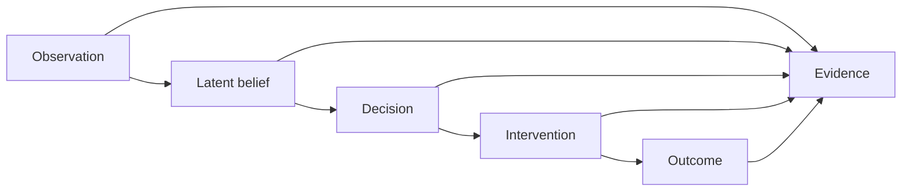

# Reiyah

Reiyah is the open-source research architecture for HARBOR, the proposed Human-Automation Readiness, Belief & Operational Risk program.

HARBOR asks a stricter question than whether a driver or an automated system noticed something: what did each participant have reason to believe about the same object, at the same time, before a decision was made, and what evidence can support that conclusion?

The repository currently contains Gate A only. Gate A defines the scientific contract, evidence custody rules, mathematical objects, adversarial fixtures, and deterministic offline validation needed before any empirical study or product implementation can be considered.

> Gate A is a candidate architecture. It is not accepted, empirically supported, safety validated, standards compliant, or authorized for runtime use.

## Research thesis

Reiyah deliberately keeps six records separate:



This separation defines a research scope beyond driver-monitoring classification:

1. Did the human and automation form compatible beliefs about the same road user or hazard?
2. Was the human able to understand and act within the available recovery window?
3. Did both channels miss the same relevant condition, and was a fallback actually available?
4. Can a claimed policy effect be identified from the logged assignment and decision process?
5. Does evidence survive transfer, abstention, missingness, and worst group analysis?

Every construct and claim remains proposed until retained evidence and independent review justify a stronger status.

## Gate A boundary

| Included | Excluded |
|---|---|
| Scientific charter and non-claims | Product runtime |
| Immutable candidate manifests | Model training or inference |
| Source custody and standards gap records | Vehicle control or deployment |
| Strict JSON Schemas | Private data ingestion |
| Synthetic known-good and known-bad fixtures | Operational data collection |
| Read-only offline validation | Safety, compliance, or superiority claims |
| Mermaid architecture diagrams | Empirical publication or operator acceptance |

No later gate is defined or authorized here.

## Review order

1. Read [AGENTS.md](AGENTS.md) for repository authority and invariants.
2. Read [the session handoff](docs/SESSION_HANDOFF.md) for the exact current state.
3. Read [the scientific charter](docs/SCIENTIFIC_CHARTER.md) and [claims register](docs/CLAIMS_AND_NON_CLAIMS.md).
4. Inspect [the 2026 frontier baseline](docs/FRONTIER_BASELINE_2026.md) and [research gap register](docs/RESEARCH_GAP_REGISTER.md).
5. Review [the architecture](docs/ARCHITECTURE.md), [mathematical specification](docs/MATHEMATICAL_SPECIFICATION.md), and [threat model](docs/THREAT_MODEL.md).
6. Run the deterministic validation entry point.

```sh
python3 tools/validate_gate_a.py
```

The validator is offline and read only. A passing full run means that the indexed architecture is internally consistent for its exact bytes. It does not authenticate a reviewer, establish scientific truth, or accept Gate A.

## Repository map

| Path | Purpose |
|---|---|
| `docs/` | Normative contracts, research baseline, diagrams, and review guidance |
| `manifests/` | Append-only mission, protocol, definition, and research-function releases |
| `schemas/` | Draft 2020-12 machine contracts |
| `evidence/` | Public source custody, retained bytes, and standards gap mappings |
| `fixtures/` | Synthetic positive examples and reason-specific counterexamples |
| `validation/` | Frozen validation plan and dependency provenance |
| `tools/` | Static index builder and offline validator only |
| `gate/` | Candidate evidence index, validation report, and external decision procedure |

## Evidence discipline

A URL is a discovery pointer, not retained evidence. Positive standards or benchmark mappings require exact local bytes, identity metadata, a content digest, scope, comparator, and an explicit redistribution state. Missing, unmeasured, out-of-distribution, sensor-invalid, and abstained are different states. None may be converted to zero or to a confident label.

Company statements, patents, job postings, generated prose, checksums, and passing tests can clarify research questions or integrity. They do not become independent proof of safety, performance, deployment, or scientific support.

## Open source and third-party material

Reiyah authored code, schemas, fixtures, and documentation are licensed under [Apache License 2.0](LICENSE). Contributions are accepted under the same terms.

The repository license does not relicense third-party evidence. Each retained source is governed by its own recorded terms and attribution requirements. See [NOTICE](NOTICE), [the source policy](docs/SOURCE_POLICY.md), and the machine-readable public distribution inventory in `evidence/`.

## Contributing and security

Read [CONTRIBUTING.md](CONTRIBUTING.md) before proposing a change. Report security or integrity issues through the process in [SECURITY.md](SECURITY.md). Research claims, evidence changes, and manifest successors receive stricter review than editorial changes.

## Citation

Reiyah is a pre-implementation research-architecture candidate. The project name, HARBOR expansion, constructs, and all scientific claims are proposed. Use the metadata in [CITATION.cff](CITATION.cff) and cite the exact Git commit and Gate A evidence index digest reviewed.
