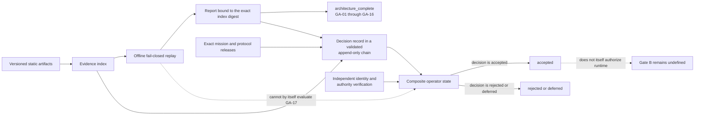
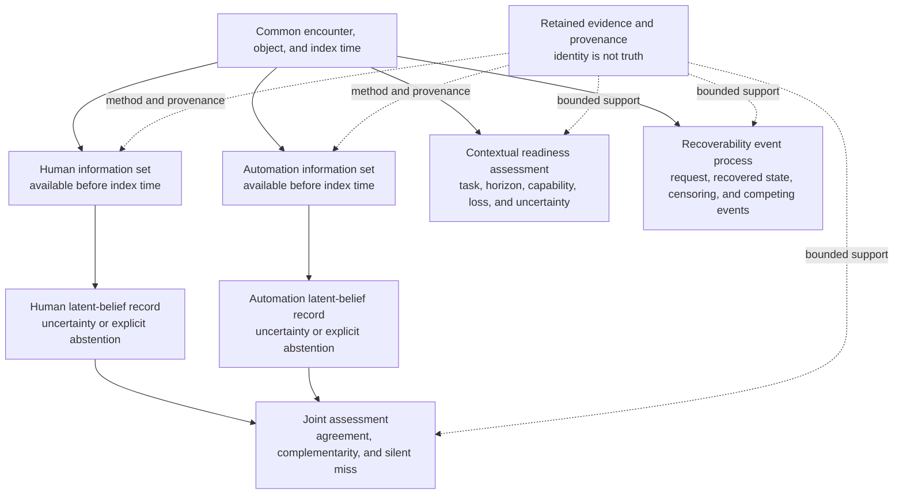

# Reiyah

Reiyah is a pre-implementation, open-source research architecture for HARBOR, the proposed
Human-Automation Readiness, Belief & Operational Risk program. It is an evidence and benchmark
engine for falsifiable analysis of shared human-automation driving situations. It is not a
driver-monitoring classifier, an autonomy stack, a safety case, or a runtime system.

For a specific object at a specific time, HARBOR asks what the human and automation could each
observe, what each had reason to believe, what decisions and interventions followed, what outcome
occurred, and what retained evidence can support each statement.

> Gate A covers static architecture, deterministic fixtures, and offline validation only. An
> `architecture_complete` result is not operator acceptance, scientific support, safety
> validation, standards compliance, product readiness, or runtime authorization.

## Current status

Gate A `1.1.2` is scoped as a presentation and continuity successor. It does not change the Gate
A `1.1.0` mission or protocol releases or add a scientific proposition. Its exact release and
transport state must be resolved from machine-readable artifacts rather than inferred from the
branch name or this narrative.

| Surface | Meaning |
|---|---|
| Architecture state | `architecture_complete` applies only to the exact evidence-index digest named by a passing canonical report. |
| Operator state | `unaccepted`. Acceptance requires a current exact-binding record whose decision is `accepted`, a validator-accepted append-only decision chain, and independent verification of operator identity and authority. |
| External control | GA-17 remains `not_evaluated` by offline repository validation. |
| Runtime | Unauthorized. No product runtime, model execution, live network dependency, cloud execution, private-data ingestion, deployment, or physical-control integration is present. |
| Later gates | Gate B is not defined or authorized. |
| Public remote | A distribution channel only; it has no scientific, safety, standards, acceptance, or publication authority. |

Architecture completion and operator acceptance are deliberately separate:



The diagram describes repository governance, not a deployed system.

## Resolve the exact current identity

The indexed packet cannot contain its own digest, later Git commit, or post-publication receipt
without creating a cycle. Resolve the current state in this order:

1. Verify [`GATE_A_EVIDENCE_INDEX.json`](gate/GATE_A_EVIDENCE_INDEX.json) against its
   [`SHA-256 sidecar`](gate/GATE_A_EVIDENCE_INDEX.sha256).
2. Select the canonical report in [`gate/validation-reports/`](gate/validation-reports/) whose
   `index_binding.sha256` equals that sidecar digest.
3. Run the offline validator and require the report, index, repository inventory, fixtures, and
   declared controls to reconcile with zero diagnostics.
4. For transport identity, select the unique highest valid record in
   [`gate/public-distribution-receipts/`](gate/public-distribution-receipts/) whose linear history
   exact-binds that index, report, published commit, repository, and verified remote readback.
5. Resolve acceptance separately. The current index, report, mission, and protocol must be bound
   by the head of a validator-accepted decision chain; that head must say `accepted`; and operator
   identity and authority must be independently verified. Otherwise no accepted state may be
   inferred from repository bytes.
6. If no valid current receipt exists, the packet's public transport is unverified. A branch tip
   or an older receipt is not a substitute.

### Exact public predecessor

Gate A `1.1.1` is the immutable public predecessor for this continuity successor:

| Item | Gate A `1.1.1` identity |
|---|---|
| Indexed packet commit | `90072fb64f3c16cb5d0af0f1a3bcad56554707fa` |
| Receipt-bearing repository commit | `8f4ba9894faf257c46351b2a89fc17f112a988f1` |
| Evidence-index digest | `sha256:308f65ba2693c13fa71d081dad3f74f56ec80617e97497a2606c0d88a07b2ceb` |
| Validation-report digest | `sha256:76c0dcce583beb02b121776e14bc9df41833a26c5c49488270d96861b3e33806` |
| Distribution-receipt digest | `sha256:6156a35d3dfb2c4f0d46cbf48845867da6c942b69ed734a4056ae1e36910aa11` |
| Receipt sequence | `2` |
| Mission release | `reiyah.mission@1.1.0` |
| Protocol release | `reiyah.protocol.harbor-gate-a@1.1.0` |
| Exact state | `architecture_complete`, `unaccepted`, GA-17 `not_evaluated`, runtime `false` |

The predecessor receipt records static public transport only. It creates no scientific evidence,
operator acceptance, compliance result, or runtime authority.

### Why the successor exists

Gate A `1.1.0` established the first receipt-bound public Gate A architecture. A
forensic release review then found that its operator-decision interface required the `1.1.0`
protocol release to claim an older schema identity, so a truthful decision record could not
satisfy the contract. Gate A `1.1.1` corrected that governance defect, preserved the original
mission and protocol releases, froze the predecessor bytes, and added exact index, report, and
receipt replay without changing a scientific proposition.

After `1.1.1` was published, the README and machine handoff needed to record its completed
transport and explain the architecture more clearly. Both documents are evidence-index inputs,
so changing them under the released `1.1.1` identity would have invalidated its digest. Gate A
`1.1.2` therefore exists as an append-only presentation and continuity successor. The
[`historical index`](history/gate-a-1.1.1/gate/GATE_A_EVIDENCE_INDEX.json),
[`validation report`](gate/validation-reports/gate-a-validation-1.1.1.json), and
[`distribution receipt`](gate/public-distribution-receipts/reiyah.public-distribution-receipt-1.1.1.json)
keep the `1.1.1` review and transport facts independently replayable.

## Research thesis

HARBOR treats the human and automation as distinct actors with potentially different information
sets. It compares their uncertainty about the same object without treating either channel as
ground truth or collapsing disagreement into a single score.



This is a research view, not a sensing, inference, alerting, intervention, or vehicle-control
pipeline. The architecture keeps observation, latent belief, decision, intervention, outcome,
and evidence separate in identity, provenance, and time. Missing, unmeasured,
out-of-distribution, sensor-invalid, and abstained are distinct states. None may silently become
zero, false, normal, negative, or a confident label.

## Research surfaces

| Surface | Gate A static contract |
|---|---|
| Object-level belief | Identified actor, object, state space, frozen information set, uncertainty, calibration target, applicability domain, and abstention. |
| Readiness | Named task and context, index time, horizon, capability set, loss, uncertainty, and intervention; never a universal person label. |
| Recoverability | Perturbation or request, recovered-state definition, time-to-event treatment, censoring, competing events, and observation coverage. |
| Joint silent miss | Common opportunity, per-channel validity, detection and warning windows, dependence treatment, and fallback availability. |
| Causal and sequential policy effects | Exact policy and comparator versions, assignment and propensity records, support, estimand, estimator, uncertainty, and sensitivity assumptions. |
| Explicit unknowns | Selective prediction, abstention, out-of-distribution state, conformal applicability, denominators, and coverage-performance reporting. |
| Transfer and worst groups | Frozen source and target domains, access chronology, adaptation limits, complete group universe, intersections, validity, and simultaneous uncertainty. |
| Research and assurance governance | Preregistration, datasets, benchmarks, ODDs, scenarios, tests, hazards, arguments, evidence, defeaters, and change impact without safety authority. |

The formal quantities and invalid-state behavior are defined in the
[`mathematical specification`](docs/MATHEMATICAL_SPECIFICATION.md). Five closed application
schemas make these research surfaces machine-reviewable without collecting data or executing a
model, policy, simulation, or study.

## Gate A boundary

| Included | Excluded |
|---|---|
| Scientific charter, claims, non-claims, and status model | Product runtime, live services, cloud execution, or deployment |
| Append-only mission, protocol, definition, and research-function releases | Model training, inference, or monitoring |
| Source custody, dated standards gap mappings, and public distribution controls | Vehicle sensing, alerts, actuation, or physical control |
| Closed Draft 2020-12 schemas | Private, secret, or operational human and vehicle data |
| Synthetic known-good and reason-specific known-bad fixtures | Operational data collection or empirical publication machinery |
| Read-only deterministic validation | Safety, compliance, causal-benefit, or superiority claims |
| Evidence index, canonical report, and external decision procedure | Operator acceptance inferred from tests, signatures, or consensus |

An artifact with mixed permitted and forbidden behavior is forbidden in full. Gate A validation
is offline; live network and cloud execution are prohibited.

## Evidence discipline

A URL is a discovery pointer, not retained evidence. Positive standards or benchmark mappings
require exact permitted bytes, identity, version, publication date, scope, comparator, content
digest, limitations, and an explicit custody and redistribution state. The repository currently
contains four eligible ISO Open Data metadata payloads, not normative ISO text. Four NIST or UN
records and all 38 frontier records covering primary methods, official specifications, and
bounded Tesla and Mobileye company comparators remain pointer only and evidence ineligible.

Company statements, papers, standards pages, generated prose, signatures, checksums, passing
tests, and consensus may motivate a question or provide an integrity signal. They do not become
independent proof of effectiveness, safety, compliance, deployment, or comparative advantage.
See the [`source policy`](docs/SOURCE_POLICY.md), [`standards crosswalk`](docs/STANDARDS_CROSSWALK.md),
and [`2026 frontier baseline`](docs/FRONTIER_BASELINE_2026.md).

## Rigor under pressure

Hard problems tighten the method. When ambiguity survives review, Reiyah stops at the narrowest
affected boundary, preserves the unknown state, records the strongest plausible falsifier, makes
assumptions, denominators, time, provenance, and residual risk explicit, adds the smallest
reason-specific counterexample, and replays the unchanged contract. A deadline, prestigious
source, confident model, generated signature, consensus, or passing test cannot promote a claim
or weaken an expected failure.

Failures, contradictions, null results, invalid analyses, corrections, and retractions remain
discoverable. A blocked result is preferable to a plausible default.

## Reproduce the static checks

Authoritative replay is intentionally bound to the exact resolved canonical root
`/Users/danielwahnich/workspace/reiyah`. The validation plan and both offline tools fail closed for
an ordinary clone at any other path. External path portability is not provided at Gate A; moving
the repository, using an alias or symlink, or bypassing the identity preflight produces a different,
untrusted analysis rather than an equivalent Reiyah validation.

Only from that verified Reiyah Git root:

```sh
python3 tools/validate_gate_a.py
```

For machine-readable output without writing into the repository:

```sh
python3 tools/validate_gate_a.py --format json > /tmp/reiyah-gate-a-validation.json
```

A successful full run requires exit code `0`, zero diagnostics, every known-good fixture to pass,
every known-bad fixture to fail for its declared primary rule, complete required-property
mutation coverage, and GA-01 through GA-16 to pass. The validator always leaves GA-17
`not_evaluated` and cannot create an acceptance record. Read the matching canonical report for
the exact current totals and toolchain provenance.

The immutable `1.1.1` predecessor checked 60 schemas, 223 normative instances, 179 fixtures, 15
of 15 known-good cases, 164 of 164 known-bad cases, 1,010 of 1,010 required-property mutations,
and 317 indexed artifacts with zero diagnostics.

## Review and navigation

| Purpose | Start here |
|---|---|
| Authority and session continuity | [`AGENTS.md`](AGENTS.md), [`SESSION_HANDOFF.md`](docs/SESSION_HANDOFF.md) |
| Mission and claim boundary | [`scientific charter`](docs/SCIENTIFIC_CHARTER.md), [`claims and non-claims`](docs/CLAIMS_AND_NON_CLAIMS.md), [`status model`](docs/STATUS_MODEL.md) |
| Gate decision procedure | [`pre-implementation gate`](docs/PRE_IMPLEMENTATION_GATE.md), [`gate records`](gate/) |
| Scientific and technical review | [`architecture`](docs/ARCHITECTURE.md), [`mathematical specification`](docs/MATHEMATICAL_SPECIFICATION.md), [`threat model`](docs/THREAT_MODEL.md) |
| Research frontier and open gaps | [`research operating model`](docs/RESEARCH_OPERATING_MODEL.md), [`2026 frontier baseline`](docs/FRONTIER_BASELINE_2026.md), [`research gap register`](docs/RESEARCH_GAP_REGISTER.md) |
| Evidence and standards review | [`source policy`](docs/SOURCE_POLICY.md), [`standards crosswalk`](docs/STANDARDS_CROSSWALK.md), [`evidence records`](evidence/) |
| Deterministic replay | [`validation guide`](docs/VALIDATION.md), [`validation plan`](validation/), [`fixture catalog`](fixtures/fixture-catalog.json) |
| Contribution or disclosure | [`CONTRIBUTING.md`](CONTRIBUTING.md), [`SECURITY.md`](SECURITY.md) |

Every repository session must verify the named project, working directory, Git root, repository
contract, worktree state, and handoff before making a repository-specific change. Never discard
unrelated work or reuse a published release identifier.

## Open risks and next authorized action

- HARBOR's name, constructs, estimands, thresholds, and every scientific claim remain proposed.
- No eligible empirical dataset, executed study, benchmark result, policy log, construct-validity
  result, subgroup analysis, independent replication, safety review, standards review, or legal
  opinion exists.
- The frontier baseline remains discovery material and cannot support a protocol or superiority
  claim.
- A finite schema, threat model, and fixture suite cannot prove that every scientific, security,
  rights, or release threat is known.
- No independently retained external review is included in or established by this packet.
- Authoritative replay is canonical-path-bound; portability to an arbitrary public clone remains
  explicitly unsupported at Gate A.

If the Gate A `1.1.2` index, sidecar, canonical report, historical snapshot, fixtures, or
validator support is absent or inconsistent, this packet permits completing only that static
successor work. Once full replay is byte-identical to the canonical report and classifies the
exact current bytes as `architecture_complete`, this packet permits independent advisory review
of that exact candidate; it does not establish that such a review occurred. Review cannot
authenticate operator authority, evaluate GA-17, accept Gate A, define Gate B, authorize live
network or cloud execution, or authorize runtime. Any change to a published indexed byte requires
a new append-only successor and a fresh review identity.

## Open source and citation

Reiyah-authored code, schemas, fixtures, and documentation are licensed under the
[`Apache License 2.0`](LICENSE). Contributions use the same terms. The repository licence does
not relicense third-party material; see [`NOTICE`](NOTICE) and the
[`public distribution inventory`](evidence/public-distribution-inventory-1.1.0.json) for the
bounded evidence payloads and required attribution.

Use [`CITATION.cff`](CITATION.cff) and cite the exact evidence-index digest reviewed. When public
transport identity matters, also cite the unique highest valid append-only receipt that exact-binds
that same index, its canonical report, packet commit, and verified remote readback. Until such a
current receipt exists, transport is unverified. Do not cite a mutable branch name, repository
availability, or an older receipt as a substitute for the exact reviewed bytes.
