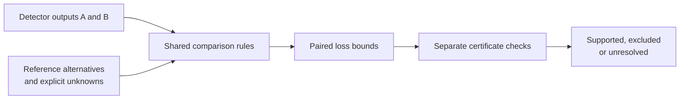

# Reiyah

**Evidence for deciding whether a perception change is justified.**

Reiyah is an offline research engine for comparing perception systems when their
reference evidence is uncertain. It evaluates a detector replacement or addition
against the same declared objects and reference interpretations, accounts for
misses and false detections, and returns a checked loss bound. When the evidence
cannot settle the choice, the result remains unresolved.

The intended user is a perception-validation lead deciding whether a change
merits further integration work. The research goal is to reach a justified
decision with less total work, including the cost of obtaining and checking the
evidence. **An advantage over competent conventional analysis remains unproven.**

[Run an example](#run-the-offline-auditor) · [Current evidence](#current-evidence) ·
[Technical guide](research/perception-revision/0.1.0/README.md) ·
[Research roadmap](docs/ENGINE_ROADMAP_2026-09-19.md)

## The decision problem

More detections do not necessarily make a better system. An addition can find
an object, introduce a false detection, or change which existing detection gets
matched. A disputed object near the original detector's output can therefore
change the value of the addition, even when every object near the new output
has been confirmed.

Reiyah keeps those interactions in one comparison. Both configurations share
the same reference interpretation, loss weights and improvement threshold.
The question is whether the change improves that declared loss across the
allowed interpretations, and which unresolved evidence could change the answer.
The [small reproducible examples](research/perception-decision-review/0.1.0/README.md)
show why separate scores or a count of confirmed objects can miss this distinction.

## How the engine works



The implemented pipeline retains original source records, indices and clocks;
preserves joint reference alternatives across configurations; and computes
paired-loss enclosures using exact arithmetic. Separate checkers verify matching
and bound certificates against the declared inputs. Dependency traces connect
an adverse interpretation back to the original records and available captures.

The [replacement and audit interface](research/perception-revision/0.1.0/README.md)
also checks whether supplied reference observations suffice for a decision and
whether a certificate remains applicable after a revision. Reusing an observation
requires checking its premises; the earlier conclusion does not automatically
carry over. Missing outputs, observed empty outputs, invalid evidence and open
reference coverage retain distinct meanings.

## Current evidence

The following summarizes retained work through **19 September 2026**. The linked
records contain the assumptions, complete outcomes, failures and measured costs.
These are exposed development comparisons and authored mathematical studies.

| Question | Checked result | Scope and implication |
| --- | --- | --- |
| Can reference assumptions change a detector decision? | The two-anchor comparison remains **[-8, 8]** with open physical references, while retained benchmark labels give **[1, 1]**. | The narrower result is conditional on those labels. Physical reference adjudication remains open. [Case](docs/PERCEPTION_ANNOTATION_CASE_2026-09-14.md) |
| Can a sufficient set of observations be checked? | On one forty-frame case, **372 hypothetical confirmed-present labels** attain the minimum needed to preserve the strict decision under the specified deletion model. | This is a conditional sufficiency result. Sequential query cost and human effort are different quantities. [Proof](docs/PERCEPTION_MONOTONE_AUDIT_2026-09-17.md) |
| What remains undecidable under the available evidence? | All **1,790 unresolved rows** in the 7,707-row operating study have checked worlds supporting opposing decisions; **2,199 rows remain blocked**. | These are dependent development rows. Resolving them requires a distinguishing observation or a justified change of assumptions. [Outcomes](research/operating-timing-witness/0.1.0/OUTCOMES.md) |
| Does the workflow save work against competent alternatives? | Conventional methods match retained stopping results and attain all **99 resolved query floors**. The bounded certificate-reuse assay is slower than full computation on its small workload. | Lower complete validation cost remains unestablished. [Comparison audit](research/roadmap-audit/0.1.0/README.md) · [Reuse assay](docs/PERCEPTION_REVISION_AUDIT_2026-09-16.md) |
| Can statistical audits preserve residual reference uncertainty? | Four registered methods pass exact checks over **38,816 sampling orders on 28 authored populations**; five populations remain unresolved after full observation. | The control variate improves one case slightly, but a conventional weight-priority procedure is faster there. A stronger adaptive-betting comparison remains necessary. [Methods study](research/sequential-audit/0.1.0/README.md) |

The exact conditional proofs and statistical error guarantees answer different
questions. Neither establishes the physical correctness of a reference, a
deployed safety rate or savings in an unmeasured workflow. All **1,433
outcome-reserved images remain closed**.

## Run the offline auditor

From the repository root, run the standalone reference calculation:

```sh
python3 -B research/perception-decision-review/0.1.0/reproduce.py
```

It uses only the Python standard library, with no sensor dataset, model or API
key. The JSON output should match the retained
[expected result](research/perception-decision-review/0.1.0/expected.json).
The examples cover a matching ambiguity, uncertainty that cancels in a paired
comparison, and reference dependencies that must survive aggregation.

To produce and separately verify an Engine packet, follow the
[decision-engine commands](research/perception-decision/0.1.0/README.md), which
also require `jsonschema`. The [replacement guide](research/perception-revision/0.1.0/README.md)
adds independently declared A/B outputs and reference-audit certificates.

For repository research-consistency checks, use Python with `numpy`, `scipy`
and `jsonschema` installed:

```sh
python3 -B tools/measure/gate_b_check.py --json /tmp/reiyah-gate-b-check.json
```

The default check verifies retained transcript identities and consistency; it
does not rerun the historical experiments. The
[replay manifest](validation/gate-b-replay-manifest.json) declares their input
and environment requirements. Gate A release validation has its own locked
launcher and immutable candidate procedure.

## What comes next

The [current roadmap](docs/ENGINE_ROADMAP_2026-09-19.md) selects two distinct
requirements for further progress:

1. Compare the statistical method with a stronger published adaptive-betting
   baseline on a separately frozen, relevant population. Preserve residual
   reference uncertainty and keep exact and probabilistic guarantees distinct.
2. Test workflow value on a consequential, owner-defined decision with a
   qualified observation process, genuine chronological revisions and complete
   costs for equally equipped conventional and Reiyah workflows.

The existing negative comparisons remain part of that decision. The 28 exposed
mathematical populations are a methods check; tuning them into a favorable
example would not establish practical value. The
[dated primary-method review](research/roadmap-audit/0.1.0/FRONTIER.md) records
the relevant prior work and the comparisons still needed.

## The wider research program

Perception is the first application within **HARBOR: Human-Automation Readiness,
Belief & Operational Risk**, Reiyah's proposed research program. Its broader
question concerns what people and automated systems know about the same
encounter, when they miss the same object, and what evidence supports readiness
or recovery under intervention.

The architecture separates observation, latent belief, decision, intervention,
outcome and evidence. The existing sensor, human-proxy and LLM studies have
their own populations and limits. Perception results do not establish human
belief, recoverability, causal intervention benefit or cross-domain transfer.
The [scientific charter](docs/SCIENTIFIC_CHARTER.md) and
[corrected synthesis](docs/GENERAL_SYNTHESIS.md) explain that scope.

## Research map

| Read for | Start here |
| --- | --- |
| Current direction and continuation | [Roadmap](docs/ENGINE_ROADMAP_2026-09-19.md) · [Session handoff](docs/SESSION_HANDOFF.md) |
| Comparison model and mathematics | [Engine architecture](docs/PERCEPTION_DECISION_ARCHITECTURE_2026-09-09.md) · [Replacement interface](research/perception-revision/0.1.0/README.md) |
| Results and corrections | [Execution audit](research/roadmap-audit/0.1.0/README.md) · [Claim register](evidence/claim-status-register-2026-09-08T054835Z.json) |
| Detailed development history | [Archived research narrative](docs/README_RESEARCH_HISTORY_2026-09-19.md) · [Gate B handoff](docs/GATE_B_SESSION_HANDOFF.md) |
| Reference validity and measurement limits | [Reference-population audit](docs/RESULT_AO_REFERENCE_POPULATION_AUDIT.md) · [Threats to validity](docs/MEASUREMENT_THREATS_TO_VALIDITY.md) |
| Evidence contracts and source custody | [Gate A architecture](docs/ARCHITECTURE.md) · [Source policy](docs/SOURCE_POLICY.md) · [Standards crosswalk](docs/STANDARDS_CROSSWALK.md) |
| Product hypothesis | [Intended users and proof milestones](docs/PRODUCT_AND_FUNDING_THESIS_2026-09-14.md), read with the current roadmap |
| Contributing and disclosure | [Repository contract](AGENTS.md) · [Contributing](CONTRIBUTING.md) · [Security](SECURITY.md) |

Gate A remains **operator-unaccepted**. Its static contracts and the offline
research implementation have incomplete integration; passing checks does not
confer scientific acceptance, standards compliance or deployment authority.
This README is research navigation and does not change a frozen release packet.
Original results, failed attempts, corrections and unresolved cases remain
discoverable in the linked records.

## Author, license and citation

Created and maintained by **Daniel Wahnich**.

Reiyah-authored code and documentation are distributed under [Apache-2.0](LICENSE).
Third-party materials retain their own terms; see [NOTICE](NOTICE).
Use [CITATION.cff](CITATION.cff) and cite the exact result or artifact reviewed.
