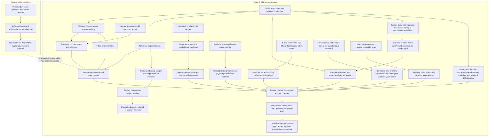
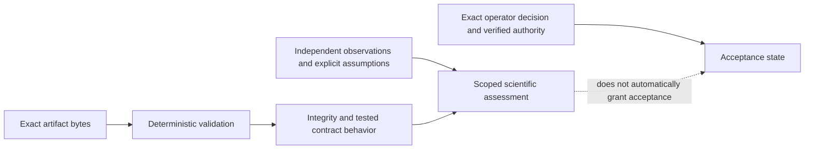

# Reiyah

Reiyah is an evidence architecture and an offline research program studying what can be inferred
about joint failures of observers. Its proposed HARBOR mission covers object-level human and
vehicle belief, readiness, recoverability, explicit unknowns and causal policy effects. Current
experiments measure narrower quantities on public detector, human-proxy and language-model data.

The [research-board report](docs/RESEARCH_BOARD_2026-09-07.md) gives the complete reconstruction,
2026 primary-source review, scorecard and research program. **The current evidence does not
establish a frontier perception system, a universal independence law, human belief measurement,
or deployable safety guarantees.** The strongest immediate opportunity is making invalid
physical-world inferences detectable and explainable.

## Current research result

[Result AO](docs/RESULT_AO_REFERENCE_POPULATION_AUDIT.md) independently reanalyzes retained
nuScenes inputs. The conditional camera/lidar miss ratio is 1.151053; a whole-scene bootstrap
interval is [1.128749, 1.166206]. This supports a bounded descriptive association.

The same audit finds that 3,151 of 24,432 camera ghost flags and 5,728 of 23,840 lidar ghost flags
are within two meters of annotations excluded from the original reference cache. These are
reference-label changes, not proof that every prediction is correct. Temporal coincidence
ratios also depend on the chosen null. Physical ghost identity remains unresolved.

The research revision repairs two concrete validation defects: failed mAP validation no longer
writes a new matcher artifact, and a replay must exit successfully as well as reproduce the
expected transcript. Regression tests exercise the original counterexamples.

## Predictive monitor experiment recovered

The [output-only monitor experiment](docs/PREDICTIVE_MONITOR_FINDINGS_2026-09-07.md)
compares cross-channel history with equally tuned marginal-history baselines.
Its future-count improvement is 2.7020% under collection-log holdouts, with a
descriptive interval including zero; spatial continuity slightly increases the
primary loss. Neither meets the declared usefulness screen. A new completion
audit rejects missing experiments and a forged spatial interval that the original
checker accepted. Original results are preserved, and fresh log/spatial refits
reproduce their private predictions exactly. The
[next experiment](docs/TRAINING_OVERLAP_NEXT_EXPERIMENT_2026-09-07.md) separates
shared detector training from dataset transfer; it has not been run.

## Reference study now implemented

The [reference-adjudication study](docs/REFERENCE_ADJUDICATION_STUDY_2026-09-07.md) freezes
a probability sample of 240 detections across 93 scenes and prepares original sensor evidence
with per-sensor geometry, timestamps and explicit missing states. The first sampling design
failed its precision check and remains retained; its replacement was frozen before independent
judgments. All physical-performance estimates remain null until the required observations exist.
This is a private offline research experiment, not a new perception model or driving runtime.

## Portable tools and the next evidence

The [offline population auditor](docs/REFERENCE_AUDIT_DEMO_2026-09-07.md) returns replayable
geometric witnesses while keeping excluded annotations, unmatched predictions and unavailable
references distinct. Its synthetic example runs without a dataset download, model or API key.
This is a conventional geometric calculation with an explicit interpretation boundary, not a
new perception algorithm or a benchmark win.

The [real-data replay](docs/REFERENCE_AUDIT_REAL_DATA_2026-09-07.md) reproduces AO's reference
correction and separately examines frames omitted by the object-row cache. An independent
numerical implementation agrees on every retained prediction classification. Physical truth
remains outside that computational check.

The [cache-policy reconstruction](docs/CACHE_SELECTION_AUDIT_2026-09-07.md) independently
derives the declared class, distance and official split selection from raw metadata. Every
cache annotation ID and checked metadata field agrees. A correct cache still requires a
correctly scoped physical interpretation.

The [reference-noise correction](docs/REFERENCE_NOISE_INTERPRETATION_2026-09-07.md) narrows
M4's broad immunity wording: proportional count rescaling preserves the coincidence ratio,
but uniform shared reference-label corruption can change it. An exact synthetic construction
and a control with matched noisy marginals make the distinction executable. No measured
detector performance is claimed by that example.

The [M4 bound audit](docs/M4_RECTANGULAR_BOUND_FINDINGS_2026-09-07.md) corrects a retained
synthetic result: F-03 has a finite supremum of 49.75, despite the historical infinity label.
A new rational solver and separate algebra checker distinguish undefined coefficients,
finite boundary limits and genuine divergence. These bounds concern a declared mathematical
domain; reference-process validity and sampling uncertainty require additional evidence.

The [identification controls](docs/REFERENCE_IDENTIFICATION_FINDINGS_2026-09-07.md) construct
two worlds with identical detector/reference observations but different true dependence.
They show what additional reference information must establish. The
[metadata-only clock census](docs/OPPORTUNITY_CLOCK_AUDIT_2026-09-07.md) finds 4,682 candidate
time anchors across 150 scenes, with explicit capture offsets and unknown online availability.
It prepares an [independent opportunity study](docs/INDEPENDENT_OPPORTUNITY_STUDY_DESIGN_2026-09-07.md)
whose sampling frame includes times when every object-level observer could be silent.

The [interface audit](docs/INTERFACE_EVIDENCE_REVIEW_2026-09-07.md) traces how results
reach the research console. Isolated source probes find that a displayed digest does not
always bind the displayed value, and that missing comparisons can become zero. A private
repair and a [single-bundle consumer design](docs/MEASUREMENT_CONSUMER_DESIGN_2026-09-07.md)
make the required correction reviewable without changing the active UI worktree.

The [RSS transfer and rare-event audit](docs/RSS_TRANSFER_AND_RARE_EVENT_LIMITS_2026-09-07.md)
separates conditional, aggregate and operating-distribution coefficients. Exact synthetic
controls show why measuring dependence between very rare failures can itself require billions
of independent observations. This is a limit on a proposed inference, not a measured vehicle
failure rate. The [physical-reference assessment](docs/PHYSICAL_REFERENCE_OPTIONS_2026-09-07.md)
examines current NPL/Met Office work and a falsifiable route toward a joint response law with
independent targets, time and sensor state. Data access and suitability remain unresolved.

The [developer-access investigation](docs/DEVELOPER_ACCESS_RESEARCH_2026-09-07.md) compares
existing evaluation products and the July 2026 MCP specification. Free access is a proposed
adoption strategy; an external engineer must first obtain independently confirmed value.
The [Sentinel, Telos and Inbar review](docs/SIBLING_RESEARCH_TRANSFER_2026-09-07.md) carries
over experimental controls and independently recalculates selected retained records. Their
codebases and scientific authorities remain separate.

Use the [research continuation ledger](docs/RESEARCH_CONTINUATION_2026-09-07.md) to resume.
The [developer-value checkpoint](docs/DEVELOPER_VALUE_CLOSEOUT_2026-09-07.md) records completed runs,
validation scope and the preceding local delivery boundary. The
[cache-policy checkpoint](docs/SELECTION_POLICY_CLOSEOUT_2026-09-07.md) records the selection
audit and reference-noise correction. The [M4 checkpoint](docs/M4_BOUND_CLOSEOUT_2026-09-07.md)
records corrected mathematical bounds. The [identification checkpoint](docs/REFERENCE_IDENTIFICATION_CLOSEOUT_2026-09-07.md)
records exact ambiguity witnesses, the clock census and the next physical study design. The
[interface checkpoint](docs/INTERFACE_EVIDENCE_CLOSEOUT_2026-09-07.md) records consumer failure
probes and a privately tested repair. The
[latest checkpoint](docs/PHYSICAL_REFERENCE_TRANSFER_CLOSEOUT_2026-09-07.md) records the
sampling-limit derivation, its separate numerical check and the physical-reference preflight.
The [vision review](docs/VISION_REVIEW_2026-09-07.md)
separates the desired company scale from the evidence needed to justify a product.
The next scientific observation is independent blinded review of the prepared cases. No human
judgments or physical false-positive rates have been supplied by the new tools.

## What actually runs



Some inherited experiments execute pretrained detectors; others fit classifiers or analyze
archived outputs. There is no inspected driving runtime, original perception backbone, learned
occupancy/world model, online belief tracker or validated recovery policy. The available review
instrument checks numbers and claim/document consistency. The later interface audit inspects
captured console code and executes isolated source probes; it does not establish the behavior
of a deployed UI or repair the owner's worktree.

## Repository and authority state

The research-board investigation froze Gate A at
`74fbacc77a3c74d3a4962f488b589ee614a4c575` and Gate B at
`fd094c066437e67cefbb86f363dd1bef7ccf8e6e`. This research revision is based on Gate B and does not
merge or replace the concurrently active engine or UI work.

Gate A's latest inspected K129 route passed its locked contract replay, while explicitly reporting
that the readiness correction is contracted, not reviewed or implemented. Operator acceptance
remains `unaccepted`. The inherited architecture records are not silently upgraded by these
empirical experiments or by passing development checks. Released mission/protocol/schema/fixture
bytes remain historical versioned artifacts. This branch's changed README and handoff are research
navigation, not a newly validated Gate A release packet.



The configured GitHub remote is a distribution channel. Repository text, signatures, checksums,
model-assisted review and publisher readback do not create scientific or safety authority.

## Reproduce the research checks

Use an environment with `numpy`, `scipy` and `jsonschema` for the checker and regression suite:

```sh
python -B tools/measure/gate_b_check.py --json /tmp/reiyah-gate-b-check.json
python -B -m unittest discover -s tools/measure -p test_research_board_regressions.py -v
python -B tools/measure/result_ao_reference_population_audit.py --data-root /path/to/local/reiyah-data
```

The digest check does not replay prior experiments unless replay is explicitly selected. The
manifest distinguishes local deterministic, network-cached, heavy-inference and historically
unrecorded commands. Result AO records exact input hashes and library versions; reproducing its
bytes requires the matching inputs and numerical environment. Source-derived annotation cases
can be written to a private path with `--private-cases-output`; they are not in the public aggregate.

Gate A release evidence must be produced by the exact locked launcher and validation plan for
its selected immutable commit. A Gate B development check is not a substitute. See the
[repository contract](AGENTS.md) and the [architecture handoff](docs/SESSION_HANDOFF.md).

## Read the complete story

| Purpose | Artifact |
|---|---|
| What exists, what is unproven, and what to investigate next | [Research-board report](docs/RESEARCH_BOARD_2026-09-07.md) |
| Current bounded interpretation of all research threads | [Corrected synthesis](docs/GENERAL_SYNTHESIS.md) |
| New measurement, limitations and exact replay | [Result AO](docs/RESULT_AO_REFERENCE_POPULATION_AUDIT.md) |
| Current claim status and predecessor lineage | [Claim register](evidence/claim-status-register-2026-09-07.json) |
| Source versions, private custody and public pointers | [Research source ledger](evidence/research-board-source-ledger-2026-09-07.json) |
| Executed checks and unresolved implementation risks | [Research closeout](docs/RESEARCH_BOARD_CLOSEOUT_2026-09-07.md) |
| Existing measurement contract and history | [Gate B contract](docs/GATE_B_MEASUREMENT_CONTRACT.md), [Gate B handoff](docs/GATE_B_SESSION_HANDOFF.md) |
| Original scientific architecture | [Architecture](docs/ARCHITECTURE.md), [scientific charter](docs/SCIENTIFIC_CHARTER.md) |
| Mathematical limits on safety transfer | [RSS estimand analysis](docs/ESTIMAND_RSS_DEFINITION_32.md) |
| Public-data permissions and retained custody | [Public-data custody](docs/PUBLIC_DATA_CUSTODY_2026-09-06.md), [NOTICE](NOTICE) |

The reference-validity study is now implemented; independent adjudication is the next scientific
action. Only if that evidence warrants it should a temporal monitor be tested against strong
calibrated baselines. The prior
results, failed forecasts and withdrawn interpretations stay discoverable. Reiyah should earn
trust by resolving those boundaries, not by expanding its claims faster than its evidence.

## Open source and citation

Repository code is distributed under [Apache-2.0](LICENSE). Third-party datasets, model outputs
and source documents retain their own terms; the code license does not relicense them. See
[NOTICE](NOTICE) and [CITATION.cff](CITATION.cff). No third-party research paper payload is added
by this review. The new local research commit has Daniel Wahnich as its sole author.
