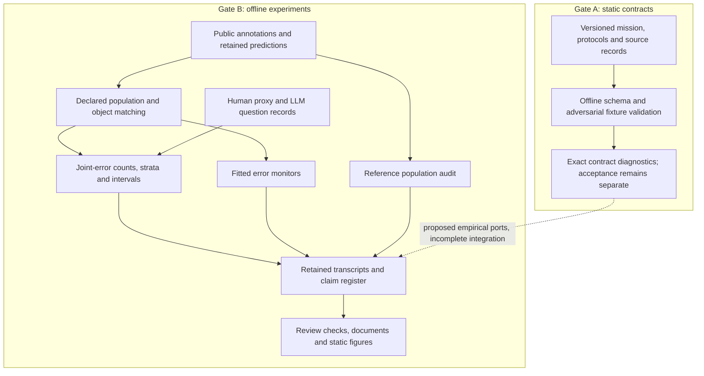
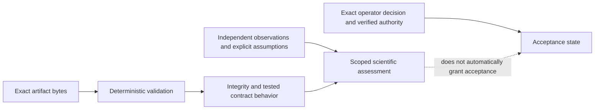

# Reiyah

Reiyah is an evidence architecture and an offline research program studying what can be inferred
about joint failures of observers. Its proposed HARBOR mission covers object-level human and
vehicle belief, readiness, recoverability, explicit unknowns and causal policy effects. Current
experiments measure narrower quantities on public detector, human-proxy and language-model data.

The [research-board report](docs/RESEARCH_BOARD_2026-09-07.md) gives the complete reconstruction,
2026 primary-source review, scorecard and research program. **The current evidence does not
establish a frontier perception system, a universal independence law, human belief measurement,
or deployable safety guarantees.** The strongest immediate opportunity is making invalid
physical-world inferences detectable and explainable.

## Current research result

[Result AO](docs/RESULT_AO_REFERENCE_POPULATION_AUDIT.md) independently reanalyzes retained
nuScenes inputs. The conditional camera/lidar miss ratio is 1.151053; a whole-scene bootstrap
interval is [1.128749, 1.166206]. This supports a bounded descriptive association.

The same audit finds that 3,151 of 24,432 camera ghost flags and 5,728 of 23,840 lidar ghost flags
are within two meters of annotations excluded from the original reference cache. These are
reference-label changes, not proof that every prediction is correct. Temporal coincidence
ratios also depend on the chosen null. Physical ghost identity remains unresolved.

The research revision repairs two concrete validation defects: failed mAP validation no longer
writes a new matcher artifact, and a replay must exit successfully as well as reproduce the
expected transcript. Regression tests exercise the original counterexamples.

## What actually runs



Some inherited experiments execute pretrained detectors; others fit classifiers or analyze
archived outputs. There is no inspected driving runtime, original perception backbone, learned
occupancy/world model, online belief tracker or validated recovery policy. The available review
instrument checks numbers and claim/document consistency; a separate interactive UI session
was not available in the inspected refs.

## Repository and authority state

The research-board investigation froze Gate A at
`74fbacc77a3c74d3a4962f488b589ee614a4c575` and Gate B at
`fd094c066437e67cefbb86f363dd1bef7ccf8e6e`. This research revision is based on Gate B and does not
merge or replace the concurrently active engine or UI work.

Gate A's latest inspected K129 route passed its locked contract replay, while explicitly reporting
that the readiness correction is contracted, not reviewed or implemented. Operator acceptance
remains `unaccepted`. The inherited architecture records are not silently upgraded by these
empirical experiments or by passing development checks. Released mission/protocol/schema/fixture
bytes remain historical versioned artifacts. This branch's changed README and handoff are research
navigation, not a newly validated Gate A release packet.



The configured GitHub remote is a distribution channel. Repository text, signatures, checksums,
model-assisted review and publisher readback do not create scientific or safety authority.

## Reproduce the research checks

Use an environment with `numpy`, `scipy` and `jsonschema` for the checker and regression suite:

```sh
python -B tools/measure/gate_b_check.py --json /tmp/reiyah-gate-b-check.json
python -B -m unittest discover -s tools/measure -p test_research_board_regressions.py -v
python -B tools/measure/result_ao_reference_population_audit.py --data-root /path/to/local/reiyah-data
```

The digest check does not replay prior experiments unless replay is explicitly selected. The
manifest distinguishes local deterministic, network-cached, heavy-inference and historically
unrecorded commands. Result AO records exact input hashes and library versions; reproducing its
bytes requires the matching inputs and numerical environment. Source-derived annotation cases
can be written to a private path with `--private-cases-output`; they are not in the public aggregate.

Gate A release evidence must be produced by the exact locked launcher and validation plan for
its selected immutable commit. A Gate B development check is not a substitute. See the
[repository contract](AGENTS.md) and the [architecture handoff](docs/SESSION_HANDOFF.md).

## Read the complete story

| Purpose | Artifact |
|---|---|
| What exists, what is unproven, and what to investigate next | [Research-board report](docs/RESEARCH_BOARD_2026-09-07.md) |
| Current bounded interpretation of all research threads | [Corrected synthesis](docs/GENERAL_SYNTHESIS.md) |
| New measurement, limitations and exact replay | [Result AO](docs/RESULT_AO_REFERENCE_POPULATION_AUDIT.md) |
| Current claim status and predecessor lineage | [Claim register](evidence/claim-status-register-2026-09-07.json) |
| Source versions, private custody and public pointers | [Research source ledger](evidence/research-board-source-ledger-2026-09-07.json) |
| Executed checks and unresolved implementation risks | [Research closeout](docs/RESEARCH_BOARD_CLOSEOUT_2026-09-07.md) |
| Existing measurement contract and history | [Gate B contract](docs/GATE_B_MEASUREMENT_CONTRACT.md), [Gate B handoff](docs/GATE_B_SESSION_HANDOFF.md) |
| Original scientific architecture | [Architecture](docs/ARCHITECTURE.md), [scientific charter](docs/SCIENTIFIC_CHARTER.md) |
| Mathematical limits on safety transfer | [RSS estimand analysis](docs/ESTIMAND_RSS_DEFINITION_32.md) |
| Public-data permissions and retained custody | [Public-data custody](docs/PUBLIC_DATA_CUSTODY_2026-09-06.md), [NOTICE](NOTICE) |

The next scientific choice is one reference-validity study with independent adjudication, followed
only if justified by a temporal monitor experiment against strong calibrated baselines. The prior
results, failed forecasts and withdrawn interpretations stay discoverable. Reiyah should earn
trust by resolving those boundaries, not by expanding its claims faster than its evidence.

## Open source and citation

Repository code is distributed under [Apache-2.0](LICENSE). Third-party datasets, model outputs
and source documents retain their own terms; the code license does not relicense them. See
[NOTICE](NOTICE) and [CITATION.cff](CITATION.cff). No third-party research paper payload is added
by this review. The new local research commit has Daniel Wahnich as its sole author.
