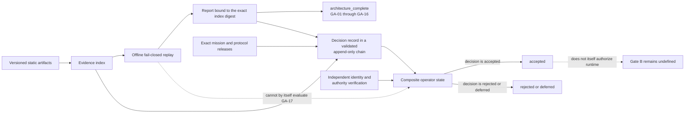
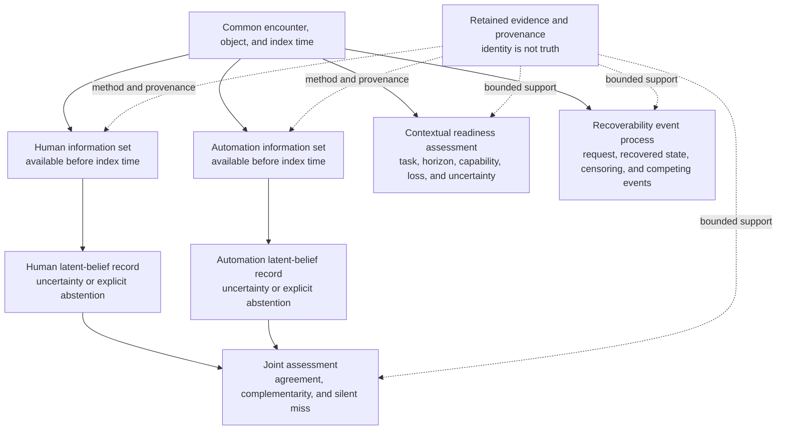
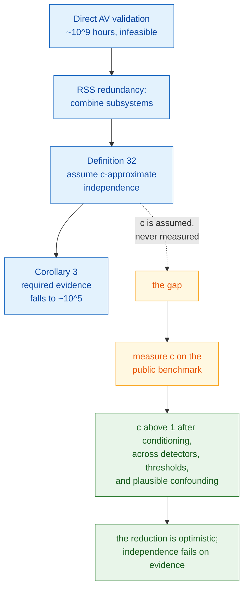
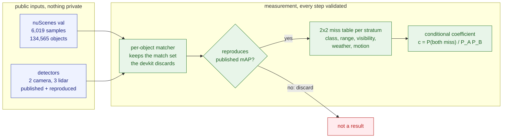
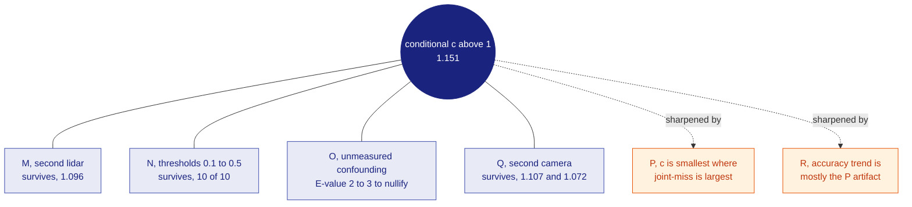

# Reiyah

Reiyah is a pre-implementation, open-source research architecture for HARBOR, the proposed
Human-Automation Readiness, Belief & Operational Risk program. It is an evidence and benchmark
engine for falsifiable analysis of shared human-automation driving situations. It is not a
driver-monitoring classifier, an autonomy stack, a safety case, or a runtime system.

For a specific object at a specific time, HARBOR asks what the human and automation could each
observe, what each had reason to believe, what decisions and interventions followed, what outcome
occurred, and what retained evidence can support each statement.

> Gate A covers static architecture, deterministic fixtures, and offline validation only. An
> `architecture_complete` result is not operator acceptance, scientific support, safety
> validation, standards compliance, product readiness, or runtime authorization.

## Current status

Gate A `1.2.0` is an operator-unaccepted correction candidate. It preserves the proposed
`reiyah.mission@1.1.0` mission and introduces the proposed
`reiyah.protocol.harbor-gate-a@1.2.0` protocol successor. The correction responds to retained
counterexamples against the public `1.1.2` packet. It does not add a runtime, execute a study,
produce empirical evidence, or support a safety, compliance, causal-benefit, product-readiness,
or superiority conclusion.

The index deliberately records `candidate_pending_canonical_report`. Only a passing release-mode
report that exact-binds that index may classify those bytes as `architecture_complete`. During
construction, or whenever the report and index do not reconcile exactly, architecture status is
not complete.

| Surface | Meaning |
|---|---|
| Architecture state | Resolve only from the exact `1.2.0` canonical report and repeated byte-identical clean release replay. Until that evidence exists and passes, the state is not complete. |
| Operator state | `unaccepted`. Acceptance requires a current exact-binding record whose decision is `accepted`, a validator-accepted append-only decision chain, and independent verification of operator identity and authority. |
| External control | GA-17 remains `not_evaluated` by offline repository validation. |
| Runtime | Unauthorized. No product runtime, model execution, live network dependency, cloud execution, private-data ingestion, deployment, or physical-control integration is present. |
| Later gates | Gate B is not defined or authorized. |
| Public remote | A distribution channel only; it has no scientific, safety, standards, acceptance, or publication authority. Publisher readback is an assertion, not independent transport verification. |

Architecture completion and operator acceptance are deliberately separate:



The diagram describes repository governance, not a deployed system.

## Resolve the exact current identity

The indexed packet cannot contain its own digest, its later Git commit, an event rights record
that binds that commit, or a post-publication receipt without creating a cycle. The validation
plan permits only one exact event-specific future-rights exclusion and rejects broad rights
prefixes. Resolve the current state in this order:

1. Verify [`GATE_A_EVIDENCE_INDEX.json`](gate/GATE_A_EVIDENCE_INDEX.json) against its
   [`SHA-256 sidecar`](gate/GATE_A_EVIDENCE_INDEX.sha256).
2. Select the canonical report in [`gate/validation-reports/`](gate/validation-reports/) whose
   `index_binding.sha256` equals that sidecar digest.
3. Run the offline validator and require the report, index, repository inventory, fixtures, and
   declared controls to reconcile with zero diagnostics.
4. For publication identity, select the unique highest valid record in
   [`gate/public-distribution-receipts/`](gate/public-distribution-receipts/) whose linear history
   exact-binds that index, report, published commit, repository, rights observation, and the
   publisher's retained readback assertions.
5. Resolve acceptance separately. The current index, report, mission, and protocol must be bound
   by the head of a validator-accepted decision chain; that head must say `accepted`; and operator
   identity and authority must be independently verified. Otherwise no accepted state may be
   inferred from repository bytes.
6. Resolve independent transport verification only from a distinct authorized observation record
   that exact-binds the same repository, commit, index, and report bytes. A publisher receipt,
   branch tip, or older receipt is not a substitute.

### Exact public predecessor

Gate A `1.1.2` is the immutable public predecessor for this correction:

| Item | Gate A `1.1.2` identity |
|---|---|
| Indexed packet commit | `ad1a8cae6ad17f26f5a07f43fb60b6c9f55b4b1b` |
| Receipt-bearing repository commit | `656d826cfe6938fd628c0ede7ea15929fe11d90e` |
| Evidence-index digest | `sha256:17f3a2e601e9cb4e1c0cd0f97561b1da9ffdc7d5893ed4af4eaccbaf8a67989f` |
| Validation-report digest | `sha256:06fc3114522c16625da337fe25c71b1fd53abeeaf9c31a11748afc06eb5d66d8` |
| Distribution-receipt digest | `sha256:e7f3bedac49423d4ba042419056896c507d26ee2bd9a706981abf2131dcda19d` |
| Receipt sequence | `3` |
| Mission release | `reiyah.mission@1.1.0` |
| Protocol release | `reiyah.protocol.harbor-gate-a@1.1.0` |
| Exact state | `architecture_complete`, `unaccepted`, GA-17 `not_evaluated`, runtime `false` |

The predecessor receipt records a publisher's static public-distribution assertions. It is not an
independent observation of remote transport and creates no scientific evidence, operator
acceptance, compliance result, or runtime authority. The exact collision-prone predecessor index
and sidecar are preserved under [`history/gate-a-1.1.2/`](history/gate-a-1.1.2/).

### Why the successor exists

Gate A `1.1.0` established the first receipt-bound public Gate A architecture. A
forensic release review then found that its operator-decision interface required the `1.1.0`
protocol release to claim an older schema identity, so a truthful decision record could not
satisfy the contract. Gate A `1.1.1` corrected that governance defect, preserved the original
mission and protocol releases, froze the predecessor bytes, and added exact index, report, and
receipt replay without changing a scientific proposition.

After `1.1.2` was published, a forensic challenge found twelve gaps. Eight were scientific:
incomplete policy-distribution and trajectory-weight checks, asserted rather than derived causal
adjustment validity, confident readiness despite required unknown capabilities, unreconciled
recovery summaries, incomplete transfer eligibility, unqualified conformal guarantees,
non-exhaustive OOD/selective denominators, and asserted worst-group eligibility. Four concerned
validation integrity: unenforced string formats, live-tree time-of-check/time-of-use exposure,
imports before isolation, and publisher self-attestation presented as independent transport
proof.

The Gate A `1.2.0` candidate is intended to correct these defects through executable operands,
deterministic derivations, reason-specific counterexamples, a byte-locked pre-runtime launcher,
one immutable candidate projection, and a separate transport-observation interface. Closure
requires the final immutable release replay; this prose does not establish it. The retained
[`adversarial review`](docs/GATE_A_1_1_2_ADVERSARIAL_REVIEW.md) is an advisory integrity input,
not independent scientific evidence. Every unchanged `1.1.2` indexed artifact must remain
byte-identical; every changed or added path must be explicit in the `1.2.0` validation plan.

A second adversarial pass over the developing successor found sixteen candidate-integration
risks. They include belief and observation reconciliation, joint-event identifiability,
assumption-evidence eligibility, typed-reference substitution, governance chronology, canonical
report count consistency, and premature completion language. The proposed protocol now binds the
[`candidate consistency review`](docs/GATE_A_1_2_0_CONSISTENCY_REVIEW.md) and eleven high-level
executable contracts. Those findings remain open until repeated byte-identical immutable release
replay derives their exact closure from the same candidate snapshot.

## Research thesis

HARBOR treats the human and automation as distinct actors with potentially different information
sets. It compares their uncertainty about the same object without treating either channel as
ground truth or collapsing disagreement into a single score.



This is a research view, not a sensing, inference, alerting, intervention, or vehicle-control
pipeline. The architecture keeps observation, latent belief, decision, intervention, outcome,
and evidence separate in identity, provenance, and time. Missing, unmeasured,
out-of-distribution, sensor-invalid, and abstained are distinct states. None may silently become
zero, false, normal, negative, or a confident label.

## Research surfaces

| Surface | Gate A static contract |
|---|---|
| Object-level belief | Identified actor, object, state space, frozen information set, uncertainty, calibration target, applicability domain, and abstention. |
| Readiness | Named task and context, index time, horizon, capability set, loss, uncertainty, and intervention; never a universal person label. |
| Recoverability | Perturbation or request, recovered-state definition, time-to-event treatment, censoring, competing events, and observation coverage. |
| Joint silent miss | Common opportunity, per-channel validity, detection and warning windows, dependence treatment, and fallback availability. |
| Causal and sequential policy effects | Exact policy and comparator versions, assignment and propensity records, support, estimand, estimator, uncertainty, and sensitivity assumptions. |
| Explicit unknowns | Selective prediction, abstention, out-of-distribution state, conformal applicability, denominators, and coverage-performance reporting. |
| Transfer and worst groups | Frozen source and target domains, access chronology, adaptation limits, complete group universe, intersections, validity, and simultaneous uncertainty. |
| Research and assurance governance | Preregistration, datasets, benchmarks, ODDs, scenarios, tests, hazards, arguments, evidence, defeaters, and change impact without safety authority. |

The formal quantities and invalid-state behavior are defined in the
[`mathematical specification`](docs/MATHEMATICAL_SPECIFICATION.md). Five closed-shape application
schemas make these research surfaces machine-reviewable without collecting data or executing a
model, policy, simulation, or study.

## Gate A boundary

| Included | Excluded |
|---|---|
| Scientific charter, claims, non-claims, and status model | Product runtime, live services, cloud execution, or deployment |
| Append-only mission, protocol, definition, and research-function releases | Model training, inference, or monitoring |
| Source custody, dated standards gap mappings, and public distribution controls | Vehicle sensing, alerts, actuation, or physical control |
| Closed Draft 2020-12 schemas | Private, secret, or operational human and vehicle data |
| Synthetic known-good and reason-specific known-bad fixtures | Operational data collection or empirical publication machinery |
| Read-only deterministic validation | Safety, compliance, causal-benefit, or superiority claims |
| Evidence index, canonical report, and external decision procedure | Operator acceptance inferred from tests, signatures, or consensus |

An artifact with mixed permitted and forbidden behavior is forbidden in full. Gate A validation
is offline; live network and cloud execution are prohibited.

## Evidence discipline

A URL is a discovery pointer, not retained evidence. Positive standards or benchmark mappings
require exact permitted bytes, identity, version, publication date, scope, comparator, content
digest, limitations, and an explicit custody and redistribution state. The repository currently
contains four eligible ISO Open Data metadata payloads, not normative ISO text. Four NIST or UN
records and all 38 frontier records covering primary methods, official specifications, and
bounded Tesla and Mobileye company comparators remain pointer only and evidence ineligible.

Company statements, papers, standards pages, generated prose, signatures, checksums, passing
tests, and consensus may motivate a question or provide an integrity signal. They do not become
independent proof of effectiveness, safety, compliance, deployment, or comparative advantage.
See the [`source policy`](docs/SOURCE_POLICY.md), [`standards crosswalk`](docs/STANDARDS_CROSSWALK.md),
and [`2026 frontier baseline`](docs/FRONTIER_BASELINE_2026.md).

## Rigor under pressure

Hard problems tighten the method. When ambiguity survives review, Reiyah stops at the narrowest
affected boundary, preserves the unknown state, records the strongest plausible falsifier, makes
assumptions, denominators, time, provenance, and residual risk explicit, adds the smallest
reason-specific counterexample, and replays the unchanged contract. A deadline, prestigious
source, confident model, generated signature, consensus, or passing test cannot promote a claim
or weaken an expected failure.

Failures, contradictions, null results, invalid analyses, corrections, and retractions remain
discoverable. A blocked result is preferable to a plausible default.

## The measurement, the engine's first evidence

The `gate-b-measurement` branch carries the first empirical stress test of a HARBOR construct on
public data. It takes the dependence treatment named in the joint-silent-miss surface and measures
it directly, using only published or reproduced detector outputs on the nuScenes validation split.
No private data, no deployed system, and no released `1.2` architecture byte are involved. Every
result is retained as `proposed`, and several of this workstream's own claims were withdrawn on
evidence and left standing with their refutations attached. A full reading with a figure is in
[`docs/GATE_B_FINDINGS_SYNTHESIS.md`](docs/GATE_B_FINDINGS_SYNTHESIS.md).

### The claim under test, and the number it never measures

Mobileye's RSS paper argues that direct statistical validation of an autonomous vehicle is
infeasible, then escapes that cost with a redundancy argument: Definition 32 posits that subsystem
errors are `c`-approximately independent, and Corollary 3 uses it to cut the required evidence by
about four orders of magnitude. The coefficient `c` is assumed and is never estimated anywhere in
the paper. This workstream measures it.



### How it is measured, and how each step is checked

A per-object matcher reimplements the nuScenes devkit accumulation but keeps the match set the
devkit discards, so each ground-truth object gets the score of the detection that matched it. A
detector is admitted only if that matcher reproduces its published mAP; otherwise nothing
downstream is believed. The retained coefficient is the observed joint-miss rate divided by what
independence predicts within each stratum of five admissible confounders, which is exactly the
smallest admissible constant in RSS Definition 32.



### What survived the checks

The headline is that a camera detector and a lidar detector fail on the same objects more than
independence predicts, `c = 1.151` for the first pair after five confounders, and that this
survives every cheap way to dismiss it. One measurement becomes a finding by clearing four
independent robustness axes and two sharpening results.



Two of those deserve a sentence, because they are where the method earns its keep. Result P shows
the coefficient is smallest exactly where the two sensors jointly miss the most real objects, since
a ratio is deflated by its marginals, so `c` alone cannot certify redundancy. Result R takes an
inviting trend, that stronger detectors appear to couple more, and finds that about four fifths of
it is the same marginal arithmetic P identified; only a small residual survives a matched-marginal
comparison. The dramatic version of each claim is the one the method refuses to make.

None of this is a safety finding, a compliance determination, or a comparative claim about any
vendor. It is association after declared conditioning on two public detection outputs, reproducible
from this repository, and bounded by the covariates nuScenes annotates. It is evidence that the
architecture's constructs are measurable and that the assumption they target fails where it has
been tested, not a certificate about any deployed system.

## Reproduce the static checks

Authoritative replay is intentionally bound to the exact resolved canonical root
`/Users/danielwahnich/workspace/reiyah`. The validation-plan-bound launcher, primary validator,
science module, and toolchain lock fail closed for an ordinary clone at any other path. External
path portability is not provided at Gate A; moving the repository, using an alias or symlink, or
bypassing the identity preflight produces a different, untrusted analysis rather than an
equivalent Reiyah validation.

Gate A `1.2.0` must start through the reviewed launcher. The launcher enters the locked macOS
Seatbelt policy before CPython starts, clears ambient loader state, invokes isolated no-site,
no-bytecode Python, and verifies exact platform, executable, standard-library, extension-module,
and dependency bytes. In release mode it performs two separately loaded, state-reset evaluations
of the same repository projection. Their pre-report stage evidence and index bytes must match before
the report can record `architecture_complete`. Direct Python invocation is rejected.

For a read-only development replay from the verified Reiyah Git root:

```sh
tools/gate_a_1_2_0.sh --snapshot-mode development --output human
```

For deterministic machine-readable development output:

```sh
tools/gate_a_1_2_0.sh --snapshot-mode development --output json \
  > /tmp/reiyah-gate-a-validation-1.2.0.json
```

A development replay uses one observational snapshot and is never release evidence. Release
bootstrap is a three-state, acyclic procedure. Start from a clean committed `C0` in which the
candidate is otherwise complete, including the two fresh capture manifests, but the current
index, sidecar, and report paths are absent. Never redirect bootstrap output to a repository path:
the shell opens that path before the validator captures its snapshot and thereby makes the
release tree dirty.

```sh
set -eu

index_tmp=/tmp/reiyah-gate-a-index-1.2.0.json
report_tmp=/tmp/reiyah-gate-a-validation-1.2.0.json

test -z "$(git status --porcelain=v1 --untracked-files=all)"
test ! -e gate/GATE_A_EVIDENCE_INDEX.json
test ! -e gate/GATE_A_EVIDENCE_INDEX.sha256
test ! -e gate/validation-reports/gate-a-validation-1.2.0.json

tools/gate_a_1_2_0.sh --snapshot-mode release --output json --emit-index \
  > "$index_tmp"
cp "$index_tmp" gate/GATE_A_EVIDENCE_INDEX.json
index_digest=$(shasum -a 256 "$index_tmp" | awk '{print $1}')
printf 'sha256:%s  gate/GATE_A_EVIDENCE_INDEX.json\n' "$index_digest" \
  > gate/GATE_A_EVIDENCE_INDEX.sha256
git add gate/GATE_A_EVIDENCE_INDEX.json gate/GATE_A_EVIDENCE_INDEX.sha256
git commit --amend --no-edit

tools/gate_a_1_2_0.sh --snapshot-mode release --output json --emit-report \
  > "$report_tmp"
cp "$report_tmp" gate/validation-reports/gate-a-validation-1.2.0.json
git add gate/validation-reports/gate-a-validation-1.2.0.json
git commit --amend --no-edit
```

The first amend creates `C_index`; the second creates `C_packet`. `--emit-report` requires exact
committed index and sidecar readback and internally compares two separately loaded, fresh-worker
S01 through S19 evaluations before emitting S20. The parent also performs a complete production
replay over its immutable snapshot and requires every child token row, nested row, selector row,
index byte, publication-state result, and report-driving section to equal that outer replay. The
outer replay is a substitution guard, not a third independent evaluator. Once `C_packet` exists,
two ordinary complete launcher invocations must be byte-identical to each other and the canonical
report:

```sh
tools/gate_a_1_2_0.sh --snapshot-mode release --output json \
  > /tmp/reiyah-gate-a-validation-1.2.0-a.json
tools/gate_a_1_2_0.sh --snapshot-mode release --output json \
  > /tmp/reiyah-gate-a-validation-1.2.0-b.json
cmp /tmp/reiyah-gate-a-validation-1.2.0-a.json \
  /tmp/reiyah-gate-a-validation-1.2.0-b.json
cmp /tmp/reiyah-gate-a-validation-1.2.0-a.json \
  gate/validation-reports/gate-a-validation-1.2.0.json
```

The later direct-child `C_receipt` state is checked by a release-blocking, non-emitted guard. It
validates the real rights record and sequence-four receipt and proves that the candidate
projection, index, and report remain byte-identical to `C_packet`. The unchanged canonical report
does not and cannot contain evidence about that later commit, and the receipt cannot claim remote
readback of the commit that contains the receipt itself.

A successful release run requires exit code `0`, zero diagnostics, every current-replay
known-good fixture to pass, every current-replay known-bad fixture to fail for its declared
primary rule, exact byte and schema attestation for every catalog row, exact predecessor
inheritance, exact index and projection reconciliation, and GA-01 through GA-16 to pass. The
report's same-snapshot correction closure must list exactly `CR-001` through `CR-016`, with
required findings equal to closed findings and no open finding. The
validator always leaves GA-17 and independent transport verification `not_evaluated`; it cannot
create acceptance, scientific evidence, or runtime authority.

Retained historical fixture rows remain byte-attested and schema-identified in the catalog, but
they are not counted as current `1.2.0` replay evidence.

The immutable `1.1.2` predecessor checked 68 schemas, 241 normative instances, 196 fixtures, 17
of 17 known-good cases, 179 of 179 known-bad cases, 1,010 of 1,010 required-property mutations,
and 347 indexed artifacts with zero diagnostics. These counts describe only the exact predecessor
bytes; the `1.2.0` totals must be read from its final canonical report.

## Review and navigation

| Purpose | Start here |
|---|---|
| Authority and session continuity | [`AGENTS.md`](AGENTS.md), [`SESSION_HANDOFF.md`](docs/SESSION_HANDOFF.md) |
| Mission and claim boundary | [`scientific charter`](docs/SCIENTIFIC_CHARTER.md), [`claims and non-claims`](docs/CLAIMS_AND_NON_CLAIMS.md), [`status model`](docs/STATUS_MODEL.md) |
| Gate decision procedure | [`pre-implementation gate`](docs/PRE_IMPLEMENTATION_GATE.md), [`gate records`](gate/) |
| Scientific and technical review | [`architecture`](docs/ARCHITECTURE.md), [`mathematical specification`](docs/MATHEMATICAL_SPECIFICATION.md), [`threat model`](docs/THREAT_MODEL.md) |
| Research frontier and open gaps | [`research operating model`](docs/RESEARCH_OPERATING_MODEL.md), [`2026 frontier baseline`](docs/FRONTIER_BASELINE_2026.md), [`research gap register`](docs/RESEARCH_GAP_REGISTER.md) |
| Measurement findings (this branch, proposed) | [`Gate B findings synthesis`](docs/GATE_B_FINDINGS_SYNTHESIS.md), [`measurement contract`](docs/GATE_B_MEASUREMENT_CONTRACT.md), [`Gate B handoff`](docs/GATE_B_SESSION_HANDOFF.md) |
| Evidence and standards review | [`source policy`](docs/SOURCE_POLICY.md), [`standards crosswalk`](docs/STANDARDS_CROSSWALK.md), [`evidence records`](evidence/) |
| Deterministic replay | [`validation guide`](docs/VALIDATION.md), [`validation plan`](validation/), [`fixture catalog`](fixtures/fixture-catalog.json) |
| Contribution or disclosure | [`CONTRIBUTING.md`](CONTRIBUTING.md), [`SECURITY.md`](SECURITY.md) |

Every repository session must verify the named project, working directory, Git root, repository
contract, worktree state, and handoff before making a repository-specific change. Never discard
unrelated work or reuse a published release identifier.

## Open risks and next authorized action

- HARBOR's name, constructs, estimands, thresholds, and every scientific claim remain proposed.
- No eligible empirical dataset, executed study, benchmark result, policy log, construct-validity
  result, subgroup analysis, independent replication, safety review, standards review, or legal
  opinion exists.
- The frontier baseline remains discovery material and cannot support a protocol or superiority
  claim.
- A finite schema, threat model, and fixture suite cannot prove that every scientific, security,
  rights, or release threat is known.
- The retained adversarial review is model-assisted advisory work. No independently retained
  external scientific, safety, standards, or security review is established by this packet.
- Authoritative replay is canonical-path-bound; portability to an arbitrary public clone remains
  explicitly unsupported at Gate A.

If the Gate A `1.2.0` index, sidecar, canonical report, historical `1.1.2` snapshot, fixtures, or
validator support is absent or inconsistent, continue only the bounded static correction. Once
release replay is byte-identical to the canonical report and classifies the exact current bytes
as `architecture_complete`, the exact bytes are eligible for independent advisory review and,
under separate explicit publication authority, public distribution. Publication requires a
current event-specific rights observation, exact packet/report bindings, and an append-only
publisher receipt. Independent transport verification, operator acceptance, Gate B, cloud use,
and runtime remain separate and unauthorized.

## Open source and citation

Reiyah-authored code, schemas, fixtures, and documentation are licensed under the
[`Apache License 2.0`](LICENSE). Contributions use the same terms. The repository licence does
not relicense third-party material; see [`NOTICE`](NOTICE) and the
[`public distribution inventory`](evidence/public-distribution-inventory-1.1.0.json) for the
bounded evidence payloads and required attribution.

Use [`CITATION.cff`](CITATION.cff) and cite the exact evidence-index digest reviewed. When public
distribution identity matters, also cite the unique highest valid append-only receipt that
exact-binds that same index, its canonical report, and packet commit. A publisher's readback is an
assertion. Cite independent transport verification only when a distinct authorized observation
record binds the same exact bytes. Never substitute a mutable branch name, repository
availability, or an older receipt.
