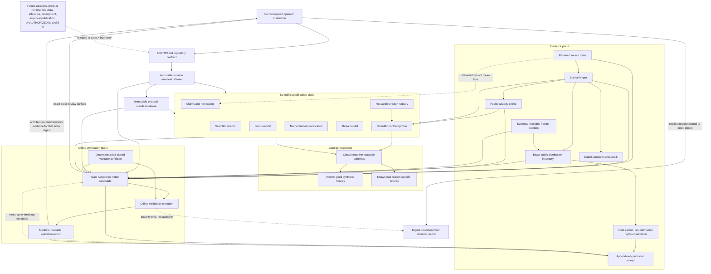
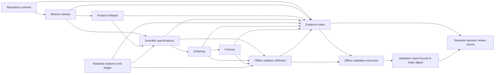
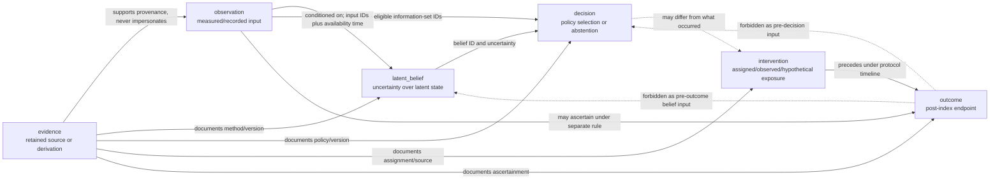
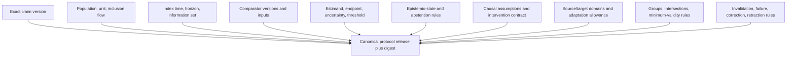
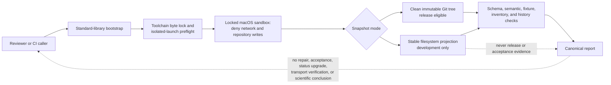
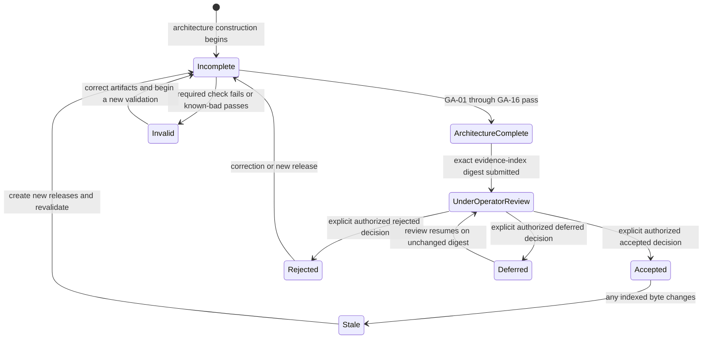

# Gate A Static Architecture

| Field | Value |
| --- | --- |
| Document ID | `reiyah.architecture` |
| Version | `1.2.0` |
| Lifecycle status | `proposed` |
| Architecture style | Static, evidence-bound, deterministic, offline |
| Runtime authorization | None |

This document describes the HARBOR Gate A architecture candidate. Diagrams show artifact
dependencies and offline review flow only. They do not depict a deployed driver, vehicle,
sensing, inference, intervention, or control system.

## 1. Architectural objective

Gate A establishes a reviewable contract in which:

- mission and protocol releases are immutable and versioned;
- observation, latent belief, decision, intervention, outcome, and evidence remain
  separate in identity, provenance, and time;
- epistemic unknowns and lifecycle statuses cannot be silently merged;
- claims are bounded by exact protocols and retained evidence;
- standards mappings expose evidence and gaps without asserting compliance;
- deterministic offline validation proves declared rejection behavior; and
- architecture completion remains separate from authorized operator acceptance.

The architecture is designed to reject ambiguity. A blocked result is preferable to a
plausible default.

## 2. Allowed and forbidden components

### 2.1 Gate A allowlist

- Markdown contracts and Mermaid source;
- JSON and YAML manifests or evidence records;
- JSON Schema with pinned dialect identifiers;
- synthetic known-good and known-bad fixtures;
- retained public-source bytes where permitted, plus metadata and digests;
- static public-repository distribution records within the exact custody inventory;
- deterministic offline validation scripts and machine-readable diagnostics; and
- unexecuted operator-acceptance templates or records.

### 2.2 Explicit denylist

- application or product runtime;
- HTTP or other network services and live dependencies;
- model training, model weights, inference, or monitoring;
- sensors, vehicles, actuators, alerts, or physical-control interfaces;
- private, secret, or operational human/vehicle data;
- deployment, product packaging, telemetry, or empirical-publication machinery; and
- claims of safety, compliance, benchmark superiority, or scientific support without an
  eligible frozen protocol and retained evidence.

An artifact with mixed allowed and forbidden behavior is forbidden in full.

## 3. Planes and authority boundaries



The current explicit operator instruction is highest within repository identity and safety
bounds. `AGENTS.md` then governs candidate manifests and documents. An accepted manifest
cannot override a later explicit operator instruction, and no external input has Reiyah
authority.

The `FUTURE` node is a denied boundary marker. It has no authorized dependency into the
repository and is not an implementation backlog encoded by this architecture.

## 4. Static artifact topology

The expected dependency direction is acyclic:



The evidence index inventories its static inputs, including the validator definition, but
does not hash itself, its sidecar digest, emitted validation output, or the acceptance
record. The validation report names the evidence-index digest it checked. The operator
decision binds that same index digest and its architecture-completeness evidence. This
avoids a circular trust construction.

The validation plan additionally binds the exact SHA-256 bytes of every authorized validation
tool and the toolchain lock. The supported launcher refuses an unbound tool or environment before
claiming its execution boundary. Index construction consumes the same immutable byte projection as
semantic validation. This is an integrity boundary for reviewed Gate A bytes, not proof that
validation is scientifically complete or externally trustworthy.

## 5. Scientific record model

### 5.1 Entity separation



Dashed edges mark a caution or prohibited shortcut, not an implementation data path.

| Kind | Identifier namespace | Essential time | Allowed upstream references | Critical forbidden shortcut |
| --- | --- | --- | --- | --- |
| `observation` | observation ID | event, availability, recorded | source/evidence, subject, object, episode | treating measurement as truth |
| `latent_belief` | belief ID | target and computation/index time | eligible observation IDs, method evidence | hiding uncertainty or relabeling as observation |
| `decision` | decision ID | decision/index time | eligible observation and belief IDs, policy evidence | using future outcome or claiming execution |
| `intervention` | intervention ID | assignment and exposure time | assignment/decision references, source evidence | assuming intended equals delivered |
| `outcome` | outcome ID | ascertainment interval and availability | episode, intervention where relevant, ascertainment evidence | entering a prior information set |
| `evidence` | evidence ID | publication/acquisition/recorded time as applicable | source and derivation inputs | acting as acceptance or ground truth |

Each reference is typed and version-aware. Coincident timestamps or equal scalar values do
not permit merging records.

Observation, latent-belief, decision, intervention, and outcome records additionally bind the
same protocol-owned encounter-construction, object-identity, and temporal-correspondence rule
IDs in `context_rules`. Evidence inherits context only through its typed targets. Matching
encounter or physical-object strings without matching context rules is not identity evidence.

The exact protocol release also owns the allowed `provenance.input_refs` dependency table:
observations have no scientific-object input; beliefs depend on observations; decisions on
observations or beliefs; interventions on decisions; outcomes on observations, decisions, or
interventions; and evidence on any scientific kind. The complete reference graph must be
acyclic, including evidence-to-evidence edges. Validator code derives these edges from the
protocol policy and cannot widen them.

### 5.2 Epistemic state envelope

Any nullable scientific value is represented by a state envelope, never a naked sentinel:

```text
state = observed | missing | unmeasured | out_of_distribution | sensor_invalid | abstained
value = present only when permitted by the state-specific schema
reason = required for every non-observed state
```

An `observed` value still requires provenance and validity under its measurement contract.
For every aggregation, the architecture reconciles total eligible units with observed and
all non-observed state counts.

Observed categorical beliefs use the exact owning protocol's
`belief_normalization_policy`: target sum one, absolute-error comparison, and tolerance
`0.000001`. The record's complete `belief.normalization_policy_binding` must equal that frozen
policy field for field, including identity, release, scope, arithmetic operands, and the runtime
boundary. A record cannot select its own acceptance threshold.

### 5.3 Lifecycle record

Objects with scientific lifecycle carry a current status plus an append-only ordered event
history. The shared schema contract covers observations, latent beliefs, research decisions,
interventions, outcomes, evidence objects, experiments, and results. Every event records a
stable event ID, contiguous sequence, prior and new status, UTC time, typed actor, rationale,
versioned evidence references, and either a null root predecessor or an exact prior-artifact
logical ID, kind, compatible schema, semantic version, path, digest, and byte size. The last event
equals the record's current status.

Sequence one is `proposed` and is the only event permitted to have null prior fields. Each
later event is a new immutable artifact version and binds only its already-existing immediate
predecessor. The current artifact's digest remains in the external evidence index, avoiding a
self-digest cycle. Corrected and retracted successors retain the same logical record ID and
schema/kind but use a distinct immutable artifact ID and path, a strictly older predecessor
version, and exact predecessor digest and byte size. The loaded predecessor history must equal the
successor history without its last event, which prevents earlier events from being rewritten.
Allowed entity/status pairs come
from the exact bound protocol release's versioned
`lifecycle_transition_policy`, not a validator-owned hardcoded table. Status `null` is a
protocol result and is unrelated to JSON `null` or epistemic absence.

## 6. Benchmark protocol architecture

An immutable protocol release binds the complete evaluation question before eligible
outcome access:



Not every protocol needs a causal, transfer, or subgroup estimand, but it must explicitly
mark such sections inapplicable with rationale rather than omit them ambiguously.

Any substantive change creates a new release identifier linked to the superseded release.
A preregistered release is never overwritten. Exploratory deviations are retained and
must be labeled `exploratory`.

Preregistration is conferred only by an exact retained
`preregistration-record.schema.json` artifact, never by indexed prose. That record binds the
experiment ID and version, protocol release, exact typed analysis-specification
artifact/schema/version/path/digest, UTC freeze time, and a declared observation boundary.
The separate analysis specification repeats the complete frozen population, sampling,
exposure, comparator, estimand, outcome, rule, assignment, assumption, seven-dimension
validity, epistemic, subgroup, uncertainty, multiplicity, decision, and metric mapping
contract. It names one primary metric and freezes each metric's decision rule, abstention
rule, uncertainty method, and confidence level. Semantic validation requires exact parity and
the freeze to precede the boundary.
The record and analysis specification both set `runtime_execution_authorized: false`.

The protocol also binds one exact typed definition-registry artifact. Its proposed,
protocol-owned entries version every rule, method, outcome, group, clock, sensor, construct,
state space and members, choice set and members, inference and analysis specification,
uncertainty and multiplicity method, assignment mechanism, and other governed definition.
Validators resolve composite membership as well as identifiers: belief state IDs belong to
the named state space, and an observed selected action belongs to the named choice set. The
registry is definition authority only within its exact proposed protocol release; it is not
scientific evidence or runtime authority.

The scientific profile partitions every reference occurrence exactly once into nine executable
classes: rule reference, versioned reference, actor reference, schema reference, artifact
reference, document-local reference, explicit evidence gap, registry-bare identifier, and
document-local identifier. Structured references resolve kind and exact version. Registry-bare
IDs resolve a declared definition kind and owner. Document-local references and identifiers
resolve against the exact owning collection. Schema references bind the local `$id`; artifact
references bind regular-file bytes; evidence gaps remain explicitly unavailable and carry no
supporting references. Unclassified or multiply classified occurrences fail closed.
The exact application-path inventory is derived from the bound schemas and reconciled with the
implemented resolver families. Every stable-identifier-bearing schema path is either covered by
one reference classifier or explicitly marked as an identity declaration. Adding an identifier
path without that classification blocks the gate; a profile's abstract list of shape names is not
proof of exhaustive coverage.

Gate A 1.1 introduced a digest-bound scientific contract profile and research-function registry.
The Gate A 1.2 successor binds the exact common, application, and mutation-fixture schemas; every
static positive and scientific negative fixture; and the production semantic rules that replay
those fixtures. Governance and validator-security fixtures remain separately classified in the
central catalog and validation plan.
Eleven high-level executable contracts cover policy distributions, causal identification,
readiness, recovery, transfer, conformal guarantees, OOD partitioning, worst-group eligibility,
human belief-observation-decision reconciliation, joint silent-miss identifiability, and
assumption-evidence eligibility. The complete production rule set is broader and remains the
actual executable closure surface. Ten of these application contracts carry a typed estimand
operand that must equal the exact profile and protocol mapping; assumption-evidence eligibility is
the only intentional empty estimand mapping.
The function registry orders question and falsifier design, custody, construct validation,
preregistration, data and benchmark governance, ODD and scenario design, temporal information
sets, belief assessment, joint readiness and recovery, policy evaluation, selective uncertainty,
transfer and worst-group evaluation, result lifecycle, and independent review. Both artifacts
are proposed architecture. They assign no personnel, execute no study, and create no scientific
support.

## 7. Construct-specific architecture requirements

| Construct | Minimum static contract | Invalid shortcut |
| --- | --- | --- |
| Object-level belief | object identity and uncertainty; latent target; conditioning observation IDs; method/version; applicability domain; abstention | treating a point score as known latent truth |
| Readiness | named task/intervention; context; index time; horizon; capability set; loss; uncertainty | universal person label |
| Recoverability | perturbation/request; recovered-state definition; time-to-event/censoring/competing-event handling | folding non-recovery, invalid measurement, and censoring into one zero |
| Joint silent miss | common opportunity; per-channel validity; detection and warning windows; dependence model | multiplying marginals under undeclared independence |
| Causal policy effect | treatment versions; assignment; potential-outcome estimand; comparator; assumptions; sensitivity | causal wording from prediction/association alone |
| Transfer | frozen source/target; access chronology; adaptation allowance; shift type; target validity | tuning on target outcomes and reporting as transfer |
| Worst group | frozen group/intersection universe; denominators; estimate and uncertainty per group; validity | dropping empty, invalid, missing, or weak groups |

Formal quantities and invalid-state behavior are defined in
`docs/MATHEMATICAL_SPECIFICATION.md`; prose here does not replace its machine-checked
bindings.

The Gate A 1.2 machine surface realizes these minimums through five closed-shape application schemas:
`human-automation-assessment`, `study-design-preregistration`,
`sequential-off-policy-evaluation`, `joint-performance-evaluation`, and
`evaluation-assurance-bundle`. A shared contract defines typed actors, object references,
information sets, time points, epistemic states, evidence bindings, and lifecycle history. The
application schemas remain static specifications. They contain no data acquisition, model,
policy execution, simulation, vehicle interface, or deployment behavior.

## 8. Evidence architecture

Candidate external material enters only through the evidence boundary:

1. identify the source and acquisition context;
2. retain exact bytes under `evidence/sources/` where access constraints permit;
3. record exact version, publication date, media type, scope, origin, access and licence
   constraints, and digest in `evidence/source-ledger-1.1.0.json`;
4. distinguish full text, excerpt, metadata-only, and inaccessible evidence extent;
5. map standards cautiously in `evidence/standards-crosswalk-1.1.0.json`; and
6. link claims to eligible evidence records while retaining contradictory and retracted
   material.

A URL is locator metadata, not retained evidence. A catalog page is not the full standard.
A crosswalk row is always a proposed evidence/gap mapping and never a compliance result.
Rows asserted as `proposed_mapping` or `partial_mapping` require retained source IDs and
observed exact version, publication date, scope, comparator, and requirement locator.
Unresolved values require the explicit `evidence_gap` mapping state rather than an asserted
mapping.
Narrative policy and limitations live in `docs/SOURCE_POLICY.md` and
`docs/STANDARDS_CROSSWALK.md`.

The public profile separates four retained and distribution-authorized payloads from four
historical pointer-only records and a separately bound frontier discovery register. A static
distribution inventory binds every included payload by path, size, digest, attribution, and
caveat. The packet first freezes the exact index and report in commit `C_packet`. Immediately before
packet finalization, two typed capture manifests record predeclared method-specific observation
metadata and bounded paraphrases without redistributing the raw ISO or NIST HTML. Direct HTTP
capture records the digest and size of the unretained response body. If a predeclared official page
blocks that method, a closed adapter-observation branch records the failed direct attempt and leaves
unexposed response bytes, status, digest, size, and cookie state unasserted. It cannot be selected
as an undeclared fallback. Both branches expose their limitations and remain evidence-ineligible.
The manifests are ordinary indexed packet artifacts. After `C_packet` exists and immediately
before publication, a
separate rights record resolves those manifests, covers the mutable official ISO Open Data and
NIST rights pages, and binds `C_packet`, the index, and the report. That record has no legal or
operator authority and fails closed on an inaccessible page or observed contradiction. Because including a
record that names `C_packet` inside that same commit is impossible, the validation plan permits one
exact event-specific rights path as a cycle-breaking exclusion and rejects every broad or historical
rights exclusion. A post-push receipt and the rights record are committed together in direct child
`C_receipt`. The receipt binds the pre-push custody profile, ledger, discovery register, inventory,
rights observation, repository, Git ref, packet commit, time, and exact four payloads. Both event
records remain excluded from the packet projection. The receipt preserves the publisher's
transport assertion but does not independently verify a remote observation. A distinct
transport-verification record must bind retained response or witness bytes before any scoped
external readback claim is made.

## 9. Deterministic offline validation architecture

The supported validation entry point starts with a standard-library bootstrap. Before importing a
third-party package, it verifies the canonical root, isolated Python flags, locked executable and
dependency bytes, and the exact platform-specific sandbox profile. The sandboxed child may inspect
only a single immutable repository snapshot. It must make no network call, mutate no repository
artifact, use no live or private input, and perform no model training or inference.



### 9.1 Validation stages

1. **Bootstrap:** assert the Reiyah canonical root, isolated interpreter flags, and the
   digest-bound toolchain before any third-party import.
2. **Execution boundary:** enter the reviewed platform sandbox and report its conditional
   network and repository-write guarantee without implying broader operating-system assurance.
3. **Snapshot:** load either one clean regular-blob Git tree for release review or one stable
   filesystem projection for explicitly non-release development review. Reject symlinks, special
   files, submodules, or pre-to-post drift.
4. **Inventory:** reject undeclared required artifacts, duplicates, unsafe paths, and digest
   mismatches against that same in-memory byte map.
5. **Syntax and schema:** use the pinned dialect, strict JSON, a closed locally implemented format
   set, and positive and negative format canaries. Reject unknown properties where the schema is
   closed and reject unsupported formats or schema versions.
6. **Semantic integrity:** enforce stable IDs, typed references, allowed status events, kind
   separation, temporal availability, provenance, evidence eligibility, executable derived-value
   rules, and denominator reconciliation.
7. **Fixture replay:** every known-good case passes; every known-bad case fails for its declared
   primary rule ID. Failure for an unrelated reason is insufficient.
8. **Document integrity:** verify internal links, artifact IDs, version bindings, and
   cross-document vocabulary. The validation plan digest-binds every normative narrative to
   its machine contract through strict `narrative_bindings`; duplicate binding IDs or a stale
   narrative or machine digest fail closed.
9. **Determinism:** canonicalize traversal and diagnostic order; two fresh validations of the
   same projection must produce identical exit status and report bytes.
10. **Report:** emit stable rule IDs, artifact-relative paths, object IDs where known, reasons,
    fixture totals, snapshot identity, execution-boundary status, and an aggregate result.

The fixture layer MUST exercise the same production check functions used for repository
validation. In-memory production mutations MUST cover removal of required boundaries,
claim-register divergence, global scientific-semantic violations, unledgered sources,
excluded-path intrusion, noncanonical indexes, incomplete threat coverage, false validation
coverage, and conflicting operator-decision history. A fixture-only surrogate that bypasses
the production path does not establish the affected control.

An exception, unknown artifact type, unresolved reference, unsupported format, or unsupported
version is an error. No validator may weaken a rule or change a fixture expectation merely to
pass. A development-mode pass cannot be promoted into release evidence.

## 10. Evidence index and acceptance

The Gate A evidence index is a canonical, machine-readable inventory of the exact candidate
architecture. For every bound artifact it records path, artifact ID, version, media type,
digest algorithm, and digest. It includes the validation definition and contract version,
but excludes itself, its sidecar digest, the emitted validation report, and all operator
decision records. Append-only post-distribution receipts are also excluded because they bind a
commit that already contains the pre-push packet. The deterministic validation report identifies the evidence-index path
and digest it checked.

For Gate A index version `1.2.0`, the schema fixes the index schema ID, schema version, artifact
ID, index ID, version, architecture date, lifecycle state, architecture state, unaccepted operator
state, null decision binding, validation entry point, snapshot-projection contract, expectations,
and no-runtime flag to their canonical values. Every `artifacts[]` binding MUST carry an explicit
semantic version, including Markdown, tooling, lockfiles, retained-source bytes, and other
artifacts that do not contain native JSON version metadata. The canonical projection and builder
logic are the only sources for derived inventory values. Missing, guessed, or mutated metadata
makes the saved index noncanonical.

The canonical, decision-free Gate A `1.2.0` closeout report is likewise closed over the exact Gate
A version and one release-eligible snapshot projection. It MUST report coverage totals derived
from the current validation plan and index. Every known-good case MUST pass; every scientific,
governance, and validator-security known-bad case MUST fail for its declared rule; each passed or
rejected count MUST equal its corresponding total; unexpected outcomes and diagnostics MUST both
be zero; `acceptance_created` MUST be false; and `operator_acceptance_state` MUST be `unaccepted`.
Its control summary MUST list GA-01 through GA-16 as required, covered, and passed with no failed
architecture control. GA-17 is represented by `control_summary.external_control`, which the
offline repository report always sets to `not_evaluated` with a null decision-record ID. The validator
may diagnose decision-record structure, bindings, and history, but repository bytes cannot
authenticate a human or establish authority. Only an independently authorized external verifier
may evaluate the composite operator state; a schema-valid self-assertion is insufficient and
Gate B remains blocked. The report also keeps public transport `not_evaluated`: it may validate
receipt-chain structure but cannot convert receipt assertions into an external remote observation.
Any result other than `pass`, any nonzero exit code, any count mismatch, any failed architecture
control, or any nonempty diagnostic set forbids `architecture_complete` for that report.

The report MUST also carry a same-snapshot `correction_closure_summary`. Its ordered
`required_finding_ids` are exactly `CR-001` through `CR-016`; `closed_finding_ids` and
`open_finding_ids` form an exact disjoint partition of that set; and `finding_results` contains one
ordered result for every required finding with the exact production checks and fixtures used to
derive its state. `architecture_complete` is permitted only when the required and closed arrays are
identical, the open array is empty, and every referenced check and fixture passed in that replay.
Review prose, a prior run, or an independently edited closure list cannot close a finding.

To prevent a decision/index digest cycle, the candidate index permanently records
`operator_acceptance_state: unaccepted` and a null decision binding. A later external decision
record may bind the index and yield a composite accepted, rejected, or deferred state, but the
decision is never written back into the bytes it binds.

The acceptance sequence is deliberately separate:



These labels represent the exact gate concepts `incomplete`, `invalid`,
`architecture_complete`, `stale` and the operator decisions `accepted`, `rejected`, and
`deferred`; they do not replace scientific lifecycle statuses. `architecture_complete` is
not `accepted`.

An operator decision record is valid only if it contains:

- the canonical evidence-index artifact ID, path, schema ID, version, digest algorithm, and
  digest in every required index binding;
- every canonical mission and protocol release in the current append-only ledger, with exact
  artifact bindings;
- the canonical retained validation-report artifact ID, path, schema ID, version, and digest,
  whose content establishes architecture completeness for that same evidence-index digest;
- decision (`accepted`, `rejected`, or `deferred` as defined by the decision schema);
- a stable lowercase operator identifier in the `operator.*` namespace, independently
  verified outside schema validation;
- a substantive authority basis, UTC decision time, and decision-specific rationale with no
  placeholder text;
- explicit acknowledgement of unresolved risks and the no-runtime boundary;
- confirmation that no GA-01 through GA-16 failure remains unresolved; and
- decision schema identifier and version; and
- a one-based sequence number, `append_only_linear` history policy, and an immediate-prior
  record ID plus digest for every successor decision.

Passing validation cannot create this record. The validator may inspect and report a record
created by an operator, but it cannot choose `accepted`, `rejected`, or `deferred` and cannot
convert architecture completeness into acceptance. A generated or typed signature without
verified operator authority is insufficient. The schema can constrain identity syntax and
binding shape but cannot authenticate a human or establish authority. Repository validation
MUST additionally reject duplicate record or artifact IDs, non-increasing UTC times, branches,
cycles, missing predecessors, multiple roots, multiple heads, or a predecessor digest mismatch.
The first decision has sequence one and null predecessor fields. Any changed bound artifact
invalidates authorization from an earlier `accepted` decision but never deletes that record;
a later decision appends to the one linear chain.

### 10.1 Evidentiary status compatibility

Claim and result status cannot outrun evidence. A proposed claim MAY retain an explicit
evidence gap, which preserves the current bootstrap register. A non-claim MUST remain
`proposed` with evidence marked `not_applicable`, because it is a scope boundary rather than
an empirical finding. Any claim or experiment assigned `invalid`, `null`, `inconclusive`,
`failed`, `supported`, `contradicted`, `replicated`, `corrected`, or `retracted` MUST bind at
least one retained evidence object.

The Gate A 1.2 application envelope nevertheless exposes only an explicit evidence-gap binding;
it has no eligible scientific-evidence or experiment-binding resolver. Evidence-requiring
scientific statuses remain schema-representable as rejection targets, but no application record
can enter a favorable or terminal evidence-backed state in this release. This deliberate boundary
prevents a lifecycle label or self-reference from manufacturing scientific support.

The same retained-evidence rule applies to a result or metric interpretation with one of
those evidentiary dispositions. Every claim, experiment, result, or lifecycle event binding
declared `retained` uses an exact `{evidence_id, version}` reference and resolves to that
version of an evidence object whose basis is itself retained and whose source identifiers
resolve to the source ledger. Bare evidence IDs are invalid. Metrics inherit the result-level
binding. The exact protocol release's `evidence_binding_policy` rejects proposed,
exploratory, preregistered, running, blocked, null, and retracted evidence for every terminal
consumer. A corrected evidence object is bindable only as the validated current successor;
a predecessor version named by a corrected or retracted successor's `prior_artifact` is not
current-bindable. A `supported`, `contradicted`, or `replicated` consumer must bind valid
evidence. The protocol also requires at least one status-compatible witness: matching
evidence for invalid, inconclusive, failed, contradicted, and replicated consumers;
supported or replicated evidence for a supported consumer; and supported evidence meeting
the frozen null criterion for a null consumer. Corrected evidence may supplement but cannot
be the sole support-like witness. `null`, `inconclusive`, `supported`, `contradicted`, and `replicated` metric
interpretations additionally require a valid observed estimate, observed coverage, observed
uncertainty bounds, and at least one observed unit. `corrected` and `retracted` results use the
shared exact predecessor lineage. A replicated result uses an exact distinct result artifact,
logical record, schema, version, path, and digest reference. Every result also binds the exact
experiment ID and version. For `null`, `inconclusive`, `supported`, `contradicted`, or
`replicated`, the experiment must be `running` or a valid `corrected` successor whose history
contains `preregistered` before `running`, and its retained preregistration artifact must pass
binding, freeze-parity, and pre-boundary chronology checks. Proposed, exploratory-only,
preregistered-only, blocked, invalid, failed, and retracted experiments are ineligible.
Protocol release and analysis specification must match.
Each result metric's class and direction equal its unique protocol estimand, while outcome,
population, comparator, uncertainty method, confidence level, and metric mapping equal the
typed analysis specification. Per-metric decision and abstention rules also match. The result
and analysis specification name the same unique primary metric; every metric-derived result
status equals that metric's interpretation status. A worst-group disposition is a typed set of every
direction-aware tied extremum plus its protocol-owned selection rule, never a free sentence.
The result
inherits the exact experiment's complete population, object, time, sensor, reference, support,
and protocol boundaries. These structural requirements remain integrity checks, not proof
that a status assignment is scientifically justified.

Evidence objects follow the same fail-closed boundary. An evidence object may use an explicit
`evidence_gap` basis only while its lifecycle is `proposed`, `exploratory`, `preregistered`,
`running`, or `blocked`. Every other lifecycle status requires a retained basis with at least
one retained source-record identifier. `supported`, `contradicted`, and `replicated` evidence
objects additionally require `validity.state: valid`. Retention and validity remain necessary
structural conditions, not proof that the evidence is true, sufficient, or authoritative.

## 11. Change and release discipline

- Mission and protocol manifest releases are append-only; release IDs are never reused.
- Corrections create a successor with an explicit `corrects` relation and reason; old releases remain
  indexed and discoverable.
- Historical Gate A `1.0.0` contains its two initial manifest releases and remains unaccepted.
  Gate A `1.1.0` adds exact mission and protocol successors through the append-only release
  ledger. No successor may become an unchecked current head or overwrite an earlier release.
- Gate A `1.1.2` remains frozen as the last public packet before adversarial semantic and
  validation-integrity findings. Gate A `1.2.0` preserves mission `1.1.0`, creates a corrected
  protocol `1.2.0`, and binds the predecessor through exact recovery artifacts.
- Retractions remain visible and cannot silently restore an earlier status.
- Schema or semantic-rule changes create a new version and require fixture replay.
- Claim wording changes create a new claim version and must not inherit a result without a
  documented applicability decision.
- Standards, benchmark, or source changes bind exact new versions and retained bytes.
- Accepted artifact changes invalidate acceptance even when the edit appears editorial.

## 12. Integration invariants

All Gate A components must use these exact shared values:

- object kinds: `observation`, `latent_belief`, `decision`, `intervention`, `outcome`,
  `evidence`;
- epistemic states: `observed`, `missing`, `unmeasured`, `out_of_distribution`,
  `sensor_invalid`, `abstained`, with `reason` for every non-`observed` state; and
- lifecycle statuses: `proposed`, `exploratory`, `preregistered`, `running`, `blocked`,
  `invalid`, `null`, `inconclusive`, `failed`, `supported`, `contradicted`, `replicated`,
  `corrected`, `retracted`.

Schemas use stable versioned identifiers and pin their dialect. Documents may explain a
term but must not introduce an alias that machine-readable artifacts accept silently.

## 13. Gate A exit criteria

Gate A is architecture-complete only when the repository contract's required packet is
present and the documented offline validation entry point confirms:

- every required artifact and immutable release is inventoried and digest-bound;
- all schemas and semantic cross-references pass;
- all known-good fixtures pass;
- all known-bad fixtures fail for their declared primary reasons;
- internal links, IDs, versions, source extents, and hashes reconcile;
- validation uses the locked execution boundary, one immutable snapshot, a closed format set, and
  byte-identical deterministic replay;
- the full working-tree diff has been reviewed; and
- the handoff records validation evidence, unresolved risk, and the next authorized action.

Operator acceptance is a later, separate decision. Until an authorized, digest-bound
acceptance record exists, Gate A remains not accepted even if every exit criterion above
passes.
