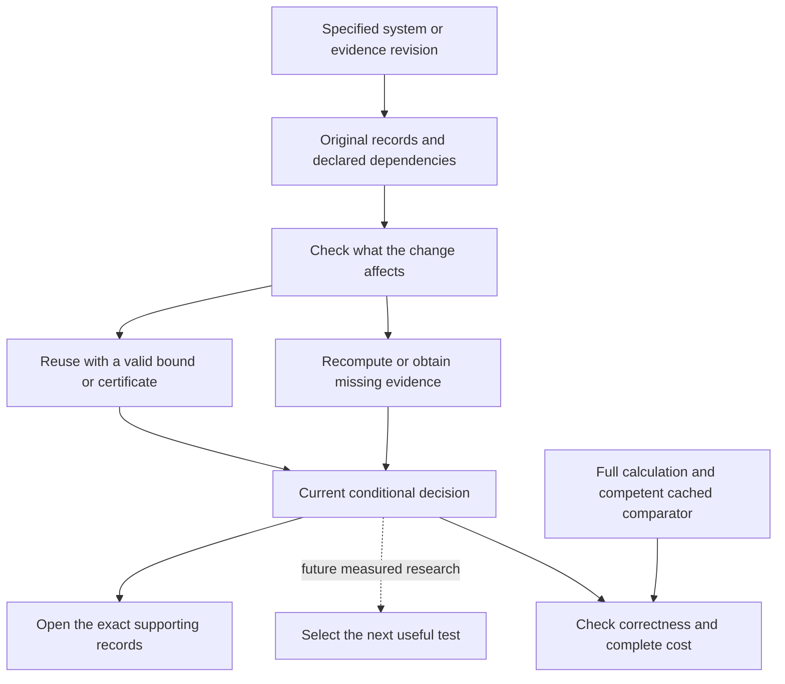

# Reiyah: justify the change and identify what needs revalidation

Document ID: `reiyah.decision-assurance.continuation`. Version: `0.1.0`.
Dated 15 September 2026. Lifecycle status: `exploratory`.

Reiyah's product direction is **decision assurance for changing autonomous systems under imperfect
evidence**. It should explain what a specified engineering decision is supported by, what remains
unresolved, what evidence could change the answer, and which prior work remains applicable after
a revision. Perception remains the first application. This direction builds on the current
Engine's custody, shared interpretations, matching, bounds and source traces.

The immediate technical milestone is a bounded revalidation comparison against a competent
cached procedure. A decision receipt or dependency graph becomes useful when it prevents an
unsupported conclusion or reduces complete measured effort. It does not itself demonstrate
readiness for deployment, superiority over an incumbent or recurring customer value.

## Corrected census and checked source case

The selected Fable `scale-final-0.4.0` source is
`5aacbde150d28591c3c2c1bb7aaeeb51228ecc3e`, manifest SHA-256
`6276518a171496b98e5ec95fd22e826c386f49a7ef3efc5586c3ac3fc547981d`.
All fifteen payloads and eleven committed origins agree. Its final report records 1,127 supported
units at their arithmetic floors, zero above-floor or unresolved supported units, and 1,873
unsupported baselines among 3,000 declared scene/pair decisions. Exact members for all 1,127
witnesses are not delivered in this outbox; this consumer does not claim to have source-verified
the entire census.

The [earlier failure](PERCEPTION_SCALE_CONSUMER_2026-09-15.md) is retained. The corrected research
module now returns floor one and exact minimum two on the overlapping-reference counterexample.
Thus all observed supported census units can be at their floors while above-floor cases remain
possible under the same loss. The empirical frequency is not a universal theorem. Closing the
three previously unresolved units is new evidence; earlier recorded uncertainty remains valid
history. Another all-floor dataset would still not eliminate the need for a crossing witness or
a separately proved sufficient condition.

One full delivered case is now checked through the existing Engine and original files:

| Item | Result |
|---|---|
| Declared cohort | Forty ordered frames in one additional development scene |
| Source accounting | 2,471 original annotations; 2,299 retained references |
| Detector operands | 2,007 base detections and 738 retained additions |
| Conditional improvement | 51/20 before the edit; 1/10 after the named 49-record deletion |
| Criterion | Strict improvement above tolerance 1/10 is excluded after the deletion |
| Minimum | 49 for the declared single-record deletion family, by lower bound plus checked witness |
| Original-record trace | All 2,745 retained prediction rows and reference identities join to source records |
| Temporal association | 49 selected records span eight frames and eleven dataset instance IDs |

Unit penalties and weights 1/40 make the greatest gain loss from one deletion 1/20.
The lower bound is `ceil((51/20 - 1/10)/(1/20)) = 49`; the complete group attains it.
This calculation identifies no actual annotation error, physical risk or human review workload.
The eleven dataset instance IDs are source associations; they are not a proved eleven-edit
minimum or independent observations.

The input case SHA-256 is
`0f0aa6c2657cb91711bef64d1f5fbdc8ec15d03e7b74d9003fa08e5f9cc77ecf`.
Original annotations, sample/instance/category joins, nominal poses and prediction byte spans
are checked. Existing native Engine normalization gives the same membership and both verdicts.
The preparation definitions still differ: research uses ego-rotated XY range and ascending
source-row suppression order; the native adapter uses global XY and descending score then
source index. Equality on this case does not establish general policy equivalence.

The private opening index links all 49 members, their original annotation and incident detection
fragments, and associated metadata. All 171 distinct local links were checked. This is navigation
over source records, not a new viewer or independent scene inspection. Capture metadata is
present, but corresponding original sensor capture bytes have not been located and verified for
this case. No reference is admitted into the separate physical comparison.

## Research implications and next experiment

Waymo describes quantitative readiness methods, a separate validation layer and a Critic;
its public account supports the relevance of evidence-based decisions and the strength of
existing internal capabilities. [Waymo, 26 August 2026](https://blog.waymo.com/blog/2026/08/10ailessons/).
N-SCORE already studies sequential robot-policy comparison, while Sim2Val reuses paired
surrogate/target measurements. They are serious comparators where their assumptions fit.
[N-SCORE, March 2026](https://arxiv.org/html/2603.13616v1),
[Sim2Val, CoRL 2025](https://proceedings.mlr.press/v305/luo25a.html).

Evidence reuse also has substantial predecessors in selective regression testing and incremental
neural verification. The 2026 conflict-reuse method proves inheritance under query refinement;
that guarantee does not cover arbitrary model-weight changes.
[Incremental verification, March 2026](https://arxiv.org/html/2603.12232v1).
Reiyah must state what its dependency map actually covers and compare ordinary caching before
claiming an incremental-assurance advantage.

The first development assay retains the supplied evidence edit, target and full calculation.
Eight anchor graphs change, thirty-two remain unchanged. Engine will test bounded reuse against
full recomputation; Fable owns the ordinary content-addressed per-anchor comparator and research
procedure. Count input checking, graph construction, hashing, matching, certificate validation,
aggregation and repair. The unchanged-anchor count is not an 80% cost-saving result. These are
counterfactual annotation edits, not model revisions or independently confirmed label repairs.

The next candidate for stronger evidence is a published externally validated annotation revision.
The [REC✓D repository](https://github.com/JonathanKlees/rechecked) describes KITTI pedestrian
annotations and detector predictions. Its metadata and processing code have been inspected;
source access, dataset terms, safe prediction representation and the exact two-dimensional target
remain to be qualified. Freeze score, matching, size, don't-care and soft-label policies before
new outcome inspection. No new dataset experiment or model inference has run here.

For eventual model-revision tests, first inventory genuine revisions, test outcomes and costs.
The five current detector submissions are not a 50–100-revision history. Keep full-benchmark
agreement distinct from physical correctness. Sequential selection must not read unacquired
outcomes or treat adjacent frames as independent trials. Report false acceptance, false rejection,
unresolved decisions and subgroup regressions alongside cost. Any 8% budget or 80–95% reuse
figure is an experimental target, not an achieved result.

## Evidence, costs and limits

The private checkpoint is
`~/.codex/reports/reiyah/engine-frontier-continuation-2026-09-15-cghzq0wh/`.
Read `START_HERE.md`, `SOURCE_BINDINGS.json`, `CLOSEOUT.json` and `PACKET_SEAL.json` before reuse.
Its `output/ASSESSMENT.md` reviews the selected primary sources; `output/NEXT_EXPERIMENT.md`
defines the next assay; `private/open-evidence-2/OPEN_EVIDENCE.md` opens the checked case.
Research retention records distinguish full paper bytes, official pages, abstracts and provider
excerpts. Third-party source payloads remain private.

The delivered-case check took 0.899 s, original source capture/verification 107.464 s, source
membership audit 2.196 s and corrected record navigation/native-after check 0.388 s. Maximum
child RSS across these commands was 547.6 MB. The first private navigation command failed from
a wrong producer function name; its exact source, partial output and 0.410 s failure remain
retained. A fresh corrected run used the existing API. No Engine implementation changed.
The first documentation consistency check also rejected new em-dash punctuation; the prose was
corrected without weakening the checker. These measurements exclude development and human
work; no total-effort advantage is established.

The original physical-reference comparison stays **[-8,8]**, with no qualifying human readings.
Its staged protocol remains available but does not block the separate automated route. Gate A
remains unaccepted. No new outreach, post, deployment, cloud campaign, physical operation,
frozen-study selection or Console change is part of this checkpoint. Both owners retain their
worktrees, history and separate source-bound outboxes.
