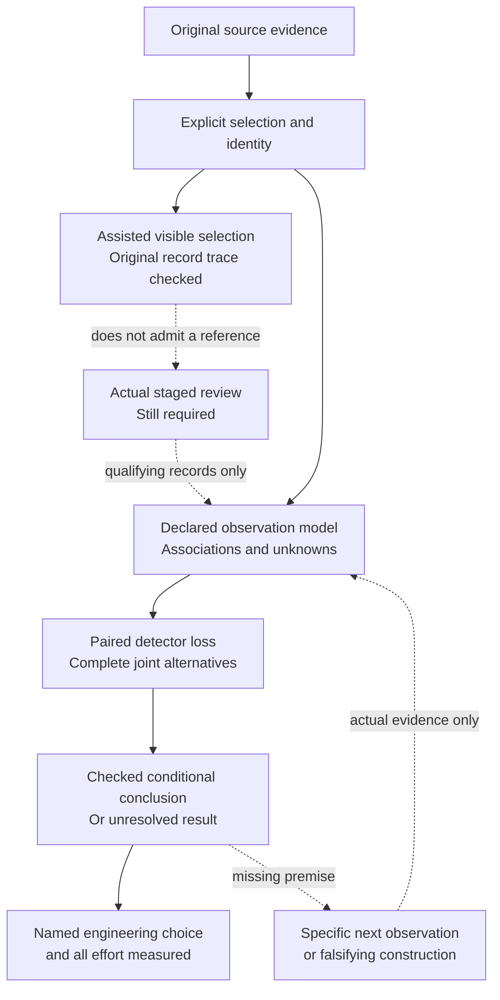
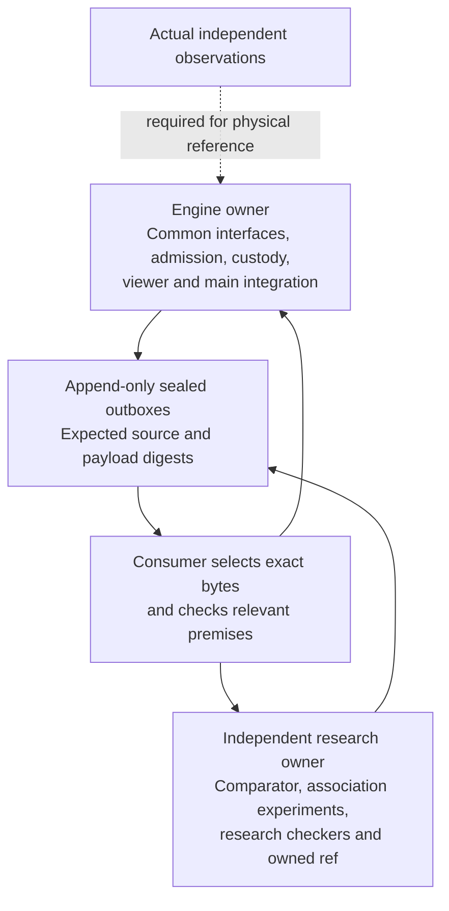

# Reiyah: the decision, the evidence and the next checks

Document ID: `reiyah.engine.roadmap`. Version: `0.1.3`. Status: `exploratory`. Updated 14 September 2026.

Reiyah's present product question is whether a perception-validation lead can make a better
added-detector integration choice, or reach the same defensible choice with less total effort,
than a competent analyst given the same evidence. The broader HARBOR mission includes human
belief, readiness, recoverability and causal policy effects. Those constructs remain distinct;
an object-detection result does not validate them by analogy.

## How the present question emerged

| Stage | What it contributed | What it did not establish |
|---|---|---|
| Static Gate A architecture | Versioned claims, evidence custody, explicit unknowns, protocols and locked validation | Operator acceptance, deployment or physical performance |
| Offline measurement research | Joint errors, marginal effects, source policies, retained failures and corrections | A universal independence law, causal mechanism or transferable safety rate |
| Reference-population audits | Reconstructed exclusions and geometric proximity to omitted source annotations | Physical correctness of a detection or an admitted human judgment |
| Paired decision Engine | Exact additive-loss bounds, joint alternatives and checkable maximum-matching witnesses | Truth of the selected reference/geometry model |
| Review and common-operand preparation | Staged records, equal analyst evidence, source custody and one verified assisted selection return | Independent discoveries, reliable usability or measured decision value |
| Compiler and provenance checks | Guarded reference sharing, original member identity, matching traces and finite conformance | Unlimited scale, a runtime product or proof over every possible compiler input |
| Current prediction preparation | Exact original selected rows, no annotation reads during extraction and separate source agreement | Annotation-independent historical selection or cross-channel physical association |
| Independent comparator findings | Overlap parity and conditional raw-table uncertainty; claims withdrawn where premises failed | Coefficient superiority or guaranteed identification from adding a third channel |

The [README](../README.md) links the retained findings and historical protocols. The
[current continuation](SESSION_HANDOFF.md) records exact Engine state; the
[Fable correction review](FABLE_SIGN_CONSUMER_REVIEW_2026-09-13.md) separates inspected research
claims from main implementation. Earlier failures remain part of the evidence.

## Current gaps and falsifiable next steps

| Gap | Owner and next concrete check | Evidence that would change the choice |
|---|---|---|
| Practical inspection | Engine: one assisted selection now traces to original records; use a working copy to repair the observed overwrite and save-path problems | A later participant can complete the revised procedure, with actual effort and failures recorded |
| Independent physical references | Engine coordinates the authorized staged protocol; reviewers supply actual observations | Both unassisted records locked before assistance, complete disagreements and admitted joint alternatives |
| Raw association uncertainty | Fable: use selected original rows, preserve unmatched records and order, compare a declared rule with a serious baseline | A checked decision or abstention stable to a defensible association/error model, or a retained counterexample |
| Preparation assumptions and inference | Fable: the selected comparator 0.2.0 correction has source-bound consumer checks; stop fixture expansion until a real input or concrete defect arrives | A checked flip, robustness result or unresolved outcome under explicit target semantics; physical uncertainty, evaluation definitions and configuration changes remain distinct |
| Equal useful comparison | Both lanes: same opportunities, references, weights, loss, tolerance and source evidence | One defensible integration choice with measured preparation, computation, verification, review and repair effort |
| Generalization and stronger scientific claims | Separate future protocol and appropriately diverse inputs; no new cohort selected here | Held-out validation and dated primary comparisons that survive marginal, association and shared-data controls |

The real comparison remains **[-8,8]**. The [assisted inspection](PERCEPTION_ASSISTED_INSPECTION_2026-09-14.md)
verifies one user-reported selection with retained screenshots and unchanged source records.
Repeated guidance and a save-path repair were required. Qualifying human references, reliable
usability, measured decision value and external scientific review remain missing. Preserve this
result without converting a highlighted point into an object judgment or inventing references.
The next consequential evidence is actual staged review, followed by one fair decision comparison.

The [14 September inspection check](PERCEPTION_INSPECTION_2026-09-14.md) repairs a required
argument missing from the viewer guide and verifies extraction against an existing programmatic
control. It adds no participant observation. The operator's preparation-proposal assessment
fits this split: research identifies a consequential assumption; inspection obtains evidence
about it. Its selected 20-row preparation grid only abstains. Treat a benchmark experiment as
retrospective and annotation-conditional, compare ordinary sweeps and relevant multiverse methods,
and check each headline's assumptions and counterexamples before publishing a checkpoint.

The next input packet and a conditional impossibility result can both be useful. Neither is the
product proof. Test the simplest competent method first; retain parity if it succeeds. A changed
decision, justified abstention, better observation or reduced measured effort can earn priority
over a new statistic. A proposed route can be replaced after stating its deficiency, alternative,
assumptions, comparator, cost and next falsifier.

The delivered predictions carry nominal coordinates and sample identities, without declared
per-row localization or timing error bounds. Research may explore a declared association family;
its radius is not thereby a measured physical tolerance. The successor should prioritize actual
participant returns and consume newly sealed Fable work without duplicating that lane.

## Ownership and authority

The earlier ten-hour Engine window is complete. Later work continues under Daniel's explicit
instruction with fresh task identities and preserved owner checkouts. P005 is operator-reported
published on 12 September and commits to a fair decision comparison with all effort counted;
no further outreach is authorized. Gate A remains unaccepted. The prospective physical study
has no selected cohort or seed and has not run. This roadmap is current research navigation,
not a revised frozen protocol or a claim of scientific, safety or transport acceptance.
