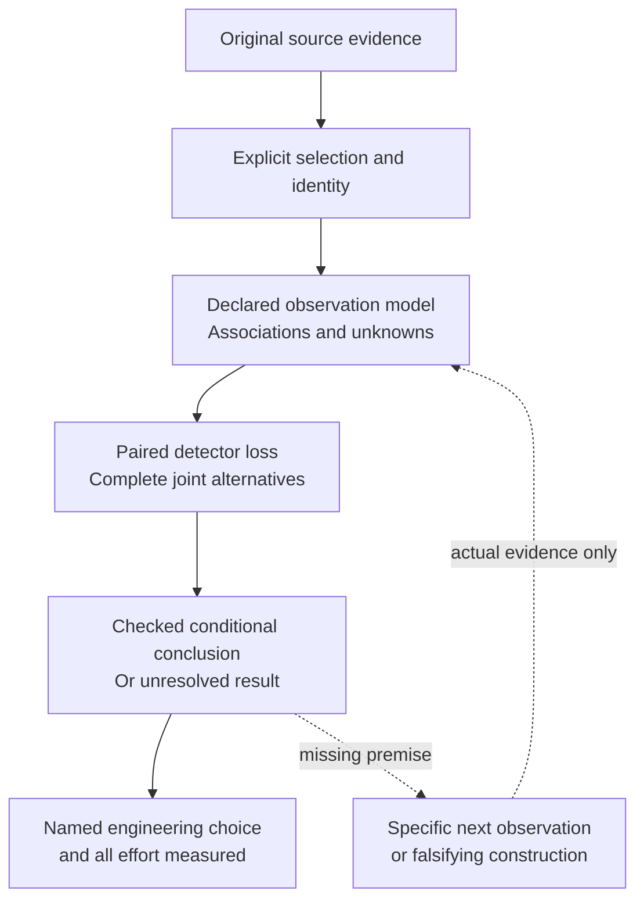
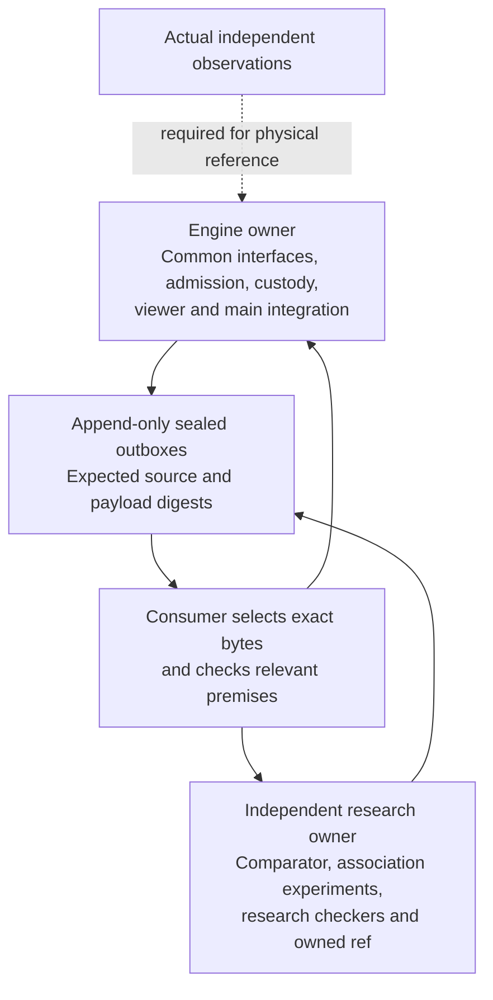

# Reiyah: the decision, the evidence and the next checks

Document ID: `reiyah.engine.roadmap`. Version: `0.1.0`. Status: `exploratory`. Dated 13 September 2026.

Reiyah's present product question is whether a perception-validation lead can make a better
added-detector integration choice, or reach the same defensible choice with less total effort,
than a competent analyst given the same evidence. The broader HARBOR mission includes human
belief, readiness, recoverability and causal policy effects. Those constructs remain distinct;
an object-detection result does not validate them by analogy.

## How the present question emerged

| Stage | What it contributed | What it did not establish |
|---|---|---|
| Static Gate A architecture | Versioned claims, evidence custody, explicit unknowns, protocols and locked validation | Operator acceptance, deployment or physical performance |
| Offline measurement research | Joint errors, marginal effects, source policies, retained failures and corrections | A universal independence law, causal mechanism or transferable safety rate |
| Reference-population audits | Reconstructed exclusions and geometric proximity to omitted source annotations | Physical correctness of a detection or an admitted human judgment |
| Paired decision Engine | Exact additive-loss bounds, joint alternatives and checkable maximum-matching witnesses | Truth of the selected reference/geometry model |
| Review and common-operand preparation | Staged records, equal analyst evidence, source-to-observation custody and a ready native opening | Actual independent discoveries or participant usability |
| Compiler and provenance checks | Guarded reference sharing, original member identity, matching traces and finite conformance | Unlimited scale, a runtime product or proof over every possible compiler input |
| Current prediction preparation | Exact original selected rows, no annotation reads during extraction and separate source agreement | Annotation-independent historical selection or cross-channel physical association |
| Independent comparator findings | Overlap parity and conditional raw-table uncertainty; claims withdrawn where premises failed | Coefficient superiority or guaranteed identification from adding a third channel |

The [README](../README.md) links the retained findings and historical protocols. The
[current continuation](SESSION_HANDOFF.md) records exact Engine state; the
[Fable consumer review](FABLE_RAW_CONSUMER_REVIEW_2026-09-13.md) separates inspected research
claims from main implementation. Earlier failures remain part of the evidence.

## Current gaps and falsifiable next steps

| Gap | Owner and next concrete check | Evidence that would change the choice |
|---|---|---|
| Practical inspection | Engine: consume one actual opening/selection return against its exact original capture and indices | Observable interaction and participant effort, including a failed or unreviewable return |
| Independent physical references | Engine coordinates the authorized staged protocol; reviewers supply actual observations | Both unassisted records locked before assistance, complete disagreements and admitted joint alternatives |
| Raw association uncertainty | Fable: use selected original rows, preserve unmatched records and order, compare a declared rule with a serious baseline | A checked decision or abstention stable to a defensible association/error model, or a retained counterexample |
| Conditional inference and input boundary | Fable: enforce source identity, trace runtime reads and repair zero/equality/third-channel claims | A sound set of conclusions over the declared feasible population; invalid and undefined cases preserved |
| Equal useful comparison | Both lanes: same opportunities, references, weights, loss, tolerance and source evidence | One defensible integration choice with measured preparation, computation, verification, review and repair effort |
| Generalization and stronger scientific claims | Separate future protocol and appropriately diverse inputs; no new cohort selected here | Held-out validation and dated primary comparisons that survive marginal, association and shared-data controls |

The real comparison remains **[-8,8]**. No qualifying human references, actual participant
usability or external scientific review are available at this checkpoint. A missing participant
does not justify invented judgments, repeated identical desktop bootstraps or more viewer
architecture. Continue useful bounded work while retaining the ready opening and its exact
missing prerequisite.

The next input packet and a conditional impossibility result can both be useful. Neither is the
product proof. Test the simplest competent method first; retain parity if it succeeds. A changed
decision, justified abstention, better observation or reduced measured effort can earn priority
over a new statistic. A proposed route can be replaced after stating its deficiency, alternative,
assumptions, comparator, cost and next falsifier.

## Ownership and authority

The earlier ten-hour Engine window is complete. Later work continues under Daniel's explicit
instruction with fresh task identities and preserved owner checkouts. P005 is operator-reported
published on 12 September and commits to a fair decision comparison with all effort counted;
no further outreach is authorized. Gate A remains unaccepted. The prospective physical study
has no selected cohort or seed and has not run. This roadmap is current research navigation,
not a revised frozen protocol or a claim of scientific, safety or transport acceptance.
