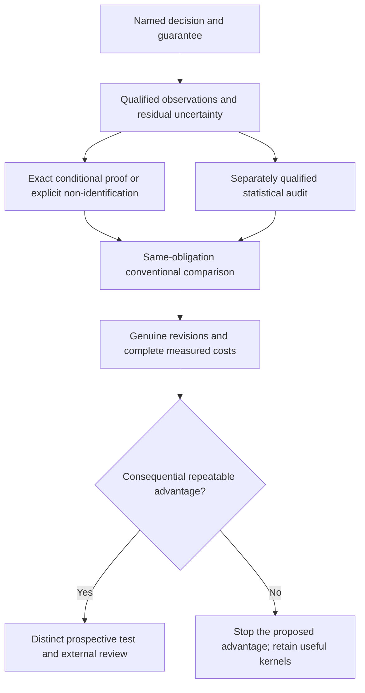

# Reiyah: the next evidence that can change the decision

Document ID: `reiyah.engine.roadmap`. Version: `0.2.0`.
Lifecycle status: `proposed`. Updated 19 September 2026.

**Keep the small proof-checking Engine. Focus the next research on what can be
observed, what guarantee a decision needs, and whether obtaining that guarantee
costs less than competent alternatives.** Add modern sequential auditing to the
comparison; require genuine revision histories before claiming reusable economic
value. This is the best-supported direction from the present evidence, not an
established state-of-the-art advantage or an optimal strategy for every market.

This is current navigation. It supersedes the
[September 13 roadmap](ENGINE_ROADMAP_2026-09-13.md) and
[September 17 next mission](REIYAH_NEXT_MISSION_2026-09-17.md) for future scheduling,
without changing frozen protocols or accepted manifests. The
[execution audit](../research/roadmap-audit/0.1.0/README.md) and
[dated primary comparison](../research/roadmap-audit/0.1.0/FRONTIER.md) supply its basis.
Codex owns the mission end to end under the current operator instruction. There is
no required second model or delegated research lane.

## Where the evidence leaves us

| Established within its declared scope | Still missing |
| --- | --- |
| Common-world paired loss, exact arithmetic, checkable bounds and counterexamples | Independent reference truth and an actual team's consequential release criterion |
| Complete conventional/native parity in the retained comparisons; the public-output baseline attains all 99 resolved query floors | A selection or stopping advantage on those contracts |
| Checked opposing worlds for all 1,790 unresolved operating rows; 2,199 other rows remain input-blocked | Observations that distinguish the relevant worlds or legitimately narrow the uncertainty family |
| Qualified YOLO11n/YOLO26n outputs on 64 exposed images | Genuine chronological customer revisions and a distinct prospective value test |
| Observation applicability and bounded certificate reuse | Savings after preparation, source checks, review, failed attempts, proof overhead and repair |

Do not add sensitivity variants to make this development proxy look favorable.
All rows, including failures and unresolved results, remain evidence. A universal
conclusion cannot be obtained from a transcript that is identical in two allowed
worlds with opposing decisions. A different observation, a justified narrower
model, or a separately specified probabilistic claim is required.

## Keep five obligations distinct

| Obligation | Question | Evidence needed |
| --- | --- | --- |
| Computational | Does the conclusion follow from the encoded operands and uncertainty family? | Small checking kernel, exact bindings, certificates, adversarial controls and retained work limits |
| Statistical | How often does the procedure make an incorrect statement under its sampling design? | Named estimand, randomization, error budget, valid stopping rule and dependence assumptions |
| Measurement | Do the observations identify the intended objects, time, class, geometry and census? | Qualified observation/adjudication process, residual uncertainty and missingness policy |
| Operational | Does this loss and threshold correspond to the action the owner must choose? | Owner-defined tradeoffs, unresolved-action rule and an appropriate downstream evaluation |
| Economic | Is the same justified decision obtained with less total work? | Timed competent workflows, cold and incremental costs, real revision frequency and agreed rates |

An exact certificate satisfies only its computational obligation. A confidence
sequence does not establish reference correctness. A higher perception score does
not establish recovery, readiness, causal policy value or deployed safety.

## The next bounded technical task

Prepare one **offline comparison of sequential audits with explicit residual
reference uncertainty**, using authored finite populations first. The question is
whether a statistical audit can save observations under an explicitly different
error obligation while continuing to report what the observations cannot identify.
This is a proposed methods check, not a substitute for workflow evidence.

Start with established uniform sampling without replacement and the weighted audit
construction of [Shekhar et al., UAI 2023](https://proceedings.mlr.press/v216/shekhar23a.html).
Use the [2026 PPAT preprint](https://arxiv.org/abs/2607.08347v1) as a relevant
adaptive estimation comparator with its asymptotic interval scope stated.
Do not use those intervals as an unproved finite-sample stopping certificate.
Prediction-powered e-processes are an additional candidate only after their
factor, sampling and predictability requirements are satisfied. The reviewed
methods and their limits are detailed in the frontier packet.

Before execution, freeze the exact synthetic fixtures, algorithms, arithmetic,
query interface, information access, estimands, error allocation and cost policy.
The proposed ceiling is 32 authored populations with at most six units each,
300 process seconds for execution, 300 for separate checking and 64 MiB of new
artifacts. Enumerate all sampling permutations where that is the declared design.
Caps and incomplete checks remain results. Use existing local runtimes; a new
library, learned selector or solver framework is unnecessary for this first test.

Include clear margins, boundary ties, near-zero margins, misleading proxies,
correlated scene members, unequal weights, invalid or absent observations and
residual intervals admitting both decisions. Exercise every stopping prefix,
sampling-probability boundary, incorrect reuse, changed loss and changed population.
Never count a failed query as zero loss or treat copied answers as independent data.

Compare methods only within the same guarantee:

- **Exact conditional arm:** current native checks and the equally equipped
  conventional matcher/bounds, both required to exclude every allowed adverse
  world. Preserve their existing parity result.
- **Statistical arm:** a labels-only sequential baseline and a weighted or
  prediction-assisted procedure with the same target, observations, randomization
  contract, error budget and first valid stopping rule. A fixed-time or asymptotic
  interval may be reported separately, never silently promoted to this guarantee.

Report correctness or stated error coverage, decision/resolution fraction,
observations, computation, source/preparation work and all failures. Fewer queries
under a weaker guarantee are not a win over the exact arm. This methods task is
worth retaining only if it establishes a correct, useful comparison or a concrete
reason the proposed route fails. It authorizes no reserved-outcome study here.

## A simple mathematical boundary for that task

For a fixed finite population, let `d_i(T)` be the paired loss difference in a
common admissible reference world `T`, and let nonnegative weights `w_i` sum to one.
The target is `Delta(T) = sum_i w_i d_i(T)`, with improvement strictly above the
owner's threshold `tau`. Suppose an observation supplies sound enclosures
`l_i <= d_i(T) <= u_i` for every compatible world. Then

`sum_i w_i l_i <= Delta(T) <= sum_i w_i u_i`.

This elementary enclosure does not require independent reference errors. Its
endpoints need not be jointly attainable; preserve stronger common-world checks
where available. If a sampling design supplies simultaneous valid lower and upper
confidence bounds for these two fixed endpoint totals, their outer interval covers
every compatible `Delta(T)` on that simultaneous event. Split the error budget or
prove a joint bound; do not give each of many tests the full budget. This is a proof
obligation for the new task, not an implemented statistical feature or a novelty claim.

At complete observation, a witnessed identification interval crossing `tau` stays
unresolved. More sampled copies of the same ambiguous answer cannot shrink that
identification interval into truth. Adaptive refinement of the endpoint functions,
nonuniform sampling, changing model/loss, and reuse of the data for policy choice
each require a valid revised argument. The fixed-endpoint statement alone covers
none of those changes.

## Then test one genuine revision workflow

Use the [existing workflow brief](../research/value-disproof/0.1.0/WORKFLOW_BRIEF.md)
for the owner and input questions. Its historical 279-gap paragraph is superseded:
all of those gaps are now witnessed. Do not create another generic inventory.
The missing input is a real decision with an authorized observation process.

| Stage | Entry condition and concrete work | Advance or stop |
| --- | --- | --- |
| 1. Qualify the decision | A decision owner supplies the real action, loss/tradeoff, acceptable error/resolution obligation, complete membership and missing/invalid policy. Establish what a review actually observes and what uncertainty remains. | If the answer cannot distinguish consequential worlds, revise the measurement question or retain non-identification. Do not tune a selector. |
| 2. Qualify revisions and comparator | Bind actual old/new artifacts and preparation, a competent existing workflow and applicable shared observations. For repeated reuse, obtain at least three genuine chronological revisions. Count costs for acquiring the initial evidence. | Different publisher generations alone do not pass. Unknown history or source terms remains unqualified. |
| 3. Freeze a distinct comparison | Fix population, scene/log dependence, all arms, observation interface, operating-policy selection, error allocation, stopping, costs and the outcome-access boundary before opening outcomes. | The 1,433 reserved images remain closed until their separate protocol and exposure boundary are qualified. They are not a substitute for customer provenance. |
| 4. Run and account | Same usable evidence and correctness obligations for both workflows; record preparation, actual reviewer/adjudicator time, retries, invalid results, proof/checking, integration and repair. Compare cold start and incremental revision costs. | Report every allocated case. Retain the existing 3x observation and 2x complete-cost investment targets as unachieved; do not manufacture prices or redefine a win after results. |
| 5. Decide whether to invest | Repeat a consequential result on a distinct qualified population with a serious current baseline; obtain external scrutiny before stronger claims. | If parity or overhead erases value, stop the cost-reduction product hypothesis and keep the useful checking kernels. A different value hypothesis needs its own advance criterion. |

Actual team access and human costs cannot be manufactured autonomously. Their
absence does not prevent the bounded public-source/mathematical task above.
No outreach, paid work or private-data ingestion is implied by this roadmap.

## Preserve the larger mission without claiming it is complete

The original [HARBOR charter](SCIENTIFIC_CHARTER.md) remains the program's scope.
Reintroduce its questions through distinct protocols after the perception
application earns further investment: object-level human belief needs actual
measurements; recoverability needs a defined recovery state and horizon; joint
silent misses need observable opportunities and dependence analysis; causal policy
effects need an identification design; transfer and worst-group claims need
predeclared groups, appropriate sampling and complete missing/invalid reporting.

For a later driving decision, compare a named downstream outcome and its operating
domain. NAVSIM pseudo-simulation and BridgeSim inform that future evaluation
boundary, but neither turns this detector-loss study into real-world safety evidence.
Simulation validity and the human channel are separate qualification work.

Engine source stays `38a50ec014cc83e86ea6f247df803ded2971b386`; Gate A remains
operator-unaccepted. This roadmap selects research questions, not product runtime,
training, a learning-engine platform, deployment or physical-control integration.
Preserve the historical controller, closed packets, configured human Git identity,
normal safe publication and exact publisher readback. Result descriptions retain
the [existing source terms](../research/roadmap-audit/0.1.0/DISTRIBUTION.md).
