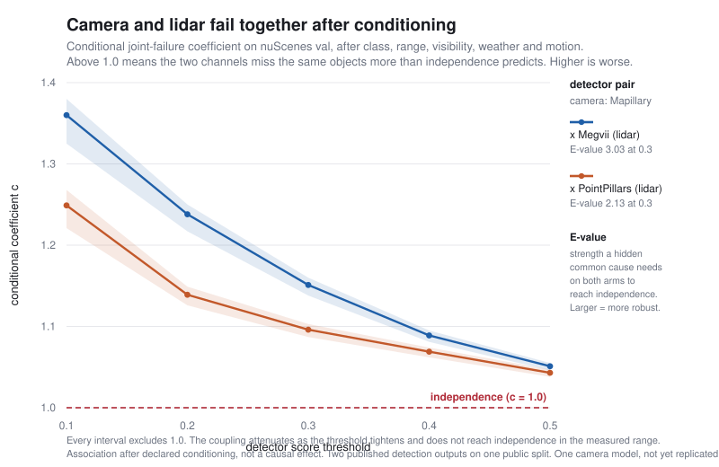

# Gate B measurement: camera and lidar fail together, and it matters for the safety math

Document ID: `reiyah.gate-b-findings-synthesis`

Version: `0.1.0`

Lifecycle status: `proposed`

This is the one-page reading of the Gate B measurement workstream (Results A through O). Every
number here is measured on public data and reproducible from this repository; each claim links
to the result that establishes it. The non-claims at the foot are not boilerplate - they are the
exact boundary of what has and has not been shown.

## The finding in one sentence

On the nuScenes validation split, a camera detector and a lidar detector **fail on the same
objects more often than independence predicts, even after conditioning on class, range,
visibility, weather and motion** - and that residual coupling is robust to the detector, to the
score threshold, and to plausible unmeasured confounding.

## Why it is worth a safety engineer's attention

Mobileye's RSS paper (Shalev-Shwartz, Shammah, Shashua, arXiv:1708.06374) argues that direct
statistical validation of an autonomous vehicle would need on the order of `10^9` hours.
**Definition 32** escapes that cost by positing *c-approximate independence* between subsystem
errors, and **Corollary 3** uses it to cut the required evidence to about `10^5`. The coefficient
`c` is never estimated anywhere in the paper, and independence is assumed rather than measured.

If two perception channels fail together more than independently, that assumption is optimistic
and the evidence reduction is overstated. This workstream measures the coefficient the safety
argument leaves unmeasured.

## The core result, and its three robustness axes



The conditional coefficient is the joint-failure rate divided by what independence would predict
*within* each stratum of the five confounders. Above 1.0 means the channels miss the same objects
more than independence allows. The headline value is `1.151` for Mapillary x Megvii at score
`>= 0.3` ([Result L](RESULT_L_CONVERGENCE.md)). What turns one measurement into a finding is that
it survives every cheap way to dismiss it:

| Axis | Result | Objection answered | Outcome at score >= 0.3 |
|---|---|---|---|
| **Detector** | [M](RESULT_M_CROSS_DETECTOR_REPLICATION.md) | "it is one model pair" | Replace the entire lidar backbone with PointPillars (half the accuracy): c = **1.096**, still excludes 1.0 |
| **Score threshold** | [N](RESULT_N_THRESHOLD_ROBUSTNESS.md) | "0.3 is cherry-picked" | Sweep 0.1 to 0.5, both detectors: **10 of 10** intervals exclude 1.0 |
| **Unmeasured confounding** | [O](RESULT_O_SENSITIVITY_EVALUE.md) | "you did not measure everything" | A hidden common cause must reach **E-value 3.03** (Megvii) / **2.13** (PointPillars) on both arms to nullify it |

The E-value is the decisive honesty move: instead of only declaring that an unmeasured common
cause *could* exist, it states how strong one would have to be. A confounder associated with both
camera and lidar failure by less than roughly two to three on the risk-ratio scale, beyond the
five measured covariates, cannot explain the coupling away.

## What is stated as measured, and not oversold

- **The coupling attenuates.** As the score threshold tightens and only confident detections
  remain, the conditional coefficient declines toward independence (Megvii `1.360 -> 1.051`). It
  does not reach it anywhere measured, but the effect at strict thresholds is small.
- **This is association, not causation.** Every coefficient is measured after declared
  conditioning. No causal effect is claimed, and no adjustment set is claimed sufficient for
  identification.
- **It is bounded by what nuScenes annotates.** Object size and truncation are not in this cache
  and were not tested; the E-value says how strong such a factor would have to matter, not that it
  does not.
- **One axis is still open.** Every pair shares the single Mapillary camera model, so robustness to
  the *camera* detector is untested. A second camera-only detector is the next replication and
  requires running inference, not just public predictions.

## Reproduce it

The matched prediction caches and the ground-truth cache are built by the tools in
`tools/measure/` (see [GATE_B_SESSION_HANDOFF.md](GATE_B_SESSION_HANDOFF.md) for the data setup).
With those in place, each axis is one command:

```
# headline conditional coefficient (Result L / M)
python3 tools/measure/result_l_convergence.py \
    gt_val_cache.json matched_mapillary.json matched_megvii.json

# threshold robustness, both detectors (Result N)
python3 tools/measure/result_n_threshold_robustness.py \
    gt_val_cache.json matched_mapillary.json matched_pointpillars.json

# E-value sensitivity to unmeasured confounding (Result O)
python3 tools/measure/result_o_sensitivity_evalue.py \
    gt_val_cache.json matched_mapillary.json matched_megvii.json

# regenerate this figure
python3 tools/measure/make_synthesis_figure.py > docs/gate_b_robustness_figure.svg
```

Raw outputs are retained under `evidence/measurement/` (`result_l.txt` through `result_o.txt`).
Result N reproduces Result L's `1.151` at 0.3 exactly; Result O reproduces Result E's conditional
odds ratio of `2.810` to `2.776`. Those self-checks are what license reading the rest.

## Where this sits in the whole result set

Results A through F establish the measurement apparatus and a separate finding (the nuScenes
evaluation pipeline removes a range-sensor-selected 9.43% of ground-truth objects before scoring,
biasing dependence estimates toward independence). Results D, E, G through K measure and interpret
the coefficient and carry it into the RSS argument. Results L through O, summarised here, close the
convergence question and harden it along the three axes. Each result records its own withdrawals:
several claims from this workstream were refuted on evidence and left standing in the record *with*
their refutations attached rather than edited out.

## Non-claims

This is Gate B measurement on two published detection outputs over one public split, retained as
`proposed`. No scientific support, safety finding, compliance determination, comparative claim
about any detector or vendor, operator acceptance, or runtime authorization is asserted. No
released `1.2` architecture byte is modified by this workstream. The public remote is a
distribution channel with no scientific, safety, or acceptance authority.
