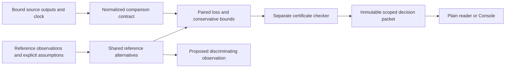

# Perception decisions under uncertain references

Document ID: `reiyah.perception-decision.architecture`

Version: `0.2.0`

Lifecycle status: `proposed`

## Decision and scope

Build an offline evaluation tool for the perception-validation lead deciding whether an
additional detector merits a further integration study. Compare fixed outputs on the same
recordings, under the same reference interpretation and explicitly declared loss. Produce a
checked loss-difference enclosure and distinguish the decision it supports from the uncertainty
that remains. A useful result may identify what observation would change the choice.

The first scientific study compares the existing Megvii/CBGS lidar outputs with those same
outputs plus retained Mapillary/MonoDIS camera outputs. This replaces the earlier comparison
between two companions before sampling or new outcomes. PointPillars is not required. A synthetic
query-allocation challenge and the shared/disjoint training campaign are not the selected next
experiment. Their earlier plans and retained results remain historical records.

The operator instructed implementation after reviewing the architecture. This is offline research
scope. Gate A remains operator-unaccepted; no deployment, physical control, independent physical
reference, sensor-modality superiority or commercial value is established by this document.

## Computational object

Let A be the base output and C the augmented output, preserving every A detection unchanged.
In one shared reference interpretation w, T is the common number of target objects, D the
emitted-detection count, and TP the maximum same-class one-to-one matched count. With nonnegative
false-negative and false-positive penalties a and b:

```text
loss_pi(w) = a * (T(w) - TP_pi(w)) + b * (D_pi - TP_pi(w))
delta(w) = loss_A(w) - loss_C(w)
         = (a+b) * (TP_C(w)-TP_A(w)) - b * (D_C-D_A)

r = D_C-D_A
0 <= TP_C(w)-TP_A(w) <= r
-b*r <= delta(w) <= a*r
```

Adding r vertices cannot reduce a maximum matching or increase it by more than r. This proves
the coarse bound without knowing absolute object count. Unit penalties give [-r,r]. No retained
addition gives exactly zero. These are conventional identities, not novelty claims. Common
unknown objects cancel only when they cannot affect the paired matching and the additive loss
uses a shared opportunity population and fixed weights. F1, trajectory-dependent losses and
causal hazard do not inherit this cancellation.

For a fixed cohort Q with nonnegative weights summing to one, compute an outer enclosure of
the weighted contrasts across every interpretation admitted by the reference model. Use exact
integer/rational arithmetic. A sound model-relative enclosure has no automatic probability
coverage for physical truth and no sampling guarantee for another population.

## A matching trap the implementation must preserve

Place same-class detections at base x=0 m and added x=3 m. A known object is at x=1.5 m;
a disputed object, if present, is at x=-1 m. With a strict 2 m eligibility gate, both detections
can match the known object but only the base can match the disputed one. The addition survives
the declared suppression gate because it is 3 m from the base.

With only the known object, the unit-loss advantage is -1. With both objects it is +1: the base
matches the disputed object and the addition matches the known one. Thus a camera-only matching
neighborhood can miss a decision-changing interpretation. Preserve potentially relevant paths
through the shared base. The example is synthetic, not a dataset observation.

## Architecture



1. **Contract and adapter.** Bind source bytes, configuration roles, cohort, weights, target,
   matching/fusion policy, information time and loss. Verify base preservation. Observed empty
   output is different from missing, unmeasured, invalid, abstained or outside-support output.
2. **Reference model.** Preserve joint presence, class, geometry, time and identity alternatives.
   Boolean graph alternatives are a restricted first representation, with explicit constraints
   and coverage assumptions. Shared variables may couple anchors. A supplied list of plausible
   worlds is not proof of exhaustiveness or physical coverage.
3. **Kernel.** Begin with the count bound, then concrete graph matching and bounded complete
   enumeration of a declared finite model. If a tighter computation is unavailable, retain a
   verified coarse enclosure. Do not remove possibilities to satisfy a resource limit.
4. **Checker.** For a concrete graph, verify a valid matching and a vertex cover of equal size.
   Every matching is at most any cover, so the two certify the optimum. Separately enumerate
   small model domains and constraints to check global extrema. A visited-world digest alone
   does not prove that no world was omitted. Avoid calling producer code to validate its answer.
5. **Packet and reader.** Bind the computation to exact operands and code. Write complete
   results atomically. Verify expected bytes before parsing. Retain separate integrity,
   execution, model, enclosure, witness, decision, freshness and authority states.

Unlisted objects capable of changing matching must remain possible. If the finite abstraction
cannot justify covering their effects, return the open-reference count bound. A relaxed graph
witness is not a physically feasible interpretation. Inconsistent assumptions do not produce
vacuous support. A wide enclosure alone does not establish non-identifiability.

Matching optimizes cardinality. A deterministic traversal of stable identities selects a witness;
no minimum summed Euclidean-distance objective is needed for this count loss. Freeze the exact
traversal before study execution. Sensor geometry uncertainty remains separate from numerical
precision in the strict squared-distance comparison.

Use the existing Python research environment and a small schema family. The first kernel needs
no model endpoint, solver service, database or new infrastructure. A future customer-hosted
runner can use the same packet contract; a service and other-domain adapters require demonstrated
workflow demand and separately justified observation/loss semantics.

## Decision semantics

For tolerance t and verified enclosure [l,u], report two propositions:

| Field | Rule |
| --- | --- |
| Improvement criterion | supported if l>t; excluded if u<=t; otherwise unresolved |
| Preference | augmented if l>t; base if u<-t; equivalent if l>=-t and u<=t; otherwise unresolved |

For example [-0.4,0.05] excludes an improvement greater than 0.1 but does not establish that the
base is better by more than 0.1. Invalid required inputs or certificates leave the propositions
not evaluated and retain diagnostics. A failed optional tight computation can retain a separately
checked coarse bound; no failure is silently relabeled as normal operation.

Lifecycle states remain proposed, exploratory, preregistered, running, blocked, invalid, null,
inconclusive, failed, supported, contradicted, replicated, corrected and retracted. These do not
substitute for execution or decision states. Tests and model-assisted review do not create
operator acceptance or independent physical evidence.

## One prospective study

The study remains proposed, with no cohort selected and no fresh judgments collected. Use the
existing clock population and exclude old exposed development windows. The retained metadata-only
feasibility calculation found 2,935 eligible anchors in 138 scenes; reproduce and bind it before
freeze. It does not prove raw coverage or decodability.

After exact input/protocol/code/reviewer/comparator freeze, select 60 eligible scenes uniformly
without replacement, then one eligible anchor uniformly per scene. The primary estimand is the
equally weighted contrast on those selected anchors, with unit FN/FP penalties and an improvement
criterion greater than 0.1 error units per anchor. This is a research tolerance, not a safety or
customer break-even threshold. Retain every selected anchor, including no-addition and
unreviewable cases. Do not substitute difficult cases or tune thresholds after outcomes.

Use score >=0.30, the ten nuScenes detection classes and 50 m horizontal range. Preserve every
in-scope base detection. Process camera additions by descending score with original-file-order
ties; suppress an addition if a retained same-class detection is strictly within 2 m. Match
same-class outputs one to one with strict 2 m center distance and maximum cardinality. This
common-range comparison is not the official class-dependent benchmark protocol. Coordinate,
category mapping and timing policies must be bound before empirical use.

Two human reviewers independently inspect raw timestamped cameras/lidar in the +/-2 s window,
without annotations, prediction overlays, configuration identities or prior rankings. Lock both
discovery records before revealing full annotations and anonymized predictions for a separate
proposal-assisted phase. Retain original disagreements, unreviewable regions, assumptions and
adjudication rationale. Separate reviewers do not create independent sensor information.

A competent independent analyst freezes the conventional comparison before selection, gets the
same staged evidence and assumptions, and may compute the same paired bounds. Seal each method's
conclusions before comparing them. Prespecify independent adjudication, consequential-error and
conflict rules. Record total review, preparation, integration, computation and repair effort.
Secondary FN:FP pairs (1,4), (1,1), (4,1) and class/opportunity reports do not replace the primary.

Sound computation, a resolved detector comparison, an independently confirmed limitation missed
by the comparator, and repeated product value are separate outcomes. An ineffective addition
does not falsify correct evaluation software. Equal conventional performance demonstrates no
differentiated inference. If usable reference evidence or recurring external demand remains
unavailable at practical cost, reconsider standalone product expansion. Retain failures.

## Implementation order and readiness

W0 records source identities and an isolated main-based candidate. W1 implements the narrow
comparison contract and normalized adapter. W2 implements bounds, matching certificates and
restricted reference alternatives. W3 produces an atomic packet and reader. W4 freezes the
reference study only after the humans, raw windows and instrument exist. W5 completes that study;
W6 separates scientific, workflow and product continuation decisions.

The first executable slice uses synthetic inputs to exercise the exact count bound and the
matching counterexample. Small exhaustive models, forged-certificate rejection, unavailable
states, reversed alternatives, threshold boundaries and corrupted-byte rejection test actual
inference failures. A synthetic result is explicitly synthetic. Neither raw detector evaluation
nor human adjudication is implied by a passing instrument check.

The main README and its six diagrams remain intact. Console layout and stations remain with
their owners; it consumes the checked packet later. Released Gate A artifacts and historical
research results remain unchanged. Historical attribution cleanup is a separate coordinated
task; this work adds no AI coauthor trailers.

## Planning provenance

This repository design incorporates the completed private architecture revision and comparison
review. The private packets contain the full source custody, original reports and continuation
records; they are not copied into public Git. Their relevant own-document identities are:

| Artifact | SHA-256 |
| --- | --- |
| Architecture revision 0.2.0 | `165d58fdb4640eb6a0f758a1e578dafdd4ae47416381dacebea5ca6f807d0288` |
| First-study profile 0.2.0 | `1a949f8d4f0c7744713d6cbdcad8ea69d912ff13a3c6285035d3474b52c40523` |
| Consolidated decision | `cd624f5b9b22a1f3d21a4b6a155dcf0898a4a9e44331ee2254422af4a540b1e0` |

These are provenance pointers, not independently validated evidence or a new scientific claim.
