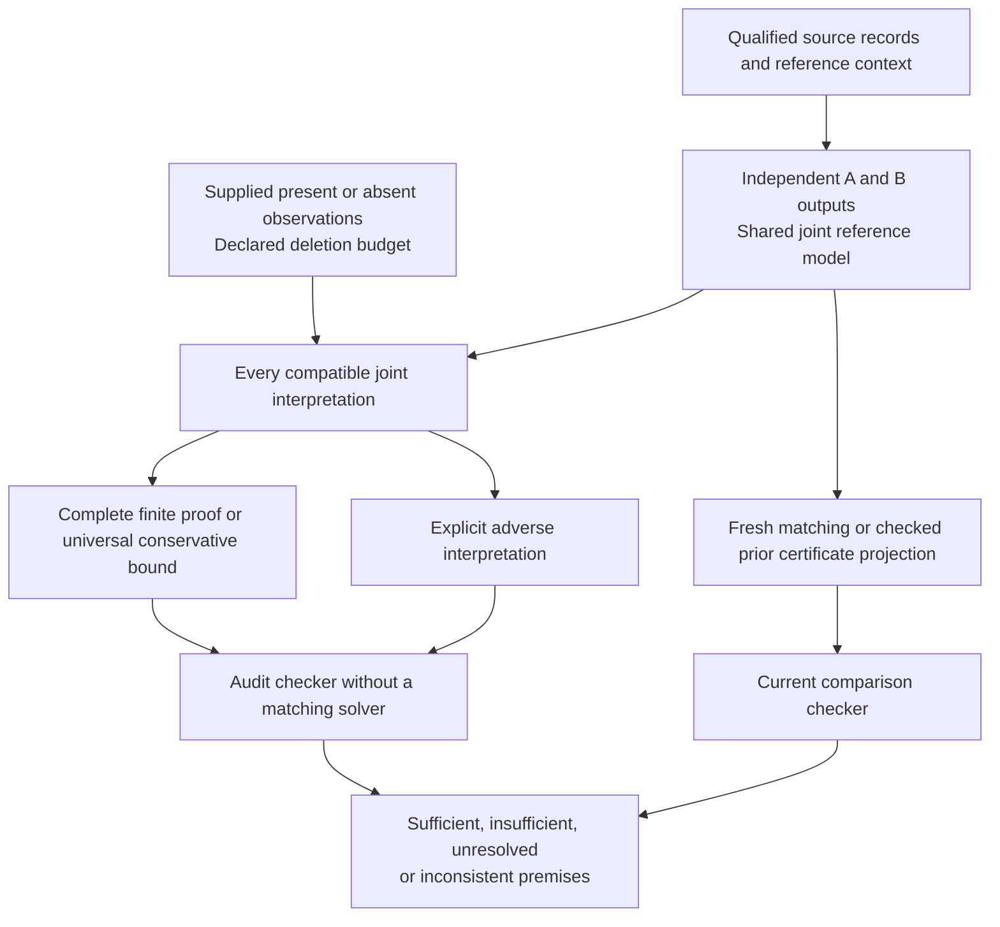

# Replacement comparisons and sufficient reference audits

Document ID: `reiyah.perception-revision-audit`. Version: `0.1.0`. Status: `exploratory`.

## Implemented decision

The Engine now compares independently declared detector outputs A and B and checks conditional
audit sufficiency under reference deletions. It preserves complete joint reference worlds,
explicit unavailable states, exact arithmetic and the unchanged legacy addition interface.
The [versioned contract and commands](../research/perception-revision/0.1.0/README.md) specify
the mathematics, input limits, source obligations and trusted code.

The current operator instruction authorizes this offline Engine implementation and adopts the
corrected audit problem. It does not establish absolute strategic optimality, scientific novelty,
physical safety or customer demand. Gate A remains operator-unaccepted.

## Why the audit target changed

The earlier minimum witness contained 49 reference records. Confirming those records is not
sufficient to protect the verdict: another disjoint 49-record deletion produces the same adverse
threshold result. Both calculations keep the original detector outputs fixed.

| Conditional comparison | Deleted records | Improvement |
|---|---:|---:|
| Original forty-frame evidence | 0 | 51/20 |
| Original adverse witness | 49 | 1/10 |
| Disjoint adverse witness with the original 49 retained | 49 | 1/10 |

The criterion is strictly greater than 1/10. The new audit checker accepts the second witness as
proof that the first proposed confirmed set is insufficient. This is a calculation under an error
model; neither set is asserted to contain actual errors. A sufficient confirmed set must exclude
every remaining admissible adverse interpretation, including coupled alternatives.

## Forty-frame implementation checks

The selected scene-0101 case retains forty frames and 2,299 conditional references. Original
source bytes and selected metadata/row fragments were rechecked. Preparation explicitly uses
global XY, the selected score/range gates and common maximum matching.

- **Legacy augmentation:** A has 2,007 detections and the augmented output retains 738 additions.
  Fresh and revalidated results agree with the existing Engine before and after both deletion
  witnesses. Current proofs are checked after reuse; producer path counts are not time savings.
- **Independent replacement:** A has 2,007 detections; standalone B has 2,237. Both are qualified
  independently, with no additional cross-output or within-output suppression. The exact weighted
  improvement is **209/20**, conditional on the source annotations and declared loss. This compares
  two public output sets, not a chronological production revision or general autonomous policies.
- **Robustness at k=48:** the conservative deletion certificate supports strict improvement without
  additional confirmations. At k=49, confirming the original witness alone remains unresolved by
  the conservative bound and is disproved by the explicit disjoint witness.
- **Constructive sufficiency:** hypothetically confirming the 1,664 objects used by the augmented
  output's matching suffices against arbitrary deletions among the other declared records. The
  checker obtains [51/20,51/20]. This is a simple sufficient set, not a minimum set, actual human
  audit or measured reduction in review cost.
- **Observation applicability:** the same source reference membership is separately checked before
  carrying 49 hypothetical confirmations into the replacement case. The procedure checks the new
  decision both with and without them. Both already give [8,129/10] at k=49 and support improvement
  without further queries, so this case demonstrates no saved audit queries. Successful rebinding
  alone is not an audit-effort saving.

The initial preparation screening overcounted replacement work by charging each output for the
other output's edges. The final new-version estimate counts both role-specific graphs and all
potential guarded edges, within the unchanged 2,000,000-unit ceiling. The source-preparation
record retains the earlier 3,588,537-unit estimate; the implemented estimate for the independent
pair is 1,191,395. These are screening units, not measured instructions or a complexity theorem.
No legacy resource policy was changed.

## Cost result and comparison boundary

The bounded assay measures fresh CLI computation against checked certificate reuse, including
input parsing, prior-packet validation where required, current proof checking and process startup.
The final three interleaved timings have medians of approximately **0.327 s for full computation
versus 0.529 s for reuse**. The reuse path checks 70 surviving certificates and recomputes ten,
out of eighty, for the original deletion. Extra verification outweighed avoided matching.
Source verification/preparation and separate packet verification are recorded separately. These
measurements do not cover human work, training, inference, driving or simulation.

Fable's competent conventional-cache and audit-selection comparator remains a separate
deliverable. This Engine checkpoint neither duplicates that implementation nor establishes an
advantage over it. The economic milestone remains a correct decision with materially less total
work under matched observations, stopping rules and costs. A draw or loss is an acceptable result.

## Proof flow

The producer does not turn unsuccessful search into a sufficiency certificate. The checker
rejects omitted worlds, omitted deletion variants, invalid covers, forged results and incompatible
observations. Proof checking still relies on explicit source and model premises. An observation
context digest does not authenticate a reviewer or prove that its interpretation applies.

## External-correction qualification

The REC✓D/rechecked repository is qualified at commit
`1321946698296416d0495999d000dec2deea5e4d`, published 10 December 2025. The earlier preflight
mislabeled that commit as a tree; the actual tree is
`71ef214fcdcc9350138e18b63171d7b14a7bcebf`. The retained inventory entries agree. The failed first
identity assertion and corrected commit/tree check are retained.

The repository supplies validated KITTI pedestrian annotations, one prediction CSV and a pickle
containing further predictions/scores. Original KITTI annotations, a safely qualified second
prediction representation, soft-label policy, missing/changed-box semantics and complete matching
rules still need an explicit adapter contract. Its correction task includes omitted pedestrians
and inaccurate boxes; deletion-only sufficiency does not cover those errors. No pickle was loaded,
no correction outcomes were evaluated and no external full-audit oracle was claimed. Original
dataset access and terms remain separate from the code repository's MIT declaration. KITTI's
retained access page declares CC BY-NC-SA 3.0; this is not unrestricted commercial-data permission.
The upstream cost-analysis code also uses greedy IoU matching. Reiyah's maximum-cardinality loss
would be a separately declared computational target, not reproduction of that published score.

Source metadata, static code and access pages are retained privately with digests. The public
[upstream repository](https://github.com/JonathanKlees/rechecked/tree/1321946698296416d0495999d000dec2deea5e4d)
and [KITTI object benchmark](https://www.cvlibs.net/datasets/kitti/eval_object.php?obj_benchmark=2d)
are pointers; source payloads are not redistributed here.

## Evidence and next consumer

The [verification record](../research/perception-revision/0.1.0/verification.json) binds source,
tests and retained command receipts. The private checkpoint is
`~/.codex/reports/reiyah/engine-replacement-audit-2026-09-16-p_4hjtex/`.
Its final outbox supplies the exact inputs, audit requests and packets to the research lane.

Fable's next action is to challenge this stopping checker and compare conventional observation
selection methods using the same declared family, observation answers and full cost accounting.
Measure additional queries on a second comparison with and without applicable prior observations.
Retain the disjoint-witness rejection as a compulsory control. A missing genuine review observation
remains missing; this experiment does not ask the operator to inspect scenes.
