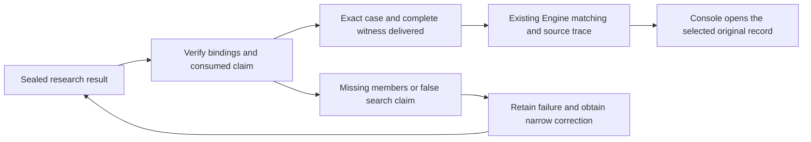

# A stalled search is not a robust decision

Document ID: `reiyah.engine.scale-consumer`. Version: `0.1.0`.
Lifecycle status: `exploratory`. Dated 15 September 2026.

The selected scale-study census cannot yet supply an inspectable decision dependency.
Its summary omits the exact deleted annotation identities and common comparison packets.
Its search also reports `no_admissible_crossing` on a small valid geometric case whose
minimum crossing deletion has two members. The existing Engine represents and checks
the case correctly; no Engine runtime or common-interface change is justified.

This consumer selects Fable census commit `10ed423b479384b2160e39bcff4528c79c23c3bf` and
`scale-census-0.2.0`, received while the pilot review was active. All fifteen payloads
match the manifest and all twelve committed origins match Git blobs. The preceding
pilot at `6b5989a72b91d0f2111c365d525bef9b899fb7ca` had fourteen matching payloads and
twelve matching committed blobs. The search module is byte-identical in both packets;
the counterexamples reproduce against the separately selected census copy too.
Exact bindings and the replay are in
[the consumer evidence](../research/perception-scale-consumer/0.1.0/README.md).
Fable's source and research branch are unmodified by this review.

## The counterexample

Use one frame, one class, unit penalties, weight one and tolerance 1/10. The base
detection is at x=0; the candidate is at x=3. Both score 0.9 and lie inside 50 m.
Three reference objects are at x=1.1, 1.5 and 1.9, with y=z=0. The addition survives
strict distance <2 m suppression. Every detection can match every object under
the same strict <2 m rule. These are explicitly synthetic coordinates.

| Deleted labels | Remaining objects | Base matches | Augmented matches | Delta |
|---|---|---|---|---|
| None | 3 | 1 | 2 | 1 |
| Any one | 2 | 1 | 2 | 1 |
| Any two | 1 | 1 | 1 | -1 |
| All three | 0 | 0 | 0 | -1 |

The arithmetic floor is ceil((1 - 1/10)/2)=1. Every singleton fails to cross;
every pair crosses. The exact minimum is therefore 2 and the ratio is 2.
All eight subsets agree between exhaustive partial-injection enumeration, the
existing Engine producer/independent certificate checker and Fable's frame matcher.
Fable's `unit()` nevertheless returns `no_admissible_crossing` after six evaluations.

The search accepts only deletions that immediately remove exactly one gain unit.
It stops at the first crossing. With the declared equal weights and unit penalties,
every successful chain therefore has exactly `k_floor` deletions. Its
`certified_above_floor` return branch cannot discover a larger minimum under these
rules. A census run through this search cannot answer whether larger minima exist.
Stalling must retain a bound or unresolved search state, not certify impossibility.

The pilot's inequality `k_floor <= G` concerns required gain loss, not the number
of edits needed to obtain it. For a complete graph with one base, one addition and
m>=2 objects, the minimum is m-1 while the floor stays one. Coordinates anywhere
strictly between x=1 and x=2 realize this family under the same suppression and
matching rules. Thus the claimed near-constant ratio does not follow from that
inequality. Its empirical frequency remains a separate question.

There is also a simple crossing upper bound in this finite deletion family:
delete every qualifying reference. Both matching counts become zero, so the
cohort delta becomes `-R/F`, which is <=0<=tolerance. This is a potentially loose
witness, not a minimum or a physical annotation-error claim.

## Other reproduced boundaries

`unit([valid_frame, None])` returns the same certified one-frame result as
`unit([valid_frame])`: the missing frame is removed before weights are assigned.
The existing Engine input with both declared anchors preserved returns
`input_blocked` and no numerical bounds. Missing data cannot silently change the cohort.

The exported qualifier retains rows with a NaN score, an infinite score, a Boolean
score and a NaN coordinate. Ordinary below-cutoff and beyond-range controls are
excluded correctly. This demonstrates missing boundary validation; it does not
show that any of the actual five submissions contains these malformed values.
A claimed upstream validation boundary needs exact executable/source evidence.

## What the census does and does not deliver

The delivered index has 3,000 unique scene/base/addition keys, exactly 150 declared
scene identities times 20 ordered pairs. The recorded counts agree: 1,124
`certified_at_floor`, 1,873 `unsupported_baseline` and three `budget_exhausted`.
The exact decisions imply integer feasible gains, the stated floors agree with
margins and weights, and per-scene frame/annotation totals and base counts agree
across pairs. This checks the delivered index, not its original-table derivation.

The recorded minima have range 1 to 575 and median 26 over the 1,124 rows reported
certified. Their tail counts are 37 at one deletion, 169 at five or fewer and 271
at one percent or less of qualifying scene annotations. The three unresolved
rows' arithmetic floors already exceed all three tail thresholds. Those summary
facts are internally consistent; their underlying witnesses are not supplied.

If the reported baselines and floor witnesses verify, the floor frequency among
all 1,127 supported units is between 1124/1127 and 1, and the above-floor frequency
is between 0 and 3/1127. That is potentially useful empirical evidence of a high
floor frequency on this declared census, despite the search's restriction. It
cannot prove a universal ratio-one theorem, that the ratio contains no information,
or any industry practice. The conditional one-percent tail is 271/1127 among all
supported units, rather than silently using only the 1,124 completed searches.

The pilot's ten claimed floor witnesses also have consistent summed deletion
counts and after-deletion rational arithmetic. Its ordinary-rematching transcript
reports twenty baseline equalities. It identifies no deleted members and does not
supply the separate checker implementation used for that full pilot comparison.

The census index supplies counts and floor claims but no exact annotation members,
ordered sample identities, normalized case packets or original row joins. It does
not even retain the pilot report's per-frame deletion counts or resulting verdicts.
The Engine rejects the pilot summary as a comparison input with `INPUT_SCHEMA`.
This is incomplete delivery, not proof that existing interfaces cannot represent
the actual case. No pilot or census witness has been accepted into the Console.

The Console's separate local commit `f09c156b0c6dd98d4a528bee057670fce2df9db5`
already opens the two earlier Engine cases, preserving joint members and original
records. It remains a local candidate. No Console code, deployment or prior
evidence packet changed in this consumer check.

Fable's chronology correction 0.3.2 now accurately records that the earlier
second-case outcome existed before its preregistration. That correction is
accepted as wording consistent with the retained Engine receipt; lane-reported
exposure is still not an independent exposure audit. The reported insertion and
coordinate repairs were inspected in the packet but not replayed in this task.

## Next input and costs

Fable owns the narrow search/state/validation repairs and any affected census
recomputation. A second dataset should follow this correction and a checkable first
study, not replace the missing verification. Retain its old results, correct the unsupported mathematical claim,
and supply one complete pilot witness with exact frame and annotation identities,
source digests and a baseline comparison. Engine owns preparation into existing
common operands and source trace; an upstream Fable input need not implement the
Engine's annotation adapter. A measured resource bound or representation failure
can justify a later interface change. Counts alone cannot be converted into
guessed original members.

The initial bounded probe took 0.146 seconds and 28,606,464 bytes child peak RSS on
the retained read-only runtime. It covered eight synthetic subsets, the missing
frame comparison, four invalid-row controls and pilot-summary arithmetic.
This is not a speed comparison with the pilot or a human-effort measurement.
The public replay took 0.095 seconds; the identical census-source replay took
0.118 seconds and the 3,000-row summary check 0.093 seconds. These are separate
scoped samples. The replay and final consistency command receipts are retained in the private
`engine-scale-consumer-2026-09-15-tmw4ob4q` checkpoint. Shared trusted code includes
the Engine schema and rational representation; source geometry and physical
reference validity are not independently established by certificate checks.

The next falsifier is a corrected, fully identified pilot witness failing either
common-operand recomputation or original-record opening. The original physical
comparison remains open at [-8,8]; no reference, customer result or scientific
acceptance is added by these synthetic and delivery checks.
