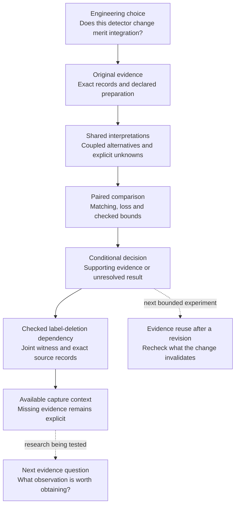

# What Reiyah is being built to become

Document ID: `reiyah.product-and-funding-thesis`. Version: `0.1.3`. Dated 14 September 2026; updated 15 September 2026.
Status: proposed product direction, with completed engineering evidence identified below.

**Reiyah is being built for decision assurance across changes to autonomous systems.** It should help a
team decide whether a system change deserves further integration, show exactly what supports
that choice, and identify which unresolved evidence could change the answer. Perception is the
first application. The ambition is dependable infrastructure that leading AI and robotics teams
want to use as their models, sensors and operating conditions evolve.

## A short explanation for a funding conversation

An engineering team wants to add a detector to an existing perception system. Finding more
objects can help, but the addition can also introduce false detections. The comparison depends
on which objects count, how detections match them, and what uncertain references mean.

Reiyah connects that engineering choice to the original evidence. Its Engine preserves the
same evidence and interpretation across both configurations, computes the resulting tradeoff,
and makes unresolved assumptions explicit. We are developing the next layer: identifying the
evidence worth checking next and reusing valid evidence when the system changes again.

Our intended customer is a perception-validation lead who needs to justify where the team
spends integration effort. The product must earn its place by exposing an unsupported conclusion,
supporting a better decision, or reaching the same defensible answer with less total work.

## The technology and why its structure matters

| Part of the Engine | What it does | Why it matters to the decision |
|---|---|---|
| Source custody | Binds received files, original records, indices, nominal clocks and preparation rules | A reviewer can establish exactly which observations entered the comparison |
| Common operands | Gives both configurations and both analysts the same opportunities, weights and evidence | A comparison cannot gain an advantage by silently changing its denominator or inputs |
| Joint interpretations | Keeps a complete declared interpretation consistent across configurations and anchors | Independent marginals can lose interactions that determine the result |
| Paired matching and loss | Accounts for competition among detections using maximum same-class one-to-one matching | Confirming an addition alone does not establish its net value when matches can be reassigned |
| Checkable bounds | Produces a conditional decision or an unresolved state, with matching/cover witnesses | The numerical argument can be challenged separately from the code that produced it |
| Provenance through compilation | Preserves original members when computation is shared | Reusing a computation should not sever its link to the evidence it represents |
| Dependency trace | Opens a checked single-label or joint-label deletion as original records and available captures | A numerical sensitivity becomes an inspectable argument, with missing evidence explicit |

These mechanisms are implemented in the offline research Engine. Exact arithmetic and matching
certificates use established mathematics. The product/research proposition is their dependable
composition around a consequential engineering decision, and the cost of obtaining, checking
and reusing the evidence that decision needs.

## The research ambition

Three research questions guide the next technology:

1. **Which evidence controls this particular decision?** Preserve interactions among reference
   alternatives, matching assignments and anchors. Test a concrete dependency against a full
   conventional calculation. The current Fable challenge applies to the actual benchmark case.
2. **What should be checked next?** A useful observation policy must account for what can really
   be inspected, what an observation can settle, its reliability and its cost. A short list of
   hypothetical facts is a starting point; its operational advantage must be measured.
3. **What evidence survives the next system revision?** Track dependencies well enough to reuse
   valid work while invalidating evidence affected by changed data, configuration or interpretation.
   Matching competition makes this more demanding than checking whether a row changed.

The [15 September continuation](DECISION_ASSURANCE_2026-09-15.md) makes revalidation the next
bounded experiment: compare the same checked evidence change with full recomputation and a
competent per-anchor cache, including dependency checking and repair. Exact computational reuse
and statistical or physical validity remain separate. The six longer-term functions are evidence
dependencies, decision definition, counterevidence, test selection, revalidation and runtime
evidence. They form a research map; they are not six new subsystems to build now.

Decision-directed observation and reuse across revisions are the intended expansion. Their
advantage over capable existing methods is a research target. We will compare dated methods
fairly before claiming novelty or state-of-the-art performance.

Related primary work shows why this problem deserves attention. Waymo's
[26 August 2026 account](https://community.waymo.com/blog/2026/08/10ailessons/) places quantitative
evaluation and complementary methods at the center of readiness decisions. NVIDIA's
[Sim2Val, September 2025](https://research.nvidia.com/index.php/publication/2025-09_sim2val-leveraging-correlation-across-test-platforms-variance-reduced-metric)
uses paired test-platform observations to improve metric estimation and reduce testing burden.
These are related evaluation efforts with different methods and scope. They set a demanding
competitive context; Reiyah must demonstrate its own advantage on its declared decision.

## What can be demonstrated today

The [forty-frame source case](DECISION_ASSURANCE_2026-09-15.md) now extends the demonstration
to an additional development scene. Original records support a checked change from 2.55 to 0.10
under a joint 49-record deletion. It remains annotation-conditional. The next input candidate is
an externally validated annotation revision, subject to source, terms and target qualification.

The [first benchmark case](PERCEPTION_ANNOTATION_CASE_2026-09-14.md) connects 106 source
annotations to a fixed comparison with 85 base detections and 16 additions. Weighted loss falls
from **23.5 to 22.5** under its declared label policy. One anchor improves and the other worsens.
The original question with open physical references stays unresolved at **[-8,8]**.

The [second comparison](PERCEPTION_SECOND_CASE_2026-09-14.md) reuses those interfaces on 14
additional exposed frames: 4,228 source rows, 588 base detections, 94 additions and 737 included
labels. Its weighted improvement is **2/7**, above the fixed 1/10 threshold. Seven frames improve,
six worsen and one is unchanged. A separate source audit checks all selected records and graph
edges. These frames come from the same two scenes, so this does not establish generalization to
new scenes. Fable's returned deletion challenge is now checked by the Engine.

The first case's label-deletion challenge is also checked: six single deletions reduce its
improvement from +1 to zero. That identifies a concrete sensitivity under a declared hypothetical
error family. It does not establish that any of those labels is wrong or that reviewing them
alone settles every uncertainty about the scene.

The [second challenge and source trace](PERCEPTION_DEPENDENCY_TRACE_2026-09-14.md) connect
two-label deletion witnesses to exact records. Both checked groups erase the 2/7 improvement.
One deletion cannot do so under the case's weights and margin; the minimum is therefore two
for this family. The same trace command runs on both cases, preserving joint dependencies,
source identity, nominal timing and unavailable captures. Human effort remains unmeasured.

The first case's implementation validation passed 430 repository tests and 93 measurement
tests. The new preparation check retains its failures and corrections. Human decision value,
customer willingness to pay and total-effort advantage remain open evaluation questions.
The current benchmark result is conditional on source labels, not an official nuScenes score
or a physical safety assessment. The independent physical-review protocol remains available
for a future study; no reviewer task is required from Daniel to continue this automated route.

## What the next investment should enable us to prove

| Milestone | Concrete deliverable | Acceptance or falsification check |
|---|---|---|
| Challenge the actual first case | Baseline and all 106 single deletions checked; six criterion-changing witnesses retained | Keep the insertion-family scope, source-binding correction and geometry counterexample explicit |
| Repeat through the same interfaces | Second comparison and returned deletion challenge checked; minimum crossing deletion group has two labels | Broader scenes and error families may overturn the result; retain adverse outcomes and repair costs |
| Demonstrate an actionable dependency | Offline command opens original records behind individual and joint dependencies on both cases | Another consumer must recover the same records and distinguish missing captures from verified evidence; total-effort advantage remains unmeasured |
| Test a recurring customer workflow | A bounded comparison on a validation team's actual integration question | Measure preparation, checking, interpretation, computation, integration and repair for both methods |
| Test reuse across a revision | One changed system, with a retained record of what evidence was reused and rechecked | Full recomputation catches any invalid reuse; measured savings exceed bookkeeping cost |

The customer workflow is a proposed funded milestone requiring its own access and agreement.
This document makes no outreach or submission. Exact financing terms, program fit and a budget
would be set in the relevant application; they are not inferred from this technical plan.

The long-term business ambition is infrastructure embedded in repeated AI engineering decisions.
The near-term proof is one useful, repeatable decision procedure. If ordinary analysis is equally
effective and easier to integrate, simplify the Engine around that evidence. If a source assumption
controls the answer, expose it before asking a customer to rely on the conclusion.
