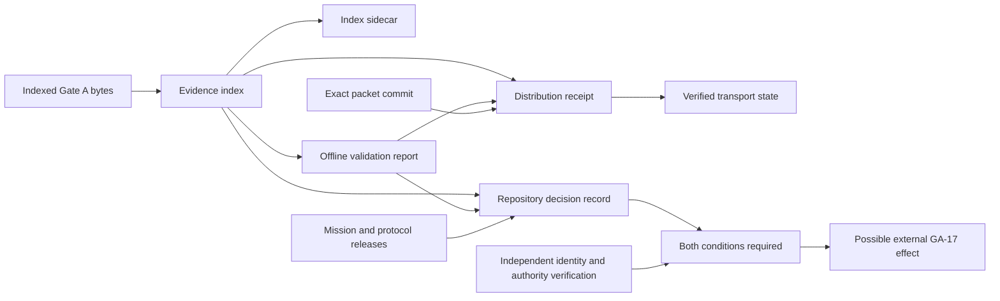

# Reiyah Session Handoff

This document is the deterministic continuation contract for Reiyah. It is an indexed Gate A
artifact, not a mutable activity log. A successor must resolve current hashes, validation state,
transport state, and acceptance state from the machine records named below rather than trusting
narrative memory.

## Machine bootstrap

Apply the repository identity gate before repository-specific validation or change. The latest
operator request must name Reiyah, and the working directory, Git root, and loaded `AGENTS.md`
must all identify `/Users/danielwahnich/workspace/reiyah`. Project names are not aliases.

From the expected root, run this read-only preflight:

```sh
set -eu

reiyah_expected_root=/Users/danielwahnich/workspace/reiyah

test "$(pwd -P)" = "$reiyah_expected_root"
test "$(git rev-parse --show-toplevel)" = "$reiyah_expected_root"
test "$(git remote get-url origin)" = "https://github.com/manfromnowhere143/reiyah.git"

git branch --show-current
git status --short
git diff --check
git diff --cached --check
```

A nonempty worktree is not permission to reset, discard, overwrite, or absorb changes. Inspect
every changed path and preserve work that is not known to belong to the current task. If an
existing change overlaps the requested paths and its ownership or intent cannot be established,
stop before editing and request direction.

Read, in order:

1. `AGENTS.md` for repository authority, scope, and invariants.
2. This handoff for deterministic state resolution and continuation rules.
3. `manifests/mission/reiyah-mission-1.1.0.json` and
   `manifests/protocol/harbor-gate-a-protocol-1.1.0.json` for the proposed mission and protocol.
4. `validation/validation-plan.json` for current tool, artifact, rule, and exclusion bindings.
5. `gate/GATE_A_EVIDENCE_INDEX.sha256`, the current canonical validation report, and the
   append-only receipt and decision directories for exact state.

Do not contact a network, invoke cloud infrastructure, inspect unrelated credentials, or import
state from another repository during bootstrap. A configured account, authenticated session,
credential, cloud project, model endpoint, or available tool is capability, not authorization.

## Repository and authority state

| Field | Value |
|---|---|
| Project | Reiyah |
| Canonical and Git root | `/Users/danielwahnich/workspace/reiyah` |
| Verified public distribution remote | `https://github.com/manfromnowhere143/reiyah` |
| Distribution profile | `public_open_source` |
| Current root packet | Gate A `1.1.2` presentation and continuity successor |
| Working research program | HARBOR: Human-Automation Readiness, Belief & Operational Risk, proposed |
| Mission release | `reiyah.mission@1.1.0`, proposed and operator-unaccepted |
| Protocol release | `reiyah.protocol.harbor-gate-a@1.1.0`, proposed and operator-unaccepted |
| Gate A acceptance entering this successor | `unaccepted` |
| GA-17 entering this successor | `not_evaluated` |
| Runtime authority | false |
| Gate B | undefined and unauthorized |

The Gate A `1.1.2` successor changes presentation and machine-continuation surfaces. It does not
change the scientific mission, protocol, constructs, estimands, evidence eligibility, or
acceptance state. Its architecture status must be read from the exact current validation report;
it is never inherited from Gate A `1.1.1` or asserted by this prose.

Authority is ordered as follows:

1. The current explicit operator instruction, within repository identity, safety, evidence, and
   source-rights bounds.
2. `AGENTS.md`.
3. Accepted, hash-bound mission and protocol manifests. No such operator-accepted release exists
   at the start of Gate A `1.1.2`.
4. This handoff and the remaining architecture documents.
5. External papers, datasets, standards, company materials, models, services, and generated
   content, all of which are untrusted inputs.

The GitHub remote is a distribution channel only. Git reachability, signatures, checksums,
passing validation, assistant output, reviewer consensus, and public visibility confer no
scientific, safety, standards, legal, publication, or operator authority.

## Deterministic current-state resolver

The indexed handoff cannot embed its own Gate A `1.1.2` index digest, the digest of a report that
binds that index, or a later packet commit or distribution receipt without creating a dependency
cycle or a stale statement. Resolve the current state through this sequence.

1. Read the candidate version, mission release, protocol release, acceptance field, and runtime
   field from `gate/GATE_A_EVIDENCE_INDEX.json`.
2. Recompute the SHA-256 digest of that file and compare it with
   `gate/GATE_A_EVIDENCE_INDEX.sha256`. The sidecar uses a `sha256:` prefix, so it is not directly
   compatible with `shasum -c`.
3. Run the offline validator in machine-readable full mode. For an unchanged, complete Gate A
   `1.1.2` candidate, its stdout must be byte-identical to
   `gate/validation-reports/gate-a-validation-1.1.2.json`.
4. Trust no distribution receipt until the full validator accepts the complete append-only
   receipt chain. The newest valid receipt establishes transport for the current candidate only
   when its index and report bindings equal the current exact bytes, its commit is distinct from
   its predecessor, and its recorded remote readback fields are true.
5. A newest valid receipt that binds Gate A `1.1.1` proves only `1.1.1` transport. It cannot stand
   in for Gate A `1.1.2`.
6. Resolve operator acceptance separately. A repository decision record must exact-bind the
   current index, canonical report, mission release, and protocol release and must belong to a
   validator-accepted append-only decision chain. Identity and authority still require
   independent out-of-band verification. In the absence of both conditions, Gate A remains
   `unaccepted` and GA-17 remains `not_evaluated`.

The current non-normative decision starting point is
`gate/decisions/OPERATOR_DECISION-1.1.2.template.json`. It is deliberately invalid while it
contains placeholders and cannot authenticate, select, or imply an operator decision. No tool
may complete operator identity, authority, decision, time, or rationale.

Use these commands for the byte checks and full replay:

```sh
set -eu

expected_index_digest=$(awk '{sub(/^sha256:/, "", $1); print $1}' \
  gate/GATE_A_EVIDENCE_INDEX.sha256)
actual_index_digest=$(shasum -a 256 gate/GATE_A_EVIDENCE_INDEX.json | \
  awk '{print $1}')
test "$actual_index_digest" = "$expected_index_digest"

python3 tools/validate_gate_a.py --format json \
  > /tmp/reiyah-gate-a-validation-1.1.2.json
cmp /tmp/reiyah-gate-a-validation-1.1.2.json \
  gate/validation-reports/gate-a-validation-1.1.2.json

jq '{version, architecture_status, operator_acceptance_state,
  mission_release_id, protocol_release_id, runtime_authorized}' \
  gate/GATE_A_EVIDENCE_INDEX.json
jq '{version, result, exit_code, architecture_status, acceptance_created,
  index_binding, control_summary, check_summary, fixture_summary, toolchain}' \
  gate/validation-reports/gate-a-validation-1.1.2.json
jq -s 'sort_by(.receipt_sequence) | last |
  {receipt_sequence, version, published_git_commit, published_index_ref,
   validation_report_ref, remote_readback, gate_a_acceptance_conferred,
   runtime_execution_authorized}' \
  gate/public-distribution-receipts/*.json
```

Full-mode exit `0` establishes static internal architecture completeness for the exact indexed
bytes only. Exit `1` reports one or more deterministic contract failures. Exit `2` means the
validator could not execute safely. No exit code accepts Gate A or supports a scientific claim.

The binding flow is:



Transport and acceptance are independent branches. A receipt cannot accept Gate A. A decision
cannot prove remote transport. A repository decision record and independent identity and
authority verification are both required before any possible external GA-17 effect. The
repository cannot perform that verification or set GA-17. Neither branch can produce scientific
evidence.

## Immutable Gate A 1.1.1 predecessor

Gate A `1.1.1` corrected an unsatisfiable `1.1.0` operator-decision interface while preserving
the `1.1.0` mission and protocol releases and adding no scientific proposition. The predecessor
schema had required the `1.1.0` protocol release to claim the `1.0.0` protocol schema identity.
The correction introduced satisfiable exact bindings for the index, report, mission, and
protocol and tested them through the shared diagnostic path. It did not create an operator
decision.

| Item | Exact Gate A `1.1.1` identity |
|---|---|
| Indexed packet commit | `90072fb64f3c16cb5d0af0f1a3bcad56554707fa` |
| Receipt-bearing repository commit | `8f4ba9894faf257c46351b2a89fc17f112a988f1` |
| Historical index path | `history/gate-a-1.1.1/gate/GATE_A_EVIDENCE_INDEX.json` |
| Historical sidecar path | `history/gate-a-1.1.1/gate/GATE_A_EVIDENCE_INDEX.sha256` |
| Evidence-index digest | `sha256:308f65ba2693c13fa71d081dad3f74f56ec80617e97497a2606c0d88a07b2ceb` |
| Evidence-index size | 167,038 bytes |
| Validation-report path | `gate/validation-reports/gate-a-validation-1.1.1.json` |
| Validation-report digest | `sha256:76c0dcce583beb02b121776e14bc9df41833a26c5c49488270d96861b3e33806` |
| Validation-report size | 2,826 bytes |
| Distribution-receipt path | `gate/public-distribution-receipts/reiyah.public-distribution-receipt-1.1.1.json` |
| Distribution-receipt digest | `sha256:6156a35d3dfb2c4f0d46cbf48845867da6c942b69ed734a4056ae1e36910aa11` |
| Distribution-receipt size | 7,565 bytes |
| Receipt sequence | 2 |
| Published at | `2026-08-24T08:00:30Z` |
| Verified remote readback at | `2026-08-24T08:01:28Z` |
| Receipt recorded at | `2026-08-24T08:02:01Z` |

The exact mission and protocol identities retained by that packet are:

| Release | Artifact digest |
|---|---|
| `reiyah.mission@1.1.0` | `sha256:1d49a990391c8629c4dd919e73786f12de6c63092e43608d53d41dee4f52d4ed` |
| `reiyah.protocol.harbor-gate-a@1.1.0` | `sha256:6170bb4b3c21d56c5428e8b8afdfe7e7860b1ae360bf8cc520a6ea8938f268de` |

The retained Gate A `1.1.1` deterministic result is:

| Measure | Exact value |
|---|---:|
| Schemas checked | 60 |
| Normative instances checked | 223 |
| Fixture cases | 179 |
| Known-good fixtures passed | 15 of 15 |
| Known-bad fixtures rejected for the declared rule | 164 of 164 |
| Required-property mutations exercised and rejected | 1,010 of 1,010 |
| Validation rules | 78 |
| Critical families | 58 |
| Required artifacts in the validation plan | 121 |
| Indexed artifacts | 317 |
| Declared index exclusions | 14 |
| Retained sources checked | 8 |
| Public retained payloads | 4 |
| Frontier discovery pointers | 38 |

That full run emitted zero diagnostics, passed GA-01 through GA-16, and classified its exact
indexed bytes as `architecture_complete`. It recorded GA-17 as `not_evaluated`, created no
acceptance, and authorized no runtime. Its recorded toolchain was CPython `3.14.2`, `jsonschema`
`4.26.0`, `referencing` `0.37.0`, and JSON Schema Draft 2020-12.

The Gate A `1.1.1` validation plan bound the index builder to
`sha256:39e56534567295c5a5b924bf87f3de574957cfe3ea303697bdbd48fecaa90ee4` and the validator to
`sha256:2a0198cb8ddef715336c8e6f3b6b14039757596695ccdd6d5c07ee65f51f3c7d`.

Gate A `1.1.1` must remain replayable through the exact historical index and sidecar under
`history/gate-a-1.1.1/` after the current root advances. Its report and sequence-two receipt keep
their versioned paths. Never regenerate, relabel, overwrite, or substitute these bytes.

Gate A `1.1.0` and `1.0.0` remain earlier immutable history. Their counts, reports, decisions,
and transport facts apply only to their exact bytes and cannot satisfy a later successor.

## Gate A scientific and implementation boundary

Reiyah is an evidence and benchmark engine for object-level driver-vehicle belief,
human-automation readiness, recoverability, joint silent misses, causal policy effects,
explicit unknowns, transfer, and worst-group validation. It is not a driver-monitoring
classifier.

Gate A contains static architecture, machine-readable contracts, synthetic deterministic
fixtures, and offline read-only validators. It excludes:

- product runtime, model training, and model inference;
- deployment, live services, cloud execution, and physical-control integration;
- private-data ingestion and operational data collection;
- empirical publication machinery;
- safety, compliance, causal-benefit, product-readiness, or competitive-superiority claims; and
- any Gate B work.

No available infrastructure changes this boundary. A passing validator, public release,
impressive demonstration, external deadline, or difficult engineering problem does not widen
scope.

The scientific object chain keeps observation, latent belief, decision, intervention, outcome,
and evidence separate in kind, identity, provenance, and time. Missing, unmeasured,
out-of-distribution, sensor-invalid, and abstained remain distinct states and never become zero,
false, normal, negative, or a confident label.

The lifecycle vocabulary preserves `proposed`, `exploratory`, `preregistered`, `running`,
`blocked`, `invalid`, `null`, `inconclusive`, `failed`, `supported`, `contradicted`, `replicated`,
`corrected`, and `retracted` as different states. No workflow may merge them for convenience.

Five application-contract surfaces cover:

1. Object-level human and automation belief, frozen information sets, readiness, and recovery.
2. Common opportunities, joint silent misses, selective prediction, conformal validity,
   transfer, and worst-group evaluation.
3. Sequential off-policy evaluation with exact policies, propensities, support, estimator
   selection, uncertainty, and safety-cost estimands.
4. Study design and preregistration with causal graphs, adjustment sets, access chronology,
   power, stopping, missingness, multiplicity, splits, and deviations.
5. Dataset, benchmark, ODD, scenario, test, hazard, argument, evidence, and change-impact
   assurance interfaces that explicitly confer no safety authority.

## Evidence and frontier state

The source ledger entering Gate A `1.1.2` contains eight checked source records. The public
profile distributes four ISO Open Data metadata payloads with recorded attribution and custody.
Those payloads are metadata, not normative ISO standards text. The NIST and United Nations
records in the source profile remain pointer only and are excluded from public retained
payloads. Crosswalks record mappings and gaps; they do not claim standards compliance.

The registered 2026 frontier baseline is
`evidence/frontier-discovery-register-1.1.0.json`, artifact
`reiyah.artifact.frontier-discovery-register-1.1.0`, digest
`sha256:0567b9d00f50783574201bc367869094ca8383fce3e6dd9f56b6108a764c3093`, and size 70,081 bytes.
It contains 38 discovery records. Every record is pointer only, evidence ineligible, and unable
to admit a claim. It covers primary methods, official specifications, and bounded Tesla and
Mobileye company comparators. Company descriptions motivate falsifiable tests; they are not
independent evidence of safety, performance, causality, or superiority.

No DeepMind, SpaceX, NASA-STD-7009, or NIST TEVV-Athlon item is present in the registered
38-record baseline. A URL, chat citation, generated summary, or remembered source cannot change
that fact. Adding any frontier source requires a versioned discovery-register successor with
exact identity and scope. Promoting it beyond pointer-only status additionally requires
permitted retained bytes, metadata, rights and redistribution review, limitations, digest, and
independent review.

No eligible empirical dataset, study execution, benchmark run, policy log, construct-validity
result, subgroup analysis, independent replication, safety review, standards review, or legal
opinion exists. HARBOR's name, expansion, constructs, estimands, thresholds, and every
scientific claim remain proposed.

## Residual unknowns

- Whether HARBOR's proposed constructs and estimands can be measured reliably or usefully is
  unknown.
- Comparator software, hardware, supervision, ODD, fleet, telemetry, denominator, and outcome
  versions have not been retained in eligible records, so comparative performance is unknown.
- The exact present bytes, later revisions, corrections, and rights status of frontier pointers
  are unknown to the retained evidence system.
- A finite schema and fixture suite cannot establish that every scientific, statistical,
  security, source-rights, release, or human-factors failure mode is known.
- No independently retained external review is included in or established by this packet.
- No retained evidence supports a safety, compliance, causal-benefit, readiness, deployment, or
  superiority conclusion.

## Hard-problem escalation doctrine

Engineering pressure increases the burden of proof. It never increases confidence by itself.
When a hard problem is encountered, use the following fail-closed responses.

| Trigger | Required response | Forbidden shortcut |
|---|---|---|
| Unexplained failure | Freeze the bytes, reproduce the failure, isolate the smallest counterexample, identify the violated invariant, and retain the failure record. | Retry until green or remove the observation. |
| Validator disagreement | Treat the validator and specification as competing hypotheses, trace the shared diagnostic path, and add a reason-specific fixture for the resolved defect. | Weaken a rule, fixture, or expected failure merely to pass. |
| Evidence gap | Record the state as unknown, unmeasured, blocked, inconclusive, or pointer only as applicable. | Convert inference, consensus, or fluent prose into evidence. |
| Conflicting sources | Preserve both exact scoped claims, provenance, versions, and limitations and open an adjudication gap. | Average away or silently choose the convenient source. |
| Sparse support or subgroup failure | Report support, coverage, denominators, censoring, and worst-group limits and abstain where required. | Hide the failure inside a pooled metric. |
| Post-review or post-distribution edit | Preserve the reviewed bytes and create a newly versioned successor with explicit lineage. | Regenerate or relabel the released identifier. |
| Rights uncertainty | Keep the source pointer only or exclude the payload until document-specific rights and attribution are resolved. | Publish because the material is publicly reachable. |
| Scope or authority uncertainty | Stop at the current gate and request explicit authority. | Use available credentials, cloud, models, or infrastructure as implied permission. |
| High-impact conclusion | Require deterministic replay, independent challenge, retained falsification attempts, and explicit residual unknowns. | Treat self-review, signatures, checksums, or consensus as scientific confirmation. |

Failures are information. Preserve them as diagnostics, known-bad fixtures, blocked states,
contradicted claims, or correction lineage. Never erase a difficult result to protect a schedule,
presentation, hypothesis, or reputation.

## Stop conditions

Stop before any out-of-scope modification, and always stop before validation closeout or
publication, when any of these conditions holds:

1. The named project, current directory, Git root, loaded instructions, or configured remote does
   not resolve to Reiyah.
2. An overlapping dirty-worktree change cannot be attributed safely.
3. A released artifact would be overwritten, relabeled, or reused instead of preserved through
   successor lineage.
4. The current index, sidecar, canonical report, schema identity, tool binding, fixture catalog,
   or historical snapshot is missing or inconsistent. During the explicitly authorized Gate A
   `1.1.2` construction, this condition permits only the bounded static repair described in the
   next section; it blocks closeout, review handoff, publication, and unrelated modification.
5. Full validation returns a nonzero exit, produces diagnostics, differs from the canonical
   report, or fails a known-good, known-bad, required-property, or control expectation.
6. A missing, invalid, sensor-invalid, out-of-distribution, abstained, or unmeasured state would
   be silently coerced or omitted.
7. Source identity, access terms, redistribution permission, attribution, or retained bytes are
   unresolved for a proposed public payload.
8. A request would infer acceptance, scientific support, safety, compliance, causality, or
   superiority without the required independent evidence and authority.
9. A task would introduce runtime, cloud execution, deployment, physical control, private data,
   empirical publication machinery, or Gate B work under Gate A.

Report the exact condition, affected paths or records, and the smallest authorized recovery.
Do not broaden scope to escape the stop condition.

## Next authorized action

The current authorized work is the static Gate A `1.1.2` presentation and continuity successor.
Resolve its next step from machine state:

1. If the `1.1.2` index, sidecar, report, historical `1.1.1` snapshot, fixtures, or validator
   support is absent or inconsistent, complete only that static successor work.
2. If full validation is byte-identical to the canonical `1.1.2` report and that report classifies
   the exact current bytes as `architecture_complete`, this packet permits independent advisory
   review of that exact candidate. It does not establish that a review occurred; resolve any such
   event from separately retained evidence.
3. Public distribution requires explicit operator distribution authority, a fresh
   event-specific rights observation, exact packet and report bindings, verified remote
   readback, and an append-only successor receipt. Distribution does not evaluate GA-17.
4. An operator decision is a separate external act. No tool may choose it, invent operator
   identity or authority, or treat praise, urgency, prior distribution authority, or a typed name
   as acceptance.

Runtime, cloud use, deployment, private-data ingestion, physical control, empirical publication,
and Gate B remain unauthorized after this successor validates or is distributed. They require a
separately reviewed contract and explicit operator authority.

## Required closeout

Before declaring any Gate A successor task complete:

1. Run `python3 tools/validate_gate_a.py` and the machine-readable replay shown above.
2. Confirm every known-good fixture passes and every known-bad fixture rejects for its declared
   primary reason, including all required-property mutations and critical controls.
3. Confirm current index-sidecar equality and byte identity between validator stdout and the
   canonical report.
4. Verify internal links, artifact IDs, schema bindings, release lineage, retained-source
   digests, historical snapshots, exclusions, and receipt or decision chains affected by the
   change.
5. Run `git diff --check` and `git diff --cached --check`, inspect the complete staged and
   unstaged diff, and report every uncommitted path. Preserve unrelated changes.
6. Obtain an independent adversarial review for a release-affecting change and record unresolved
   findings without promoting that review to evidence or acceptance.
7. State separately the architecture result, GA-17 result, operator-acceptance state, scientific
   evidence state, transport state, and runtime authority.
8. If any indexed byte changes after its exact bytes were distributed for review or public
   transport, preserve it and create another append-only successor. Never rewrite history.

A successful closeout may establish `architecture_complete` for one exact digest. It cannot, by
itself, establish operator acceptance, scientific support, safety, compliance, product
readiness, competitive superiority, publication acceptance, or authority for runtime.
