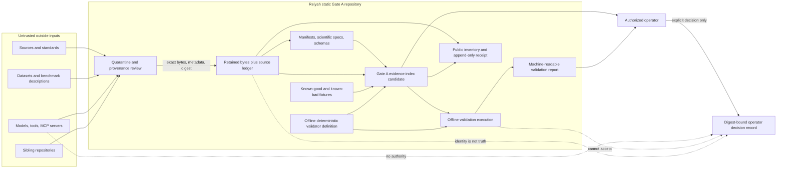

# Gate A Threat Model

| Field | Value |
| --- | --- |
| Document ID | `reiyah.threat-model` |
| Version | `1.1.0` |
| Lifecycle status | `proposed` |
| Scope | Static Gate A artifacts, fixtures, offline validators, distribution records, and acceptance records |

This threat model protects scientific and architectural integrity. It does not claim
cybersecurity assurance, vehicle safety, privacy compliance, or deployment suitability.

## 1. Authorized system boundary

Gate A contains only reviewable repository artifacts and deterministic offline validators.
There is no product runtime, live data path, network service, model training or inference,
private-data store, empirical-publication system, or physical-control interface. Static public
repository transport is separately bounded by an exact distribution inventory and receipt.

Any component that introduces one of those capabilities is outside the boundary and must
be rejected, not “sandboxed” into Gate A.

## 2. Assets and protection goals

| Asset | Protection goal |
| --- | --- |
| Repository identity and contract | Prevent cross-project authority or artifact contamination. |
| Mission and protocol manifests | Preserve version identity, append-only release history, and exact digests. |
| Six-kind ontology | Prevent observation, belief, decision, intervention, outcome, and evidence from being collapsed or relabeled. |
| Epistemic and lifecycle states | Preserve distinct meanings and complete status history. |
| Retained evidence | Preserve exact bytes, provenance, version, publication date, access constraints, and digest. |
| Claims and non-claims | Prevent scope inflation, evidence laundering, and unsupported status changes. |
| Schemas and fixtures | Reject ambiguity, unknown fields where forbidden, invalid references, and coercion. |
| Validator and diagnostics | Preserve offline, deterministic, fail-closed behavior and reason-specific failures. |
| Evidence index | Bind the exact reviewed architecture set without circular or ambiguous hashing. |
| Public custody and distribution records | Prevent restricted payloads, pointer laundering, attribution loss, and forged transport claims. |
| Operator decisions | Prevent spoofing, replay against changed artifacts, and conflation with scientific evidence. |

Availability is secondary to integrity at Gate A: a blocked validation is preferable to a
plausible but unverified result.

## 3. Actors and trust assumptions

| Actor or source | Trust level | Permitted role | Not authoritative for |
| --- | --- | --- | --- |
| Authorized operator | Highest repository decision authority, but fallible | Issue explicit instructions and digest-bound acceptance decisions | Scientific truth by fiat |
| Contributor | Untrusted until reviewed and validated | Propose architecture changes | Acceptance or scientific status |
| Independent scientific reviewer | Advisory; a review record is provenance, not scientific evidence by itself | Review methods, claims, and retained evidence | Repository/operator authority or scientific status by fiat |
| Offline validator | Deterministic integrity mechanism | Check declared static contracts | Scientific validity or acceptance |
| External source or dataset provider | Untrusted evidence source | Supply versioned candidate evidence | Reiyah policy or conclusions |
| External model, agent, MCP server, or tool | Untrusted adapter | Generate proposals or retrieve candidate inputs | Evidence, status, acceptance, or publication |
| Sibling repository | Untrusted and independent | None by default | Reiyah code, data, configuration, or authority |
| Malicious or careless actor | Adversarial | None | Any protected decision |

A typed name, generated signature, checksum, consensus, or passing test does not elevate an
actor's authority.

## 4. Trust boundaries

No arrow represents a runtime vehicle or human-data flow. The operator decision record is
a repository-governance decision, not scientific evidence.

## 5. Threat catalogue

Residual risk is stated even where a mitigation exists. Threat identifiers are stable
within this version.

| ID | Threat and attack/failure scenario | Required preventive control | Required detection or rejection | Residual risk |
| --- | --- | --- | --- | --- |
| `TM-001` | **Repository identity confusion:** work intended for Reiyah is performed under another Git root or sibling instructions. | Resolve canonical working directory and Git root before repository actions; forbid sibling imports by default. | Validation and task closeout record the exact root; mismatch halts work. | A compromised filesystem or Git binary can misreport identity. |
| `TM-002` | **Cross-repository contamination:** code, data, authority, or conclusions are copied from a sibling. | Treat siblings as untrusted external sources; require explicit provenance and retained evidence. | Inventory flags undeclared origins and foreign paths. | Human authors may fail to disclose copied concepts. |
| `TM-003` | **Source substitution or link drift:** a URL later serves different bytes or a local source is replaced. | Retain permitted bytes and record exact version, date, metadata, constraints, and SHA-256 digest; observe mutable rights pages immediately before public distribution. | Recompute payload digests offline; reject mismatches, URL-only positive evidence, unreachable rights pages, and observed rights contradictions. | A digest establishes sameness, not authenticity, truth, or legal effect. |
| `TM-004` | **Evidence laundering:** generated prose, a review, signature, consensus, or test is cited as independent evidence. | Type evidence and authority records separately; restrict eligible claim links. | Semantic validation rejects ineligible evidence kinds for scientific support. | Sophisticated circular citations may need human investigation. |
| `TM-005` | **Manifest or history rewrite:** mission/protocol content or recovered predecessor identity changes without a new version or disclosure. | Append-only release IDs, canonical serialization, content digests, supersession links, and exact recovery bindings. | Reject duplicate IDs, predecessor digest mismatch, recovered-byte mismatch, and acceptance binding mismatch. | Git history and private custody context can be rewritten outside the validator's view. |
| `TM-006` | **Ontology collapse:** observation, latent belief, decision, intervention, outcome, or evidence is relabeled to simplify analysis. | Separate schemas, namespaces, timestamps, provenance, and allowed references. | Known-bad cross-kind and illegal-edge fixtures must fail for declared reasons. | Semantically misleading values can still satisfy a syntactic schema. |
| `TM-007` | **Unknown coercion:** missing, unmeasured, OOD, sensor-invalid, or abstained becomes zero, false, normal, or negative. | Closed epistemic-state enum; reason required for every non-observed state; prohibit sentinels. | Fixtures exercise every state and coercion pattern; denominator checks fail closed. | A plausible numeric value can conceal upstream coercion not visible in retained provenance. |
| `TM-008` | **Status laundering:** `exploratory`, `null`, `inconclusive`, `failed`, `invalid`, or `retracted` is presented as support. | Closed lifecycle enum, append-only transitions, claim-language rules. | Reject illegal transitions, absent history, overwritten records, and incompatible claim links. | Human summaries may overstate a technically correct status. |
| `TM-009` | **Outcome or future-information leakage:** later observations enter a decision or belief information set. | Record event and availability times, index time, information-set membership, and protocol windows. | Temporal validator rejects unavailable inputs and ambiguous ordering where the protocol requires order. | Incorrect source timestamps may evade detection. |
| `TM-010` | **Decision/intervention conflation:** a proposed action is assumed executed, or observed exposure is assumed assigned. | Separate kinds and IDs; record assignment, delivery, receipt, adherence, and provenance independently. | Reject causal links lacking intervention and assignment records. | Unrecorded non-adherence or contamination can remain. |
| `TM-011` | **Post-hoc outcome, comparator, or subgroup relabeling:** favorable definitions replace frozen ones after outcome access. | Digest-bound preregistered protocol; new release for any substantive change; deviation log. | Compare evaluation inputs to the frozen protocol and reject mismatches. | Unauthorized outcome access may not be observable from repository artifacts. |
| `TM-012` | **Causal overclaim:** association or simulation is labeled a policy effect despite confounding, interference, or positivity failures. | Require explicit estimand, assignment mechanism, identification assumptions, diagnostics, and sensitivity plan. | Claims validator rejects causal language without a bound eligible protocol and evidence. | Assumptions can be documented yet false or empirically untestable. |
| `TM-013` | **Joint-miss independence shortcut:** marginal miss rates are multiplied without justification. | Pre-specify joint opportunity and dependence model; require an explicit independence assumption if used. | Semantic rule flags undeclared factorization and unavailable-channel coercion. | Sparse joint events may yield irreducible uncertainty. |
| `TM-014` | **Denominator manipulation:** invalid, abstained, small, or poorly performing cases are removed from reported coverage. | Record inclusion flow and per-state counts before/after every exclusion. | Reconcile denominators and reject unexplained loss or double counting. | Source populations may already embody selection bias. |
| `TM-015` | **Worst-group erasure:** an empty, invalid, or low-performing group is omitted so another group appears worst. | Freeze complete group/intersection set; report validity and uncertainty for every eligible group. | Validator requires a result or explicit non-observed/invalid record for each group. | Unmeasured group attributes can make membership unknowable. |
| `TM-016` | **Transfer leakage or target tuning:** target outcomes influence source training, threshold selection, or adaptation beyond protocol. | Freeze source/target domains, split identities, allowed adaptation, and access chronology. | Provenance and digest checks reject reused identities and undeclared target access. | Organizational knowledge leakage may be impossible to prove absent. |
| `TM-017` | **Benchmark gaming or fixture overfitting:** validator is weakened or logic special-cases known fixtures. | General rules, review of validator changes, diverse reason-specific fixtures, immutable expected failures, and exact validation-plan SHA-256 bindings for both authorized tools. | Mutation/adversarial fixtures, exact source-binding checks, and diff review; reject changed expectations or tool bytes without rationale/new version. | A finite fixture set and source binding cannot establish semantic completeness or prevent coordinated malicious change to every authority artifact. |
| `TM-018` | **Nondeterministic validation:** clocks, locale, ordering, randomness, filesystem paths, or network results change diagnostics. | Offline execution, canonical sorting/serialization, pinned dialects, no wall-clock fields in compared output, fixed seeds where allowed. | Repeat validation and compare exit code and report bytes. | Platform/library differences may remain unless the environment is fully pinned. |
| `TM-019` | **Fail-open validation:** unknown schemas, properties, IDs, references, or exceptions are ignored. | Closed schemas where specified; explicit allowlists; nonzero exit on any unknown or internal error. | Known-bad fixtures for each rejection path and a self-test inventory. | Unmodeled semantic errors can still pass. |
| `TM-020` | **Acceptance spoofing or replay:** a typed/generated approval is attached to changed artifacts. | Require declared operator identity and authority basis, UTC decision time, rationale, risk acknowledgement, exact path, algorithm, evidence-index digest, manifest releases, matching architecture-completeness evidence, and separate out-of-band identity/authority verification. | Recompute bindings and reject malformed or stale records; keep GA-17 `not_evaluated` until an authorized human independently verifies identity and authority. | Repository records cannot authenticate a human identity or authority. |
| `TM-021` | **Circular evidence index:** an index directly or indirectly hashes itself, its generated validation output, or a post-push receipt that names its commit. | Define an acyclic inventory; exclude the index, sidecar, emitted report, acceptance records, and append-only distribution receipts from indexed entries. | Dependency-cycle, excluded-path, canonical-index, and duplicate-path checks. | Later packaging can accidentally introduce a second ambiguous inventory. |
| `TM-022` | **Standards scope inflation:** catalog metadata or partial text is described as full normative evidence or compliance. | Record exact document/version/date, source type, retained extent, scope, comparator, and unresolved gaps. | Crosswalk validator rejects support/compliance status and absent retained evidence. | Standards access restrictions may prevent full-text retention and leave unresolved gaps. |
| `TM-023` | **Poisoned or restricted evidence:** malicious bytes, active content, or incompatible access or licence conditions enter the repository. | Treat retained files as inert bytes; separate retained, pointer-only, and excluded states; bind an exact public inventory; never execute evidence. | Allowlisted static inspection, exact set reconciliation, quarantine, attribution checks, and fail-closed exclusion when rights remain unresolved. | File parsers used outside Gate A may contain vulnerabilities, and automated checks cannot create legal clearance. |
| `TM-024` | **Unauthorized private-data ingestion:** real human or vehicle records are placed in fixtures/evidence. | Synthetic, non-identifying fixtures only; explicit provenance and prohibited-data rule. | Inventory/content review blocks suspected private or secret material. | Automated detection cannot prove that realistic synthetic data is not real. |
| `TM-025` | **Runtime or physical-control scope creep:** architectural components become live services, inference, alerts, or actuator interfaces. | Gate A allowlist permits documentation, schemas, fixtures, evidence records, and two digest-bound offline tools only. | Full inventory checks, exact tool-source bindings, AST restrictions, and mutations reject servers, writes, shell/network calls, dynamic indirection, device interfaces, training/inference, and deployment configs. | Static review cannot prove all future dual-use semantics; opaque Git implementation metadata remains outside Gate A authority. |
| `TM-026` | **Identifier collision, ownership ambiguity, or dangling reference:** two objects share an ID or a record points to an absent, wrong-kind, or wrong-version object. | Namespaced identifiers plus a profile-level path map classifying each reference as document-local, protocol-owned, or exact versioned external with expected kind and cardinality. | Global uniqueness, ownership-map coverage, type, version, membership, and referential-integrity checks. | External identifiers may remain semantically ambiguous even when structurally resolved. |
| `TM-027` | **Correction/retraction erasure:** an unfavorable or defective record disappears from current views. | Append-only history with supersedes/superseded-by links; retractions remain indexed. | Chain-completeness and orphan checks. | A repository rewrite can remove all local evidence of a record. |

## 6. Abuse and misuse cases

The architecture must anticipate these foreseeable misuses:

- presenting a Gate A diagram as a deployed safety architecture;
- using readiness as a durable score of an individual rather than a contextual construct;
- treating abstention as failure by the person or as success by automation;
- ranking groups without measurement-validity and uncertainty disclosure;
- asserting standards compliance from a crosswalk row;
- selecting only supported claims while hiding null, invalid, contradictory, or retracted
  records;
- converting retrospective observations into fictional interventions; and
- feeding synthetic fixtures into a real control, employment, insurance, or enforcement
  decision.

Documentation and diagnostics must label Gate A outputs as non-operational and
architecture-only. Mitigating language reduces misuse risk but cannot eliminate it.

## 7. Fail-closed response

For identity, schema, reference, digest, provenance, unknown-state, status, temporal,
fixture, or acceptance errors, validators must:

1. return a nonzero exit status;
2. emit deterministic machine-readable diagnostics with stable rule ID, artifact path,
   object ID where available, and reason;
3. produce no acceptance or scientific-status mutation;
4. make no network request or automatic repair; and
5. preserve all contradictory diagnostics rather than stopping after a favorable subset.

Automatic coercion, imputation, source fetching, status upgrading, signature generation,
or expectation rewriting is forbidden.

## 8. Verification obligations

Gate A must include at least one known-bad fixture for every critical rejection family:
identity/authority mismatch, kind conflation, each epistemic-state coercion class, illegal
status or transition, temporal leakage, missing provenance, bad digest, dangling/wrong-type
reference, manifest mutation/version reuse, denominator mismatch, omitted group,
non-deterministic input, unsupported standards claim, acceptance replay, prohibited private
data, runtime-scope intrusion, missing mission boundary, claim-register mismatch, incomplete
threat coverage, non-normalized belief, ineligible or unresolved evidence basis or consumer binding, unledgered
retained source, excluded-path intrusion, noncanonical complete index, incomplete validation
report, conflicting decision history, and circular evidence indexing.

Every bad fixture must declare its single primary expected rule ID. It may trigger secondary
diagnostics, but passing for the wrong reason does not satisfy the fixture contract.

The ten architecture-hardening cases operate on an in-memory repository overlay and call the
same production diagnostic functions used by a full validation run. Writing the mutated files
to the repository is forbidden. A fixture-only condition that duplicates or weakens the
production rule does not satisfy TM-017 or this obligation.

## 9. Residual-risk statement

Static schemas and validators can establish internal consistency, byte identity, and
declared rejection behavior. They cannot establish that external evidence is true, that a
scientific design is causally identified, that measurements are valid, that all threats are
known, that a reviewer is independent, or that a future implementation will be safe.

These residual risks remain open after architecture completion and after operator
acceptance. Any future gate must create a new threat-model version and evidence set rather
than treating Gate A as inherited operational assurance.
