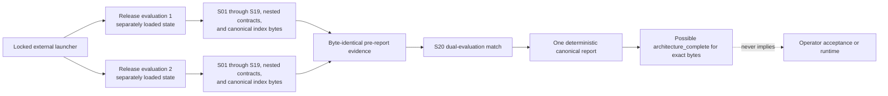

# Gate A Offline Validation

Document version: `1.2.0`

## Purpose

Gate A validation checks a static research architecture. It does not train or execute a model,
contact a network, ingest private data, operate a vehicle, run a study, evaluate real-world
safety, create scientific evidence, verify a publisher's remote transport, or make an operator
decision.

A passing result is an integrity statement about one exact candidate projection. It is not
scientific support, safety validation, standards compliance, product readiness, competitive
superiority, operator acceptance, or runtime authority.

## Canonical entry point

Authoritative replay is bound to the resolved root
`/Users/danielwahnich/workspace/reiyah`. The current request, working directory, Git root,
repository contract, and configured distribution remote must all identify Reiyah before the
launcher runs.

Direct Python execution is unsupported and rejected. Development replay starts only through the
reviewed launcher:

```sh
tools/gate_a_1_2_0.sh --snapshot-mode development --output human
```

Machine-readable development output is observational:

```sh
tools/gate_a_1_2_0.sh --snapshot-mode development --output json \
  > /tmp/reiyah-gate-a-validation-1.2.0.json
```

Development mode is never release evidence. Release bootstrap requires three distinct committed
states. Begin at clean `C0`, with every candidate byte except the current index, sidecar, and
report present. The two event-specific capture manifests are ordinary candidate artifacts and
must already be fresh and frozen. Generate only to `/tmp`; redirecting to a repository path opens
that path before snapshot capture and invalidates the clean-release precondition.

```sh
set -eu

index_tmp=/tmp/reiyah-gate-a-index-1.2.0.json
report_tmp=/tmp/reiyah-gate-a-validation-1.2.0.json

test -z "$(git status --porcelain=v1 --untracked-files=all)"
test ! -e gate/GATE_A_EVIDENCE_INDEX.json
test ! -e gate/GATE_A_EVIDENCE_INDEX.sha256
test ! -e gate/validation-reports/gate-a-validation-1.2.0.json

tools/gate_a_1_2_0.sh --snapshot-mode release --output json --emit-index \
  > "$index_tmp"
cp "$index_tmp" gate/GATE_A_EVIDENCE_INDEX.json
index_digest=$(shasum -a 256 "$index_tmp" | awk '{print $1}')
printf 'sha256:%s  gate/GATE_A_EVIDENCE_INDEX.json\n' "$index_digest" \
  > gate/GATE_A_EVIDENCE_INDEX.sha256
git add gate/GATE_A_EVIDENCE_INDEX.json gate/GATE_A_EVIDENCE_INDEX.sha256
git commit --amend --no-edit

tools/gate_a_1_2_0.sh --snapshot-mode release --output json --emit-report \
  > "$report_tmp"
cp "$report_tmp" gate/validation-reports/gate-a-validation-1.2.0.json
git add gate/validation-reports/gate-a-validation-1.2.0.json
git commit --amend --no-edit

tools/gate_a_1_2_0.sh --snapshot-mode release --output json \
  > /tmp/reiyah-gate-a-validation-1.2.0-a.json
tools/gate_a_1_2_0.sh --snapshot-mode release --output json \
  > /tmp/reiyah-gate-a-validation-1.2.0-b.json
cmp /tmp/reiyah-gate-a-validation-1.2.0-a.json \
  /tmp/reiyah-gate-a-validation-1.2.0-b.json
cmp /tmp/reiyah-gate-a-validation-1.2.0-a.json \
  gate/validation-reports/gate-a-validation-1.2.0.json
```

The first amend creates `C_index`; the second creates `C_packet`. `--emit-index` is release-only
and requires all three cycle-breaking outputs to be absent. `--emit-report` is release-only,
requires exact committed index and sidecar readback, and requires the report path to remain
absent. Ordinary release requires all three committed outputs. The canonical report must be
byte-identical on repeated ordinary release replay. Redirection is performed by the invoking
shell; the validator itself remains read-only.

For `--emit-report` and ordinary release, two fresh isolated child interpreters each execute the
complete S01 through S19 pipeline. The parent separately performs the same production replay over
its immutable snapshot and exact-binds every child token row, nested row, selector row, canonical
index, actual-publication-state result, and report-driving section to that outer result before it
compares the children and emits S20. This parent replay is a fail-closed payload-substitution guard;
it is not an independent external evaluator or transport observation.

## Isolation and toolchain contract

The launcher applies the exact locked macOS Seatbelt policy before CPython starts. It clears
ambient dynamic-loader variables, supplies a controlled empty environment, and invokes the exact
Python executable with `-I -S -B`. The Python entry point rejects a direct or incorrectly flagged
invocation before loading owner-writable standard-library modules and reapplies the same policy in
process.

The toolchain lock binds:

- the operating-system product and kernel identity;
- the shell, environment utility, Seatbelt executable, Git, and Python executable bytes;
- the Python framework, standard library, and extension modules used by validation;
- every declared third-party dependency version, distribution record, recorded-file tree, and
  import-root tree; and
- the exact covered, conditional, and externally unverified guarantee boundaries.

The validator performs concrete denied-write, denied-bind, and denied-outbound probes. These
checks are conditional on the named platform, locked bytes, Seatbelt implementation, dynamic
libraries outside the declared closure, and operating-system integrity. They do not establish an
absolute sandbox or independently verify their own executable identity; the evidence index is
the external byte binding.

## Immutable-projection pipeline



Each release evaluation reads the clean committed candidate into a separate in-memory snapshot.
All schema resolution, manifest binding, derivation, fixture replay, inheritance, index
construction, and pre-report checks consume only that evaluation's snapshot. The validator
requires both canonical pre-report evidence bundles and index bytes to match before it emits S20
or renders the report. A development invocation uses one observational snapshot, cannot emit S01
or S20, and cannot render `architecture_complete`. Final drift checks reject a tree that changes
during either evaluation.

The projection digest uses this exact serialization for files ordered by repository-relative
path:

```text
path NUL lowercase_file_sha256 NUL decimal_byte_count LF
```

The evidence index, sidecar, current canonical report, append-only decision records, append-only
publisher receipts, Git metadata, and explicitly named transient caches are excluded only to
break dependency cycles or remove nondeterministic tool output. Gate A 1.2 also requires exactly
one absent-at-packet, event-specific exclusion:
`evidence/public-rights-revalidation-2026-08-25-gate-a-static-correction-1.2.0.json`. That later
rights record must bind the already committed packet, index, and report, so including it in the
packet would create Git and digest self-reference. A broad rights prefix, an excluded historical
rights record, or any second rights exclusion is invalid. The exact path must be absent, including
no placeholder or symlink, in the packet commit. After the event, exclusion means only that the
packet projection remains unchanged: the validator must separately inventory, schema-check,
semantic-check, digest-check, and cross-bind the rights record and receipt in their direct-child
commit. Excluded locations are content-constrained and are never a general hiding place. Any
unexpected file, symlink, special file, exclusion, or path traversal is rejected.

In `C_packet`, the exact future rights path and sequence-four receipt are jointly absent. In a
valid `C_receipt`, both are present and are the only new paths, `HEAD` is a direct child of the
receipt's bound `C_packet`, and the candidate projection, index, and canonical report remain
byte-identical. The ordinary release path enforces this as a release-blocking, non-emitted
post-event guard. The unchanged `C_packet` report cannot contain evidence about the later
`C_receipt`, and the sequence-four receipt can bind only publication and publisher readback of
`C_packet`; any observation of the commit containing that receipt must be retained later and
separately.

The two prepacket rights-observation capture manifests at
`evidence/rights-observations/2026-08-25-iso-open-data-gate-a-static-correction-1.2.0.json`
and
`evidence/rights-observations/2026-08-25-nist-technical-series-gate-a-static-correction-1.2.0.json`
are ordinary indexed artifacts, not exclusions. The plan binds each exact path, role, official
URL, and capture mode. Direct HTTP mode
may bind metadata plus a digest and size for an unretained response body. A predeclared adapter
mode must retain the blocked direct attempt, leave transport values the adapter did not expose
unasserted, and disclose crawl-freshness and source-byte limitations. A failed direct attempt may
not silently select adapter mode. The postpacket rights record resolves both exact manifest bytes;
event validation derives freshness from both completion times and the receipt's actual publication
time. None of these observations creates retained scientific evidence, legal review, operator
acceptance, or independent transport verification.

## Predecessor inheritance

Gate A `1.2.0` does not silently replace the public `1.1.2` checks. It binds the exact historical
`1.1.2` index and sidecar, canonical report, sequence-three publisher receipt, packet and
receipt-bearing commits, validation plan, legacy tools, and recovery record.

For every artifact in the historical index, validation requires one of two dispositions:

1. the successor contains the same path with byte-identical content; or
2. the path appears once in the closed `changed_paths` correction list and has a successor byte
   in the new projection.

Every new file must appear once in the closed `added_paths` list. The `removed_paths` list is
empty. Any unlisted drift, missing predecessor artifact, unexpected addition, duplicate path, or
digest mismatch blocks completion. The retained `1.1.2` report is an integrity signal about its
own exact packet, not fresh execution evidence for changed `1.2.0` bytes.

## Scientific contract replay

Seven Draft 2020-12 schemas define the common vocabulary, five application document families,
and the mutation envelope. The valid synthetic documents cover human-automation assessment,
joint performance evaluation, sequential off-policy evaluation, study-design preregistration,
and an evaluation-assurance bundle, including explicit positive non-observed and lifecycle
branches where the contract permits them.

The production semantic path must derive, rather than trust, at least these contracts:

- exact typed estimand references for every mapped application section, resolved to the protocol
  and definition-registry owner rather than inferred from profile metadata;
- exact observed belief state-space coverage and protocol-bound normalization, preserved
  non-observed belief envelopes, compatible observation validity and value state, and exact object,
  information-set, human-subject, selected-action, estimand, and temporal reconciliation;
- a schema-derived inventory of every stable-identifier and reference-bearing path, classified
  exactly once across the nine reference and identity families, with no omitted, duplicate,
  abstract-shape-only, or handler-only path;
- unique trajectory and history identities, complete behavior and target policy distributions,
  exact policy application roles, frozen per-history probability tables, exact history prefixes and
  information sets, exact-once support cells, logged propensities, step ratios, horizon and terminal
  closure, declared weight transformations, cumulative trajectory weights, threshold-derived
  horizon-specific effective sample size, and explicitly non-observed estimator point and interval
  outputs;
- acyclic causal graphs with one observed treatment and outcome endpoint, temporal and
  observability eligibility, prohibited collider, mediator, and post-treatment adjustment roles,
  exact back-door query, full estimand operand, selected-set, freeze, and disposition
  reconciliation, plus exact frozen split-member manifests whose member union, pairwise
  disjointness, completeness, and typed non-outcome stratification inputs are derived rather than
  inferred from distinct split names;
- readiness with dominant propagation for every required, safety-critical, or positively weighted
  unknown, exact unresolved and basis sets, all-input weight normalization, and no safety-critical
  compensation;
- unique recovery-event identities, exact index role, earliest qualifying recovery or competing
  event, elapsed time, frozen window membership, censoring, absent reason, disposition, and tie
  policy;
- metric identity and direction, positive observed support for observed estimates, population
  harmonization, overlap, measurement invariance, strict access chronology, adaptation disclosure,
  target tuning, and deliberately non-favorable Gate A transfer eligibility;
- separation of explicit aggregate and group conformal numerators, denominators, and scope from
  the exact non-asserted Gate A guarantee, with every group bound to an exact versioned external
  group-set member;
- joint silent-miss counts and marginals derived from one exact versioned opportunity set and its
  member-complete rows, including object, clock, window, reference, human, automation, warning,
  and fallback operands, with nonobserved operands forcing an explicit nonidentifiable disposition;
- eligible exact evidence for conformal exchangeability and transfer overlap or invariance, with
  empty and self-referential evidence rejected as support;
- one disjoint exhaustive nine-cell reference-by-detector partition for OOD,
  selective-prediction counts, denominators, coverage, and rates; and
- count, coverage, effective sample size, interval width, direction, exact sufficient,
  insufficient, and unknown group partitions, ties, and complete worst-group eligibility over an
  exact versioned external group set;
- globally unique artifact and logical-version identities, one fork-free and cycle-free lifecycle
  lineage, exact predecessor path, size, digest, identity, version, and history-prefix equality,
  and preserved `created_at` chronology;
- evaluation-assurance license disposition derived as `synthetic_original`, with scientific,
  safety, compliance, deployment, and runtime authorization all false regardless of checksums,
  tests, arguments, or evidence-gap prose; and
- exact successor chronology: every Gate A 1.2 research and correction release is dated no earlier
  than the retained 2026-08-24 investigation and remains ordered after its predecessor.

Gate A 1.2 has no resolver that can establish transfer, conformal, or other favorable assumption
dispositions from retained scientific evidence. Those favorable branches therefore remain
unavailable in this release; a self-label, empty evidence list, or circular reference cannot make
them eligible.

Schema validity alone cannot satisfy these rules. A document's claimed summary is compared with
the value independently derived from its operands.

## Fixture contract

Every entry in `fixtures/fixture-catalog.json` has a unique identity, exact path, classification,
fixture family, replay mode, fixture-schema identity, target-schema identity when applicable,
whole-file SHA-256 digest, byte size, and declared primary diagnostic. A release run requires:

- every current-replay known-good case to pass schema and semantic validation;
- every current-replay known-bad scientific mutation to fail through the same production
  derivation used for
  its valid source document;
- every governance fixture to exercise the production rights, receipt, decision, or transport
  invariant it challenges;
- every validator-security fixture to exercise its corresponding production rejection path;
- observed and expected primary diagnostics to match exactly; and
- fixture, schema, rule, catalog, and report counts to reconcile from snapshot bytes.

Fixtures are deterministic synthetic counterexamples, never empirical data. A validator that
accepts one current-replay known-bad case or rejects one current-replay known-good case is invalid
for Gate A. Retained historical catalog rows are byte-attested and schema-identified but excluded
from current `1.2.0` replay totals. A synthetic boolean oracle cannot substitute for the relevant
production path.

## Index and report contract

The index inventories every candidate-projection artifact with path, role, media type, byte
count, exact SHA-256 digest, schema identity where applicable, and version. The index records
`candidate_pending_canonical_report`; it cannot certify itself.

The canonical report binds the exact index digest and independently recomputes the index
projection, predecessor inheritance, schemas, instances, scientific fixture outcomes,
governance fixture outcomes, validator-security outcomes, controls, toolchain, and claim
boundaries. Each passed or reason-specific rejection count must equal its corresponding total.
Its same-snapshot `correction_closure_summary` must contain exactly ordered
`required_finding_ids`, `closed_finding_ids`, `open_finding_ids`, and one `finding_results` entry
for each of `CR-001` through `CR-016`. The closed and open arrays must be an exact disjoint
partition of the required array, and every closure state must be derived from that replay's mapped
production checks and fixtures.
Only a zero-diagnostic release report may record
`architecture_complete`, and only for its bound index bytes. GA-01 through GA-16 must pass,
required findings must equal closed findings, and open findings must be empty.
GA-17 remains `not_evaluated`, operator acceptance remains `unaccepted`, transport remains
`not_evaluated`, and runtime and Gate B remain unauthorized.

The report's S20 evidence is limited to equality of the two separately loaded pre-report
release evaluations. It contains no report digest, report byte size, Git commit identity, or
claim about a later launcher invocation. After rendering, two complete launcher invocations and
the committed report must compare byte for byte before release or publication; that later
readback cannot be represented inside the report it verifies.

The current index, sidecar, and report are cycle-breaking outputs and must never overwrite a
released version. Any change after review or publication requires a new append-only successor.

## Historical identities

The immutable Gate A `1.1.2` report covered 68 schemas, 241 normative instances, 196 fixtures, 17
known-good cases, 179 known-bad cases, 1,010 required-property mutations, eight retained sources,
and 347 indexed artifacts with zero diagnostics. Its exact recovery bindings are in
`history/gate-a-1.1.2/RECOVERY.json`.

Those counts and that `architecture_complete` result apply only to the exact `1.1.2` index digest
`sha256:17f3a2e601e9cb4e1c0cd0f97561b1da9ffdc7d5893ed4af4eaccbaf8a67989f`.
They are not expected `1.2.0` totals and cannot stand in for the successor report.

## Exit interpretation

- Exit `0` in release mode means the static architecture is internally complete for the exact
  bound index, provided stdout is byte-identical to the canonical report.
- Exit `0` in development mode means only that the observed development snapshot passed; it is
  never release evidence.
- Exit `1` means at least one deterministic contract failed.
- Exit `2` means validation could not enter or preserve the required execution boundary.

No exit code accepts Gate A, evaluates GA-17, establishes independent remote transport, supports
a scientific or safety claim, defines Gate B, or authorizes runtime.
