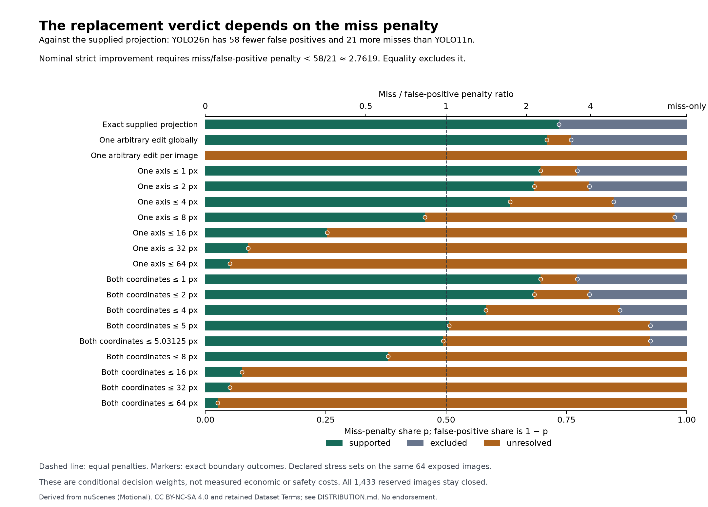

# State the false-positive and miss tradeoff

Version `0.1.0`, 18 September 2026. Status: `exploratory`.

On the same 64 exposed images and supplied reference projection, YOLO26n has
**58 fewer false positives and 21 more misses** than YOLO11n. The nominal
replacement is supported only when the miss penalty is **less than 58/21,
approximately 2.7619 times the false-positive penalty**. Equality excludes
strict improvement. The previous equal-penalty result remains correct for
its original decision rule; it does not establish a preferred operational
tradeoff or dominance on both error types.

These are eligible-car counts against the supplied projection, with height at
least 25 pixels and exact IoU at least 1/2. They are not physical error counts,
COCO AP, measured human work or evidence about a deployment population.

| Frozen output | Eligible predictions | Matched references | False positives | Misses |
| --- | ---: | ---: | ---: | ---: |
| YOLO11n | 297 | 170 | 127 | 135 |
| YOLO26n | 218 | 149 | 69 | 156 |

Both use the same 305 supplied reference rectangles. The all-class exports
still contain 487 and 353 predictions; this table uses the declared car/height
eligibility and does not change those complete packet counts.



The colored intervals and boundary markers come from exact rational sign
partitions, not interpolation between a few plotted settings. [SVG figure](tradeoff.svg).

## What the weights mean

Let `p` be a common miss-penalty share in `[0,1]`. The false-positive penalty
is `1-p`, and the miss penalty is `p`. They sum to one to remove irrelevant
positive scaling. Equal penalties occur at `p=1/2`; the normalized loss is
then half the previous unit loss, with the same sign and decisions.
For `p<1`, the miss/false-positive penalty ratio is `p/(1-p)`; at `p=1`,
only misses count. These are declared dimensionless decision weights,
not measured prices, human effort, physical risks or recommended costs.

The primary nominal normalized mean improvement is `(58-79p)/64`.
Equivalently, fixing false-positive cost at one and calling the miss cost
`lambda`, the unnormalized total improvement is `58-21lambda`. A decision
owner must choose and justify the actual criterion before a reserved study.
Different object-specific costs, confidence filters or matching thresholds
would need a different analysis.

## Reference uncertainty remains material

The following exact primary conditions use the miss/false-positive penalty
ratio. Between a support limit and an exclusion limit the decision is
unresolved, with both supported and excluding attained worlds.

| Declared family | Universally supported | Universally excluded |
| --- | --- | --- |
| Exact supplied projection | ratio < 58/21 | ratio ≥ 58/21 |
| One arbitrary reference edit globally | ratio < 56/23 | ratio ≥ 60/19 |
| One arbitrary reference edit per image | never in this share domain | never in this share domain |
| One-axis translation, radius 4 pixels | ratio < 50/29 | ratio ≥ 67/12 |
| Two-coordinate translation, radius 4 pixels | ratio < 46/33 | ratio ≥ 68/11 |
| Two-coordinate translation, radius 5 pixels | ratio < 40/39 | ratio ≥ 73/6 |
| Two-coordinate translation, radius 161/32 pixels | ratio < 39/40 | ratio ≥ 73/6 |
| Two-coordinate translation, radius 8 pixels | ratio < 30/49 | never, including miss-only |

At the lower boundary of a nontrivial uncertainty interval, the worst world
has zero improvement, so universal support ends. At its upper boundary, even
the best world has zero improvement, so universal exclusion begins. The
5-pixel family therefore loses support when the miss penalty reaches 40/39
of the false-positive penalty, approximately 1.02564. That small conditional
margin does not measure real cost uncertainty or annotation error frequency.

The broader one-edit-per-image family remains unresolved for the entire
closed share range, including false-positive-only and miss-only endpoints.
Choosing another common tradeoff cannot settle that primary comparison with
the admitted reference uncertainty. Better selection cannot resolve that
information limit. The previous query-floor and baseline-parity results
remain unchanged; no new selector is tested here.

## Complete allocation and verification

The [plan](PLAN.md) and 900 source/input/code bindings were frozen before
weighted outcomes. The predecessor results were already known, including the
two 2D bracket endpoints. This is an explicit exploratory follow-up on the
same development population, with no new inference, download, annotation,
image access or reserve consumption.

All 19 declared families and 73 overlapping cases complete: **1,387 case/family
rows**, **12,483 displayed share rows**, and **5,137 exact continuum cells**.
The displayed rows contain 2,901 supported, 4,763 excluded and 4,819 unresolved
outcomes; no failed or blocked row is omitted. Every unresolved interval has
attained opposite decisions. These rows reuse the same 64 images and are not
independent customer decisions or statistical trials.

Read the [complete displayed table](results.csv), [complete continuum table](continuum.csv)
and [source-bound summary](summary.json). The nine displayed shares correspond
to miss/false-positive ratios 0, 1/4, 1/2, 1, 2, 4, 8, 16 and miss-only.
The continuum table retains every point boundary separately from the open
intervals around it, including strict-improvement equality outcomes.

For fixed predictions let `N=nA-nB` and `M=mB-mA` in a reference world. The
unit difference is `N+2M`, while the normalized weighted difference is
`(1-p)N+M = D_unit/2 + (1/2-p)N`. Reference counts cancel even when an admitted
world inserts or deletes a reference. Because `N` is fixed and the coefficient
of the old difference is positive, the previously verified extremizers remain
extremizers for every share. The conventional implementation receives this
same elementary algebra; this is not an exclusive Engine capability.

The verifier admits 2,240 bound source components, independently checks their
557 distinct world matchings and 557 native proofs, computes false-positive
and miss counts directly, and verifies every affine enclosure and complete
share partition. It inherits the exact source-family extrema only from their
byte-bound predecessor verification. Native proofs certify the matching
worlds; the weighted transfer is checked separately. This is not independent
scientific replication or independent acceptance of the source observations.

All 24 controls pass: exhaustive small graph/count checks, constant-weight
endpoints, insertion/deletion cancellation, exact equality and every sign
orientation, source membership and byte changes, current-world proof reuse,
translation/source restrictions, composed edit budgets and missing evidence.
No frozen scientific criterion or implementation changed after execution.

## Costs and reproduction

The derivation process takes 1.865709250 seconds; separate verification takes
9.648084542 seconds. Source admission takes 1.086086959 seconds inside the
derivation, so it is not added again. Prior inference, geometric searches and
proof production are reused and retain their original cost records; this
study pays for its actual source loading, derivation and new verification.
The summary lists test, analysis, verification and presentation receipts.
Uninstrumented development, integration and review are outside those process
figures. Human work and complete economics remain unknown.

Run synthetic controls from this folder:

```sh
python -B -m unittest discover -s . -p 'test_*.py' -v
```

An authorized custodian can run a fresh named reproduction with the retained
runtime and network-denied process launcher:

```sh
REIYAH_TRADEOFF=/path/to/private/loss-tradeoff-01
python -B research/loss-tradeoff/0.1.0/trade_run.py "$REIYAH_TRADEOFF" reproduction-01
python -B research/loss-tradeoff/0.1.0/trade_verify.py "$REIYAH_TRADEOFF" reproduction-01
```

The private packet is `~/.codex/reports/reiyah/value-10h-2026-09-18-c1y8k9yc/private/loss-tradeoff-01/`.
Runs use fresh names and exclusive output creation. Relocating absolute frozen
paths requires a retained binding. Raw geometry, individual answer operands
and native payloads remain private; derived reports retain the
[nuScenes attribution and terms](DISTRIBUTION.md).

The continuation also records an unverified execution gap from 02:37:47 to
15:07:11 UTC on 18 September, excluded from useful-work accounting. This
completed experiment does not assert that ten useful hours have elapsed.
The next bounded source question is whether annotation/camera timestamp
alignment changes the supplied projection premise. Any alternative motion
model must remain an explicit assumption with missing inputs retained.
All 1,433 outcome-reserved images stay closed. Savings and demand remain
unproven, and Gate A remains operator-unaccepted.
