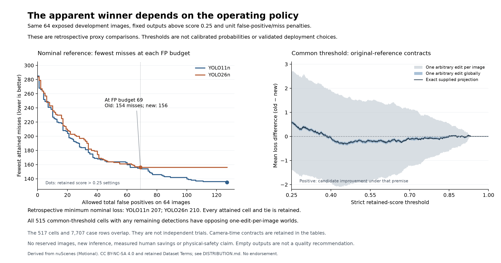

# Compare retained detector operating policies

Version `0.1.0`. Status: `exploratory`. 18 September 2026.

The apparent nominal advantage at a shared score cutoff is policy-dependent.
On the same exposed 64-image cohort, YOLO11n's best retained nominal unit loss
is 207; YOLO26n's is 210. At a budget of at most 69 false positives, the fewest
attained misses are 154 and 156 respectively. These are retrospective
development frontiers. No deployment threshold, calibrated probability or
held-out improvement is established.

The original score >0.25 comparison remains unchanged: YOLO11n has 127 false
positives and 135 misses, while YOLO26n has 69 false positives and 156 misses.
The nominal loss reduction is 37/64 per image. Allowing each checkpoint a
stricter retained-output policy changes the comparison. A competent comparison
must state its actual operating obligation, not infer equal calibration from
the same numeric score threshold.

| Retrospective nominal point | False positives | Misses | Unit loss |
| --- | ---: | ---: | ---: |
| YOLO11n, retained cutoff 0.25 | 127 | 135 | 262 |
| YOLO26n, retained cutoff 0.25 | 69 | 156 | 225 |
| YOLO11n, first minimum-loss interval | 38 | 169 | 207 |
| YOLO11n, second tied minimum-loss interval | 37 | 170 | 207 |
| YOLO26n, minimum-loss interval | 41 | 169 | 210 |

The old checkpoint's minimum occurs at thresholds in approximately
[0.44579285,0.44907117) and [0.45787007,0.45814434); the new checkpoint's occurs
at [0.33997789,0.34047222). These approximations are for reading only. Exact
rational boundaries, strict cutoff behavior and every tie are in
[detector-curves.csv](detector-curves.csv) and [summary.json](summary.json).
Choosing these after seeing this cohort is not a prospective policy test.

Neither curve uniformly dominates. Within the declared integer false-positive
budgets 0–297, the new checkpoint attains fewer misses at budgets 0, 6 and
51–59; the curves tie at 3, 44 and 47–50; the old checkpoint attains fewer at
the other budgets. Budgets beyond the largest attained false-positive count
repeat the same best recall. Their count is not a probability or amount of
independent evidence. The complete [budget table](matched-fp-budgets.csv)
retains feasible tied cells, and [frontier.csv](frontier.csv) retains all
54 old and 41 new nondominated points.

## Reference uncertainty remains

The complete common-threshold continuum has 517 exact cells on [0.25,1].
Under one arbitrary eligible reference edit per image, all 515 cells with any
remaining predictions have checked opposing worlds. The final interval and
the singleton t=1 have empty outputs and exclude strict improvement with
difference zero. Empty outputs are not a quality recommendation. No common
stricter cutoff resolves the broad uncertainty in favor of replacement.

| Common cutoff | Nominal mean old-minus-new loss | One-edit-per-image primary |
| --- | ---: | --- |
| 0.25 | 37/64 | Opposing worlds |
| 0.35 | 5/32 | Opposing worlds |
| 0.50 | -7/32 | Opposing worlds |
| 0.65 | -7/32 | Opposing worlds |
| 0.80 | -5/64 | Opposing worlds |
| 0.90 | 1/64 | Opposing worlds |
| 0.95 | 0 | Empty outputs; strict improvement excluded |
| 1.00 | 0 | Empty outputs; strict improvement excluded |

All seven original/temporal contracts are retained. The primary current-partial
motion contract remains unresolved with a bound gap at cutoffs 0.5 and 0.65
under this fixed witness bank; it excludes improvement at 0.8 and supports it
at 0.9. The three other temporal contracts remain input-blocked for the full
population throughout. A cutoff never turns an unavailable census into empty
observations. These are different conditional reference obligations; selecting
a favorable one cannot establish corrected truth or safety.

## Complete retained experiment

The [plan](PLAN.md) and 343 bindings were frozen before new threshold outcomes.
Score qualification reconstructs every eligible operand from the admitted
packets. The study is strictly post-export filtering above the original floor;
it neither changes NMS nor regenerates predictions or claims below-floor
completeness. Reassigning duplicate metric identities after each filter avoids
artificial differences between equal box multisets.

All 3,619 primary cell/contract rows and 4,088 diagnostic anchor rows verify,
with 579 distinct filtered image states and 7,407 native world certificates.
The 299/220 individual cells yield 65,780 nominal threshold pairs, all retained
privately and reconstructible from the public individual curves. They are
overlapping policy cells, not independent trials. No actual computation fails
or reaches a cap. The inherited floor bounds and decisions reproduce exactly.

Thirty-one controls pass, including 81 exhaustive tiny frontier comparisons.
A full synthetic pipeline checks 4,130 rows and 1,440 native proofs against
known transitions. The first control failure and its path-canonicalization
fix are retained. Separate filtering, interval coverage, augmenting-path
matching, case arithmetic, frontier checks and native verification complete.
This is internal verification, not independent scientific replication.

Read [all primary cells](primary-thresholds.csv), [all diagnostic cases](anchor-cases.csv),
[mathematics](MATHEMATICS.md), [source scope](SOURCES.md) and [known costs](COSTS.md).
Analysis takes 56.621070416 process seconds and verification 55.775448542.
No human time, full economic savings or customer demand is measured. All 1,433
reserved images remain closed; no new image reads, model calls, training or
downloads occur. Earlier parity and query-floor findings remain intact.

Derived reports retain [nuScenes attribution and terms](DISTRIBUTION.md).
The figure is also available as [SVG](operating.svg).
