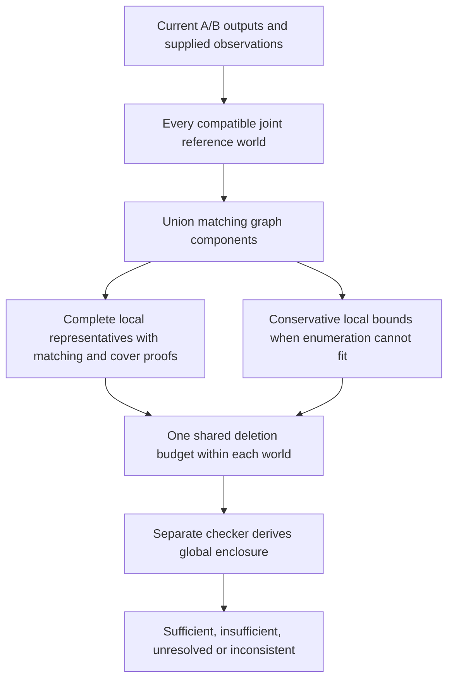

# Component proofs for reference-deletion audits

Document ID: `reiyah.perception-audit-components`. Version: `0.1.0`. Lifecycle status: `exploratory`.

## Contract

This optional proof method accepts the unchanged
[revision input and audit request](../../perception-revision/0.1.0/README.md).
It checks the same finite reference-deletion family, shared reference worlds, nonnegative
losses, weights and strict improvement criterion. It adds no reference observations or error
types. The default audit command and the legacy addition interface are unchanged.

```sh
python -B -m tools.perception_revision audit \
  --input INPUT.json --input-sha256 INPUT_SHA256 \
  --request REQUEST.json --request-sha256 REQUEST_SHA256 \
  --proof-method components --output PACKET.json

python -B -m tools.perception_revision verify-audit \
  --input INPUT.json --input-sha256 INPUT_SHA256 \
  --request REQUEST.json --request-sha256 REQUEST_SHA256 \
  --packet PACKET.json --packet-sha256 PACKET_SHA256
```

The SHA256 arguments are selected digests, not literal placeholder values. Output paths must
be new. The existing synthetic replacement input and audit requests work with these commands.
A supplied counterexample uses the default method; it cannot be combined with `components`.

## Why factorization is sound

For each admitted joint world, apply required absences and retain confirmed presences. Form
the union of both role graphs, with tagged detection and reference vertices. Connected components
are derived from the current input. Deletion can remove edges but cannot connect components.
Maximum matching therefore adds over these components for both roles.

A component whose detection membership is identical in A and B contributes zero matching
difference for every remaining deletion. Isolated reference objects also contribute zero.
Both may be omitted from the deletion budget calculation because it is an **at most** budget:
deleting irrelevant objects cannot enable a new loss value. Required absences still consume
the budget before this reduction. Detection-count offsets always use the complete outputs.

Within each unequal component, unconfirmed references with identical incident detections are
exchangeable for both matching graphs. Enumerating how many are deleted from each such group
covers every labeled subset up to a graph permutation, with its deletion count preserved.
Confirmed references never enter a free group. Grouping is recomputed within each joint world;
it does not identify different physical objects or assume independence between worlds.

Each representative has a matching and an equal-size vertex cover for each role. The separate
checker verifies these finite optimality witnesses and the complete representative list.
For deletion count d, let l_c(d), u_c(d) be the component contribution extrema, including its
anchor weight and the sum of the two loss penalties. With the complete detection-count offset K,
the exact lower bound in a world is:

```text
K + min over sum(d_c) <= remaining_budget of sum(l_c(d_c)).
```

The upper bound uses max and u_c. Dynamic programming enforces **one global budget** across
components and anchors. If the budget exceeds every relevant free reference, separate local
extrema suffice. Only after computing each world does the checker take extrema across the
compatible joint worlds. It never independently combines marginal world choices.

## Bounded fallback

Version 0.1.0 admits at most 16,384 local proof states, 2,000,000 matching screening units and
2,000,000 combination screening units across all worlds. Existing world, input, and 16 MiB
packet limits also apply. The matching estimate for a component is the sum, over its two roles,
of `2*(detections+1)*(objects+edges+1)`. These are deterministic screening units, not a runtime
or bit-complexity theorem.

Reserve one matching pair per unequal component, then spend remaining work on enumeration in
canonical world/component order. When a component's enumeration cannot fit, retain its full-graph
matching pair and derive a conservative curve for every feasible local deletion count. With
full matching difference g, p A-only detections, q B-only detections, and v_A/v_B free objects
used by the checked matchings:

```text
max(-p, g-d, g-min(d,v_B)) <= remaining matching difference
                           <= min(q, g+d, g+min(d,v_A)).
```

These follow from surviving matching edges, deletion monotonicity and the common-output bound.
They need no claim about an optimizer's successful search. A proof records which components
used `bounded_local_states` or `bounded_matching_work`. If even the reserved work or global
combination cannot fit, a checked `component_resource_limit` proof reports unresolved.

With any bounded component, the result says `conservative_component_bound`. A lower bound above
tolerance proves sufficiency; an upper bound at or below tolerance proves insufficiency.
An interval merely touching or crossing tolerance remains unresolved. With full enumeration,
`exact_for_finite_error_family` permits an insufficiency conclusion from an attained minimum.
Inconsistent observations never yield vacuous sufficiency.

## Trust and compatibility



The producer and checker share strict input parsing, reference-world semantics, partition/group
construction, work screening, rational serialization and the existing cardinality checker.
The checker calls no matching algorithm, mixed-integer solver, selector or producer. Its global
budget recurrence and local proof checks derive the result. Independent tests compare global
deletion subsets and direct partial injections against both exact and bounded routes.

`component_deletions` and `component_resource_limit` carry proof version `0.1.0` within the existing
audit-packet envelope. Older proof kinds and request schemas retain their behavior. Source hashes
distinguish implementations; an old checker rejects the new proof kinds. A current checker can
verify a mathematically valid older packet while reporting a producer source mismatch.

Use the inexpensive existing bound first when it resolves the decision. This extension earns
additional computation where that bound remains unresolved. It is not a query-selection policy,
minimum-audit solver, authenticated reviewer record, physical validation or human-cost result.

See the [measured consumer result](../../../docs/PERCEPTION_AUDIT_COMPONENTS_2026-09-17.md) and
[verification record](verification.json).
