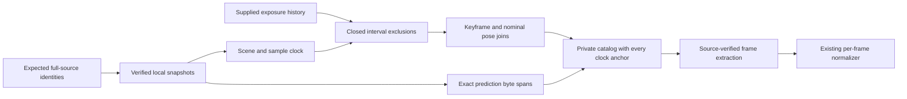

# Verified perception inputs

Document ID: `reiyah.perception-inputs.guide`

Version: `0.1.0`

Lifecycle status: `exploratory`

This offline adapter builds a private inventory for the
[paired-loss Engine](../../perception-decision/0.1.0/README.md). It verifies complete source
files, constructs the opportunity population from the sample clock, accounts for supplied
historical exposure, and indexes every available prediction frame. It does not select a study
cohort or compare detector outcomes. The [checkpoint](checkpoint.json) records the tested code,
retained input identities, real inventory and development integration.



## Run

From a repository projection containing these tools and the existing Python dependencies:

```sh
python3 -B -m tools.perception_inputs \
  --request /absolute/private/path/request.json \
  --request-sha256 EXPECTED_REQUEST_SHA256 \
  --output /absolute/private/path/catalog.json
```

The output must not exist. Exit `0` means the inventory was written successfully; explicit
missing or unavailable frames may still be present. Invalid required inputs or I/O failures
return `2` and no catalog. Output creation is atomic and refuses replacement. This command
uses retained local files; it does not retrieve datasets or invoke model inference.

The request has exactly `artifact_id: reiyah.perception-inputs.request`, `version: 0.1.0`,
and `sources`. The latter names exactly five roles: `metadata`, `splits`, `base`, `camera`,
and `exposures`. An observed source has exactly these fields:

```json
{
  "state": "observed",
  "path": "/absolute/private/path/source.json",
  "byte_size": 123,
  "sha256": "REPLACE_WITH_64_LOWERCASE_HEX_CHARACTERS"
}
```

This is a shape illustration, not an executable source identity. `metadata` and `splits` must
be observed. The other roles may instead contain exactly `state` and a nonempty `reason`,
with state `missing`, `unmeasured`, `sensor_invalid`, `abstained`, `outside_support`, or
`unknown`. Unavailable records have no value, count or invented digest.

## Population and time

`metadata` is the nuScenes `v1.0-trainval` metadata archive. `splits` is an identified Python
source containing one literal `val` assignment. The adapter parses its AST without executing
or importing that file. Scene counts, endpoints, sample identity, strictly increasing times
and bidirectional sample links must agree. All validation anchors remain in the catalog.

An anchor has declared context when its sample timestamp lies at least two seconds inside
both scene endpoints. This says nothing about continuous raw sensor availability. Supplied
historical packets contribute the hull of their anchor's closed +/-2-second context and every
exposed sensor capture time. An eligible candidate's closed context must not intersect any
such hull in the same scene. Only time and asset-presence fields determine this exclusion;
historical labels and prediction values do not enter it.

An explicitly absent scene-boundary placeholder is separate from an exposed asset lacking
its timestamp. The latter invalidates the exclusion computation. Unavailable history produces
`exposure_history_unavailable`, with unknown eligible counts. An empty observed history means
only that the supplied record lists no cases. No claim about all prior author, model-training
or public-benchmark exposure follows from this rule.

The clock-and-exclusion digest is computed before sensor joins or prediction parsing.
Changing prediction scores, counts, source availability or empty frames cannot change this
population or exclusion digest. This is a deterministic information-flow property; it does
not make the existing benchmark prospectively unseen.

## Source and frame identity

Each complete source is copied to an unlinked temporary file. Its size and SHA-256 must match
before any consumer receives the descriptor. Parsing uses those same copied bytes. Changing
the original path afterward cannot change the consumed snapshot. Prediction arrays are
streamed with strict UTF-8 framing, duplicate-key checks and exact byte offsets, sizes and
SHA-256 identities. Decimal tokens retain their source value.

The prediction document must have exactly `meta` and `results`. Its five modality flags must
be Boolean, and remain unverified producer declarations. A missing results key becomes a
`missing` frame. A present empty array remains observed with count zero. Every present row
must name the indexed sample, a supported class, bounded finite XY coordinates and a score
in `[0,1]`. Nonfinite source values may survive in opaque unused fields, including historical
velocity; they are rejected in required numeric operands. No velocity is replaced with zero.

`catalog.extract_frame(source, sample_token, descriptor)` rechecks the complete parent source,
then the indexed span, required row fields and count. Its descriptor must come from a catalog
whose expected digest the caller has checked; a free-standing span is not proof of the
mapping from an empty array to its sample key. The private development integration checks
that catalog identity before extracting frames. Full parent verification currently occurs
on each extraction, so this API favors custody over batch throughput.

The CLI records the exact request-file identity and the canonical request-content identity
separately. It also records the input and core module files and rejects a before/after change
to those files. These are identity checks in a trusted local process, not OS-enforced
isolation, independent provenance, or proof that a supplied hash is authoritative. Downstream
readers must bind the expected catalog bytes and preserve its source and availability records.

## Sensor metadata

The adapter joins all six camera keyframes and `LIDAR_TOP` for every clock anchor. Missing
keyframe metadata remains explicit. Capture timestamps and their signed differences from
the anchor are retained; online availability time remains unmeasured. Referenced lidar ego
XY is admitted as a nominal metadata position only when the pose, lidar capture and anchor
timestamps agree exactly. Missing poses remain missing. Time disagreement yields unknown
position, with no implicit interpolation.

Neither a filename nor a keyframe record establishes raw payload existence, decodability,
calibration accuracy, complete +/-2-second windows, or physical reference validity. These
states remain unchecked. Sensor availability never removes anchors from this catalog.

## Bounded implementation

| Resource | Limit and behavior |
| --- | --- |
| Complete source | At most 1 GiB; regular file, exact expected size and digest |
| Metadata archive | At most 10,000 members and 4 GiB declared expanded bytes; no filesystem extraction, links or ambiguous table paths |
| Scene/sample and exposure documents | At most 16 MiB per selected document |
| Prediction array or streamed table row | At most 1 MiB; prediction frames at most 512 rows |
| Metadata table rows | Sensor 10,000; calibration 50,000; sample-data and pose 5,000,000 each |
| Final catalog | At most 128 MiB; exceeding a limit fails without clipping |

Selected large metadata tables are temporarily copied to resolve forward references. This
requires local disk space and includes a bounded source-parser trust boundary. No new Python
dependency was added. Tests cover source mutation, exact framing, clock independence,
availability, exposure boundaries, malformed joins, frame identity and CLI write behavior.

The next adapter must connect reviewed reference alternatives to the existing graph core.
Retain geometry, class, alias, time and shared matching constraints, and an open-reference
fallback wherever unlisted matchable objects are not bounded. The 60-scene study requires its
method and input freeze, two independent reviewers, conventional comparator, adjudication
arrangement and checked observation windows before sampling.
