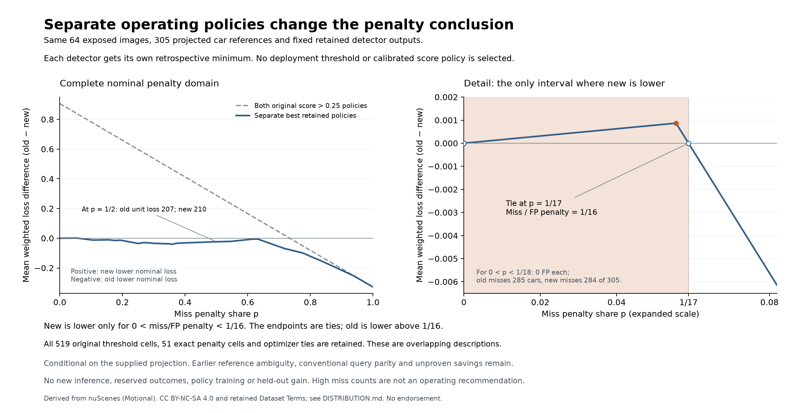

# Compare both detectors under their own retained policies

Version `0.1.0`, 18 September 2026. Status: `exploratory`.

With each detector given its own retrospective minimum over all retained
thresholds, **YOLO26n has lower nominal loss only when the miss penalty is
positive and less than 1/16 of the false-positive penalty**. The endpoints
are ties. Above 1/16, YOLO11n has the lower envelope, including miss-only
loss. This further limits the original shared-cutoff advantage; it does
not select or validate a deployment policy.

The same 64 exposed images, fixed outputs and 305 projected car references
underlie every curve. The preceding studies varied either penalty at the
original cutoff or threshold at unit loss. This study combines those two
questions symmetrically, using only their already verified scalar curves.
No new image, annotation, prediction or reserved outcome is read.

| Miss/FP penalty ratio | Separate best-retained nominal comparison |
| --- | --- |
| 0 | Tie |
| Strictly between 0 and 1/16 | YOLO26n lower |
| 1/16 | Tie |
| Greater than 1/16, including miss-only | YOLO11n lower |

At the original shared cutoff, the new checkpoint's nominal advantage lasts
until a miss/FP ratio of 58/21. That is a statement about those particular
policies. Allowing both detectors their full retained operating curves changes
the boundary to 1/16. At equal unit penalties, the earlier retrospective
minima remain 207 old versus 210 new, despite the original-cutoff totals of
262 versus 225. The different comparisons must not be conflated.

The small new-lower region is also concrete: for penalty share
`0 < p < 1/18`, both minimizing policies have zero false positives, with
285 old misses versus 284 new misses out of 305 references. The next old
policy allows one false positive with 268 misses, while new retains zero
false positives and 284 misses. Its tradeoff is better once miss/FP exceeds
1/16. These high miss counts are not an operating recommendation.



Every original threshold cell is retained in
[optimizer-domains.csv](optimizer-domains.csv), including never-minimal cells
and point-only ties. [penalty-partition.csv](penalty-partition.csv) retains all
51 exact cells over the closed penalty domain: 26 singleton boundaries and
25 open intervals. Three cells have new-lower nominal loss, 46 old-lower,
and two are ties. Those are dependent mathematical pieces of one comparison,
not independent trials. Thirty-eight pieces differ from the fixed-cutoff
conclusion. [summary.json](summary.json) retains all counts and source identities.

| Retained optimizer state | YOLO11n | YOLO26n |
| --- | ---: | ---: |
| Minimizes on an interval | 15 | 10 |
| Minimizes only at one point | 22 | 23 |
| Never minimizes on the penalty domain | 262 | 187 |
| All threshold cells | 299 | 220 |

The [plan](PLAN.md) and 106 source/implementation/runtime bindings were frozen
before the new envelope calculation. Exact pairwise inequalities characterize
each minimizing domain; a separate slope-ordered hull and 52,938 affine
endpoint checks verify every source line, partition, sign and optimizer tie.
All 13 controls pass, including 729 exhaustive tiny three-line sets, 256
two-model allocations and a complete 519-cell synthetic pipeline.
[MATHEMATICS.md](MATHEMATICS.md) explains why the continuum checks suffice.

This is an oracle description of already exposed development results. The
operating points were not chosen prospectively and no held-out performance
of a threshold-selection procedure is estimated. Reference uncertainty,
scene dependence and the original projection's limitations remain. The
uncertain-reference independent-threshold pairs are not newly evaluated here.
Earlier conventional query parity and unresolved cases stay unchanged;
observation savings, full cost savings and customer demand remain unproven.
All 1,433 reserved images remain closed.

The first verification launch hit local disk exhaustion before its child
started. Lossless archiving of completed synthetic output copies freed space;
every archived byte was verified before removing its unpacked copy. Actual
scientific packets and frozen inputs were untouched. The fresh verification
passed. [COSTS.md](COSTS.md) retains that failure, recovery and all known
phase costs; it does not infer a speedup from these small mathematical runs.

Run the public controls with Python 3.14:

```sh
python -B -m unittest discover -s research/policy-loss-envelope/0.1.0 -p 'test_envelope*.py'
```

`envelope_run.py` provides freeze, run and separate verification modes; the
source CSV and mathematical operands are public derived scalars. Actual runs
used the selected existing runtime, network denial and 1,200-second phase
limits. [SOURCES.md](SOURCES.md) records lineage and
[DISTRIBUTION.md](DISTRIBUTION.md) retains nuScenes attribution and conditions.
