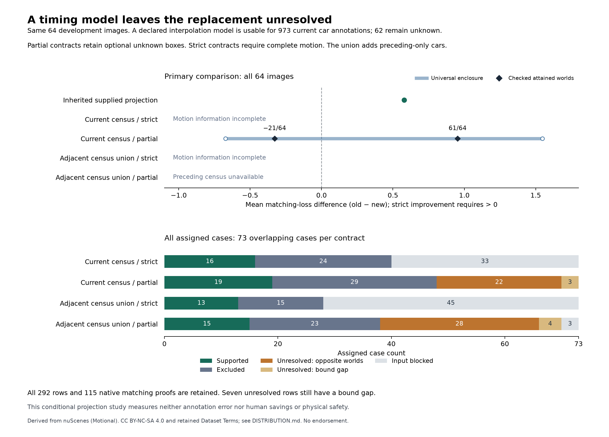

# Retain missing motion in reference comparisons

Version: `0.1.0`. Status: `exploratory`. Development only, 18 September 2026.

Retiming the supplied car annotations under a declared interpolation model does
not settle the replacement decision. The primary partial-reference contract has
a universal mean-loss enclosure of **[-43/64, 99/64]**. Checked worlds attain
**-21/64** and **61/64**, so both non-improvement and strict improvement remain
possible. These attained values do not claim exact geometric extrema.

The complete current-census model is blocked by missing motion on 25 images.
Including preceding-only car instances leaves the full-population partial case
blocked by one missing preceding sample. All 64 images remain in the allocation;
no complete subset is substituted. Earlier conventional parity, minimum query
floors and adverse-world results retain their original scopes. Savings remain
unproved.

## What was tested

The [frozen plan](PLAN.md) uses the same 64 exposed CAM_FRONT images, fixed
YOLO11n/YOLO26n outputs and 73 overlapping cases as the
[original prediction experiment](../../public-predictions/0.1.0/README.md).
It retains car category, 25-pixel minimum height, exact-decimal IoU >= 1/2,
one-to-one matching and equal false-positive/miss penalties. Positive old-minus-
new mean loss supports strict improvement. This is a declared proxy, not AP or
a physical-safety criterion. The [penalty sensitivity](../../loss-tradeoff/0.1.0/README.md)
continues to apply to the earlier reference families.

The source SDK deliberately uses current sample annotations for keyframes.
For this separate model, global centers are interpolated linearly and rotations
with SLERP between adjacent annotations at the actual camera time. Current
dimensions and the inherited camera pose/calibration are retained. No clamping,
extrapolation, zero-velocity fill or static-box fallback is allowed. Read
[source scope and identities](SOURCES.md); the timestamp offset alone does not
show that publisher annotations are wrong.

The current census contains 1,035 car annotations before any visibility,
size or prediction-match selection. Of these, 973 support the declared model:
281 are eligible projected references, four fall below the height threshold
and 688 project outside the canvas. Motion is unavailable for 62: 42 have no
same-instance annotation in the preceding sample; 20 belong to the scene-start
image with no preceding sample. An unavailable car contributes an optional
unknown rectangle in the partial contract. Its absence is one possible world,
not an observed empty result.

The adjacent-sample union adds 45 preceding-only instances across the 63 images
with available preceding censuses. That yields 87 unknown instances there;
the remaining image's union census stays unavailable. Both census contracts
exclude objects absent from their source annotation lists. Both treat the
known interpolation model as a premise, with no claim of physical truth.

## Complete results

| Contract | Supported | Excluded | Unresolved, opposite worlds | Unresolved, bound gap | Input blocked |
| --- | ---: | ---: | ---: | ---: | ---: |
| Current census, strict | 16 | 24 | 0 | 0 | 33 |
| Current census, partial (primary) | 19 | 29 | 22 | 3 | 0 |
| Adjacent census union, strict | 13 | 15 | 0 | 0 | 45 |
| Adjacent census union, partial | 15 | 23 | 28 | 4 | 3 |

All 292 assigned rows are in [results.csv](results.csv), with blocked membership
counts and explicit evidence type. The [64-image derived table](image-summary.csv)
keeps unavailable union counts blank rather than zero.
[summary.json](summary.json) retains all primary outcomes, seven remaining
bound gaps, numerical diagnostics, search limits and known costs. Cases overlap;
these counts are not independent decisions or annotation-error frequencies.

Among successfully modeled objects, 280 stay eligible and one enters eligibility;
none leave it. The 25 originally eligible objects with missing motion remain
unassessed. The maximum absolute box-coordinate change among the 280 eligible
pairs is about 43.7083 pixels. This is a difference between two declared
projections, not a measured error. Retiming can alter multiple boxes, orientation
and dimensions of their projected rectangles, so it is not the earlier
one-box fixed-size translation family.

## Verification and limits

The 265-binding freeze was written at 16:14:59 UTC before new projections or
scores; its SHA-256 is
`061b390fb24c716ca8abfe089d03b38de4e59ea80bc393d1e4ece30c8fdfb2b0`.
All 51 unit controls pass. A separate eight-image synthetic packet crosses the
SDK and research runtimes, verifies 36 case/contract rows, and rejects all 13
deliberate source, census, bound, proof and case-membership faults. Earlier
failures and fixes remain in [costs and retained attempts](COSTS.md).

The scalar quaternion/transform/polygon implementation checks all 973 modeled
objects without importing the SDK projection libraries. Maximum coordinate
disagreement is 9.8453e-11 pixels; center and rotation-matrix disagreements are
also retained. Eligibility and every relevant threshold matching edge agree.
Exactness of matching refers to the serialized decimal operands, not exact
real-valued physical geometry.

Conventional maximum flow, a separate augmenting-path matcher and 115 checked
native proofs agree on the retained worlds. The bounded constructive search
performs 8,426 candidate evaluations and 6,573 distinct flow measurements,
reusing identical searches across contracts. No search hits the declared
evaluation/reference cap. Seven case rows retain a gap between universal bounds
and attained worlds; they are not mislabeled proven ambiguity. Fifty unresolved
rows have actual opposite-decision worlds. No observation selector is tuned.

The [bound derivation](MATHEMATICS.md) gives the conventional baseline the same
math. Model, census, calibration, source accuracy, occlusion and corner-projection
assumptions remain limitations. This is algorithmic verification, not independent
scientific replication or acceptance. All 1,433 reserved images remain closed.

## Replay

The private active packet is
`~/.codex/reports/reiyah/value-10h-2026-09-18-c1y8k9yc/private/reference-timing-01/`.
Its `FREEZE.json`, `metadata-01`, `runs/projection-01` and `runs/timing-01`
bind the held inputs, full source membership, individual geometry and proofs.
Do not overwrite these runs. Reproduction requires lawfully held matching
source bytes and the pinned runtimes; public synthetic controls need no images.

Run `test_timing_metadata` and `test_timing_bounds` with the selected research
Python; run `test_timing_model` with the SDK Python. Then execute
`timing_synthetic.py prepare NEW_PACKET.json` in the SDK runtime and
`timing_synthetic.py check NEW_PACKET.json NEW_REPORT.json` in the research
runtime. For retained actual data, `timing_verify.py PRIVATE_AREA projection-01
timing-01` checks the frozen result under network denial. The default repository
check is `python -B tools/measure/gate_b_check.py`, not historical Gate A replay.

Raw inputs and proofs remain private. Derived reports retain the
[nuScenes attribution and distribution terms](DISTRIBUTION.md).
