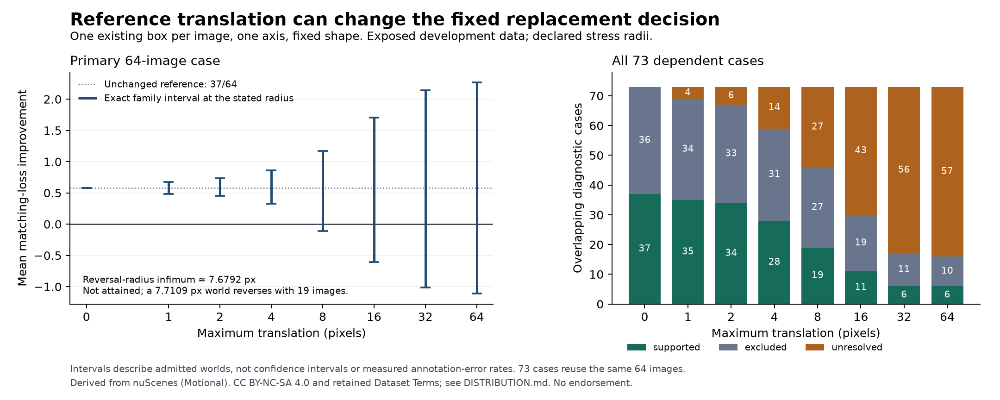

# Bound the effect of small reference translations

Version `0.1.0`, 18 September 2026. Status: `exploratory`.

The frozen YOLO11n-to-YOLO26n proxy decision stays supported at translation
radii of 1, 2 and 4 pixels, but becomes unresolved at 8 pixels. This follow-up
allows at most one existing reference rectangle per image to move along
either axis, with fixed size and its entire rectangle inside the image.
Errors may be correlated across images. These are declared stress sets,
not measured annotation error, reviewer precision or physical truth.

The exact primary reversal-radius **infimum is approximately 7.6792058 pixels
and is not attained**. At the exact rational boundary the worst total delta
is still 1; immediately beyond it a world with total -1 is possible. The retained
attained witness has radius approximately 7.7108577 pixels and changes 19 images.
It is a valid counterexample in this narrower family, without insertion,
deletion, class change or box resizing.



The interval plot shows only the frozen radii; it does not interpolate a
continuous certified curve. [SVG figure](translation.svg).

## All assigned outcomes

The [plan](PLAN.md) and 163 input/code bindings were frozen before this new
search, after the predecessor's outcomes were already known. The same 64 exposed
images, 305 eligible reference rectangles and 73 overlapping cases are retained.
All 584 case/radius rows complete with no failed or omitted image. The
[full table](results.csv) includes nominally excluded cases and zero-edit
exclusions; the [summary](summary.json) binds private results and verification.

| Radius, pixels | Primary interval | Primary decision | Minimum images for an excluding primary world | Supported / excluded / unresolved across 73 cases |
| ---: | --- | --- | --- | --- |
| 0 | [37/64,37/64] | supported | not possible | 37 / 36 / 0 |
| 1 | [31/64,43/64] | supported | not possible | 35 / 34 / 4 |
| 2 | [29/64,47/64] | supported | not possible | 34 / 33 / 6 |
| 4 | [21/64,55/64] | supported | not possible | 28 / 31 / 14 |
| 8 | [-7/64,75/64] | unresolved | 19 | 19 / 27 / 27 |
| 16 | [-39/64,109/64] | unresolved | 19 | 11 / 19 / 43 |
| 32 | [-65/64,137/64] | unresolved | 19 | 6 / 11 / 56 |
| 64 | [-71/64,145/64] | unresolved | 19 | 6 / 10 / 57 |

An excluding *world* makes the uncertain decision unresolved when a supported
world also remains possible. It does not exclude improvement across the whole
uncertainty family. At every listed radius at least 8 pixels, the exact minimum
affected-image count for such a primary world is 19. The previous **15-image**
threshold admitted broader arbitrary edits and remains unchanged. A narrower
family cannot invalidate that earlier counterexample.

## Why the geometric claim is exact

The solver partitions each legal one-axis translation domain at every exact
IoU-edge endpoint. It evaluates both singleton endpoints and the open cells
between them. Each open cell has a constant matching neighborhood. Radius
membership is an exact intersection with a closed displacement band.
It retains whether a cell's minimum required radius is actually attained.
The whole primary case combines per-image minima because correlated edits
are admitted by this declared contract.

The primary infimum is the exact fraction
`10544694601026904612822277173 / 1373149108886720000000000000`.
The verifier proves that every smaller radius remains supported and checks
the endpoint separately from its right limit. The witness radius and its
exact source/world bindings remain in the private packet. Rounded decimal
text above is only a presentation of those rational values.

A separate verifier derives edge intervals from piecewise-linear overlap,
checks every cell with an independent augmenting-path matching implementation,
and checks attained worlds through the unchanged native Engine. It verifies
all 8,050 cells on 610 reference axes, 1,668 distinct matching states, 512 image/radius
rows, 443 native proofs and 1,168 case-world compositions. No cell, axis, image,
radius or unresolved case is silently removed. Current-proof cache reuse
checks exact subject, world and payload bytes; this is not a test of real
cross-revision reuse or independent scientific replication.

All 26 targeted synthetic controls pass, including 512 exhaustive small matching
graphs, 600 rational interval comparisons, closed IoU endpoints, an unattained
critical radius, empty references, duplicate/shared predictions, correlated
reversal and known-bad claims. An initial test overestimated how many positions
its fixture grid exercised; the original failure is retained, the fixture set
is expanded, and its intended coverage threshold is preserved. No actual-data
search or criterion was changed after freeze.

## Cost and reproduction

The search process took 2.862765458 seconds, including native witness construction;
separate verification took 17.038830083 seconds. These are recorded local
process costs, not human time or complete economics. All test, search,
verification and figure-process receipts are listed in the public summary;
the private packet retains the original outputs and failures. Nested matching
and native proposal/check times are already inside their outer processes.
Publication/integration and uninstrumented development are not included in
these two process figures. No model calls or new asset downloads occurred.

Run synthetic controls from this folder:

```sh
python -B -m unittest discover -s . -p 'test_*.py' -v
```

An authorized custodian of the bound private predecessor packet can run a fresh
named reproduction, using the retained Python runtime and network-denied
process launcher:

```sh
REIYAH_TRANSLATION=/path/to/private/translation-01
python -B research/reference-translation/0.1.0/translation_run.py "$REIYAH_TRANSLATION" reproduction-01
python -B research/reference-translation/0.1.0/translation_verify.py "$REIYAH_TRANSLATION" reproduction-01
```

Run names must be fresh; outputs are not overwritten. Frozen inputs include
absolute source paths, so relocation requires a separately retained binding.
Private source: `~/.codex/reports/reiyah/value-10h-2026-09-18-c1y8k9yc/private/translation-01/`.
Read FREEZE and runs/translation-01 RESULTS/VERIFICATION. Code and synthetic
tests are public, while raw geometry and proofs remain private. The public
table/figure retains [nuScenes attribution and terms](DISTRIBUTION.md).

The next unresolved scope is simultaneous movement of both coordinates.
Axis-only exactness cannot certify a larger 2D translation set; the latter may
reverse at a smaller radius. Any follow-up needs its own freeze, sound geometry
bounds and explicit remaining gaps. The broader arbitrary-edit and baseline
parity findings remain valid. All 1,433 outcome-reserved images stay closed,
human work and demand remain unknown, and Gate A remains operator-unaccepted.
