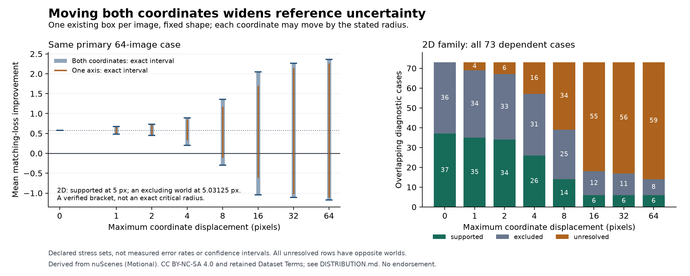

# Bound simultaneous reference translation

Version `0.1.0`, 18 September 2026. Status: `exploratory`.

The frozen YOLO11n-to-YOLO26n proxy decision remains supported when each
coordinate may move by at most **5 pixels**, but a checked excluding world
exists at **161/32 = 5.03125 pixels**. At those two radii the primary worst
total loss differences are 1 and -1 respectively. This is a verified bracket,
not an exact critical radius or a measured annotation-error threshold.

This follow-up allows at most one existing reference rectangle per image to
translate in both coordinates. Its size and category stay fixed and it must
remain entirely inside the image. Errors across images may be arbitrarily
correlated. It reuses the same 64 exposed images, 305 eligible references,
two frozen prediction packets and 73 overlapping cases. No new prediction,
image, model, training, download or outcome-reserve access occurs.



The figure compares only the evaluated radii. It does not interpolate a
continuous certified curve. [SVG figure](translation-2d.svg).

## Complete results

The [plan](PLAN.md), implementation and inputs were frozen in 244 byte bindings
before the new search. The prior axis-only results were already known. All
584 fixed-radius case rows complete; no failed image or remaining geometric
bound gap is omitted. The [full table](results.csv) preserves every assigned
case, and [summary](summary.json) binds the private results and verification.

| Radius, pixels | Primary interval | Supported / excluded / unresolved across 73 cases |
| ---: | --- | --- |
| 0 | [37/64,37/64] | 37 / 36 / 0 |
| 1 | [31/64,43/64] | 35 / 34 / 4 |
| 2 | [29/64,47/64] | 34 / 33 / 6 |
| 4 | [13/64,57/64] | 26 / 31 / 16 |
| 8 | [-19/64,87/64] | 14 / 25 / 34 |
| 16 | [-67/64,131/64] | 6 / 12 / 55 |
| 32 | [-71/64,145/64] | 6 / 11 / 56 |
| 64 | [-75/64,151/64] | 6 / 8 / 59 |

Across the 584 dependent rows, 164 are supported, 190 excluded and 230 unresolved.
Every unresolved row has both a supported and an excluding attained world.
An excluding world does not exclude improvement over the whole family when
a supported world remains possible. These rows reuse the same images and are
not independent customer decisions.

Eight predeclared bisection steps evaluate 4, 6, 5, 11/2, 21/4, 41/8, 81/16
and 161/32 pixels. Radius 4 reuses its fixed-radius result and original cost.
The other seven batches add 448 image/radius rows. The final primary bracket
is [5,161/32]; all smaller radii up to 5 are supported by set inclusion, while
161/32 has an admitted excluding world. The search stops at its declared eight
steps; it makes no claim about the exact infimum inside the bracket.

The [axis-only infimum](../../reference-translation/0.1.0/README.md) of approximately
7.6792058 pixels, its unattained boundary and 19-image witness remain correct
for that smaller family. The broader arbitrary-edit 15-image result and all
[baseline parity findings](../../public-predictions/0.1.0/README.md) also remain
unchanged. Smaller required displacement in a larger stress set is not an
estimate of how often an error happens.

## Why these extrema are exact

Each reference has a closed rectangular domain of legal left/top positions.
Exact rational overlap extrema identify prediction edges that must hold
throughout a region and edges that can hold somewhere in it. After deleting
the moving reference, each output's maximum matching can increase by at most
one when that reference is restored. Its increment is one precisely when
the new neighborhood reaches an augmentable prediction. The four possible
pairs of increments preserve shared prediction identities.

This neighborhood relaxation provides a sound interval, but it can admit
nongeometric combinations. The search therefore retains separately the bounds
and actual corner/center/previous-axis worlds. It bisects any region whose
bound could improve an attained extremum, retaining both closed children.
Its fixed limits are 2,048 evaluated regions per image/radius and depth 24.
An unresolved region would remain in the final enclosure and be reported as
a bound gap. Here every bound endpoint is attained before the limits stop it.

A separate verifier uses overlap peak plateaus and endpoints, an independent
augmenting-path matcher, and a constructive check of each allowed rank pair.
It reconstructs every root domain and complete subdivision tree, checks native
proofs for attained worlds, and recomputes all case and bracket claims. It
checks 960 image/radius rows, 13,587 regions, 625 native proofs and 1,168
fixed-radius case-world compositions. Every complete row verifies with zero
unresolved geometric regions. This is implementation verification, not
independent scientific replication or proof of physical truth.

All 33 targeted controls pass. They include exhaustive small graph and shared
neighbor combinations; separate rational overlap comparisons; a diagonal
reversal that precedes an axis reversal; deliberately retained work-limit gaps;
empty versus unavailable inputs; missing children or leaves; changed source,
shape or radius; false attainment; altered cached proof bytes; failed allocated
rows; and unsupported bracket updates. No scientific criterion or frozen
implementation changed after the actual-data freeze.

## Costs and reproduction

The search process takes 12.321791709 seconds and separate verification takes
12.482041917 seconds. Search includes 0.212568625 seconds of deletion-base
preparation and 11.137189073 seconds of per-image searches. The 625 unique
native proofs include 2.414705212 seconds of compilation, 0.044627214 seconds
of proposal and 0.039485953 seconds of checking, already nested inside search.
Reused proofs are charged only once. The search evaluates 35,879 distinct
positions within image/radius contexts and 68,848 edge envelopes.

The summary lists retained process receipts for controls, search, verification
and presentation. These measured processes exclude uninstrumented development,
review and integration; they are not total work or economic cost. Human work,
actual error frequencies, customer demand and full economics remain unknown.
There are no additional downloads or inference calls.

Run synthetic controls from this folder with the selected research runtime:

```sh
python -B -m unittest discover -s . -p 'test_*.py' -v
```

An authorized custodian of the private predecessor packet can run a fresh
named reproduction through the retained network-denied process launcher:

```sh
REIYAH_PLANAR=/path/to/private/translation-2d-01
python -B research/translation-2d/0.1.0/planar_run.py "$REIYAH_PLANAR" reproduction-01
python -B research/translation-2d/0.1.0/planar_verify.py "$REIYAH_PLANAR" reproduction-01
```

Outputs use exclusive creation and fresh run names. Relocating absolute frozen
source paths requires a separately retained binding. The private packet is
`~/.codex/reports/reiyah/value-10h-2026-09-18-c1y8k9yc/private/translation-2d-01/`.
Raw geometry, per-region operands and native payloads stay outside Git; public
derived reports retain the [nuScenes attribution and terms](DISTRIBUTION.md).

The next concrete assumption to examine is the equal penalty assigned to false
positives and misses. A decision owner must specify that tradeoff and the
actual observation contract. This result does not establish review savings,
a valid operational release gate, or an acceptable physical error tolerance.
All 1,433 outcome-reserved images remain closed. Gate A remains unaccepted.
